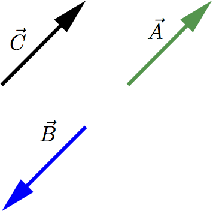
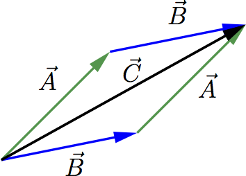
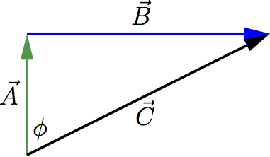
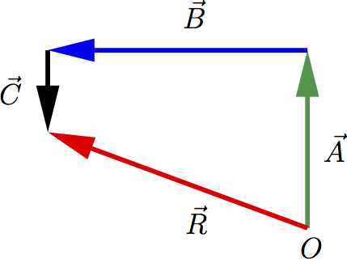
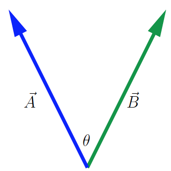
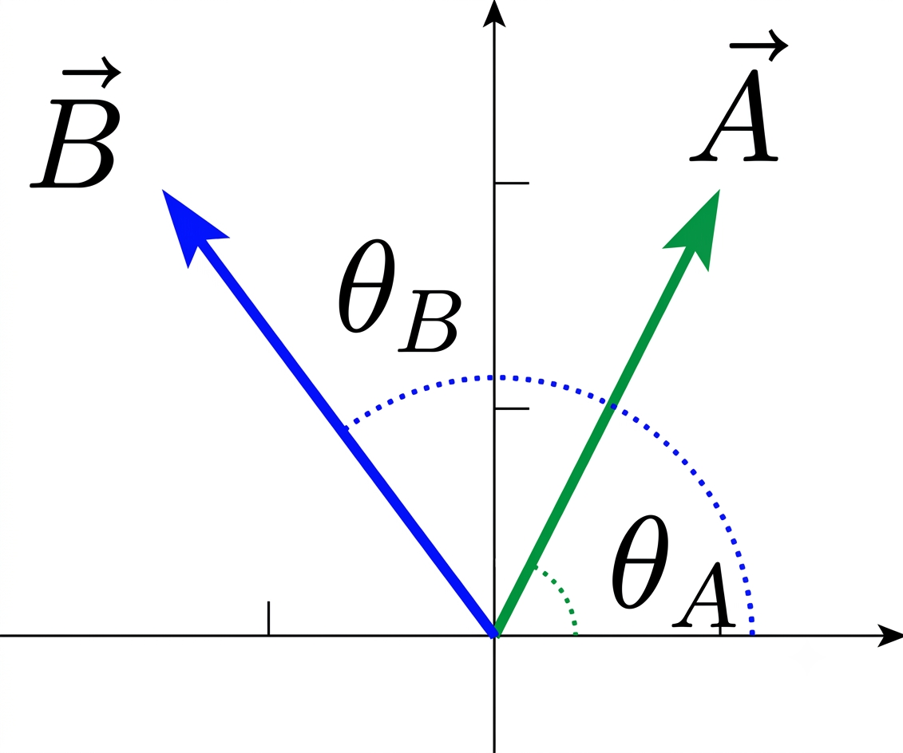
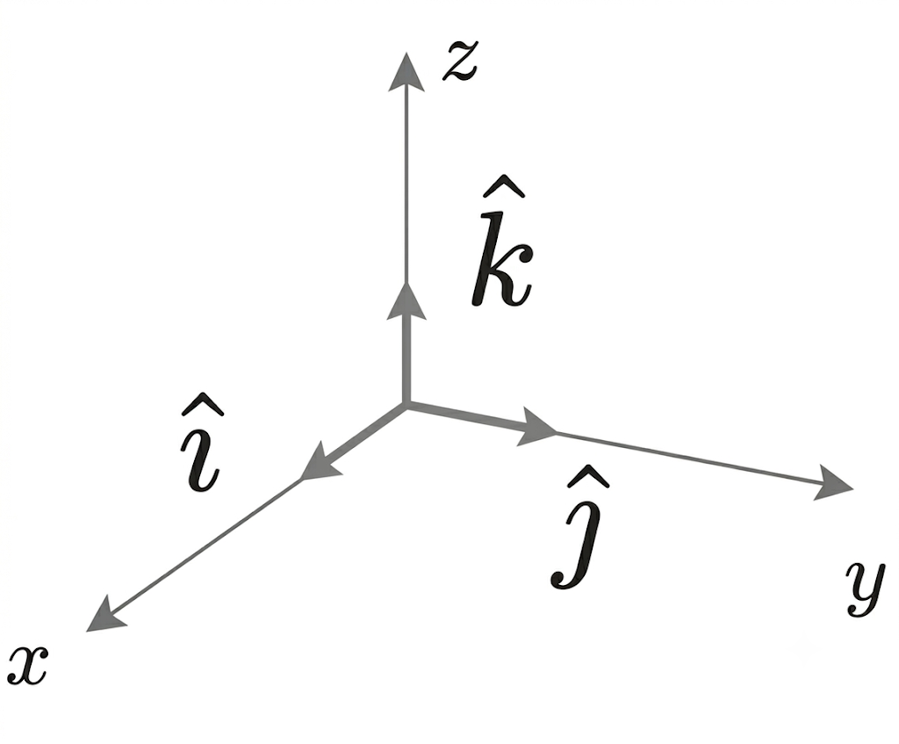

# 1. Propiedades generales de los vectores

En Física, algunas cantidades como el tiempo, la temperatura, la masa y la densidad, se pueden describir completamente con un número y una unidad. Diremos entonces que se trata de **magnitudes escalares**.

Sin embargo, existen otras magnitudes que están asociadas con una dirección y no pueden describirse con un sólo número. Por ejemplo, la velocidad: no solo es necesario indicar la rapidez de un avión, sino también su dirección. También ocurre igual con la magnitud física fuerza: para describirla correctamente, hay que indicar no solo su intensidad, sino también su dirección y sentido. Diremos que son **magnitudes vectoriales**.

:::: {.callout-note title="Ejemplo" collapse="true" icon="false"}
$\vec A$ y $\vec B$ son vectores con la misma magnitud y dirección, pero diferente sentido. El vector $\vec C$ tiene la misma dirección que los dos vectores anteriores. Diremos que son vectores paralelos.

::: {style="text-align:center;"}
{width="30%"}
:::
::::

La magnitud de un vector es el *módulo* del vector, y se expresa en la forma $\vec{A}$. Es una cantidad escalar y siempre es positiva.

# 2. Operaciones con vectores

## 2.1 Suma de vectores

Supongamos que una partícula sufre un desplazamiento del punto $O$ al punto $P$, definido por el vector $\vec{A}=\vec{OP}$, seguido de un segundo desplazamiento, del punto $P$ al punto $Q$, definido entonces por el vector $\vec{B}=\vec{PQ}$. El resultado final será equivalente a considerar que la partícula parte del punto $O$ y tiene como punto final el punto $Q$. Es decir, podemos considerar que el desplazamiento total vendrá dado por el vector $\vec{C}$, que se calcula como $$\vec{C} = \vec{A }+\vec{B} = \vec{B}+\vec{A}$$

La suma de vectores es **conmutativa**, tal y como vemos en la siguiente figura

::: {style="text-align:center;"}
{width="35%"}
:::

Y además, también es **asociativa**:

$$ \vec{A}+\vec{B}+\vec{C} \rightarrow \left ( \vec{A}+\vec{B}\right ) + \vec{C}= \vec{A}+ \left ( \vec{B} + \vec{C} \right )$$

Para restar dos vectores:

$$\vec{A} - \vec{B} = \vec{A} + \left ( -\vec{B} \right )$$

$(-\vec{B})$ es el vector opuesto de $\vec{B}$. Tiene la misma magnitud, la misma dirección, pero sentido contrario.

También podemos multiplicar un vector por un escalar. Por ejemplo:

$$\vec{B} = 2  \vec{A}$$

$\vec{B}$ es un vector con la misma dirección y sentido que $\vec{A}$ pero su magnitud es el doble.

La fuerza es una magnitud vectorial. Por tanto, de la expresión

$$ \vec{F}= m  \vec{a} $$

podemos deducir que la dirección de $\vec{F}$ y $\vec{a}$ es la misma, el sentido también (porque $m$ es siempre una cantidad positiva) y la magnitud de $\vec{F}$ es igual a la magnitud de $\vec{a}$ multiplicada por la masa $m$.

::::: {.callout-note title="Ejemplo" collapse="false" icon="false"}
Un senderista camina desde un refugio en una llanura $1$ km hacia el norte y $2$ km hacia el este. ¿A qué distancia y en qué dirección está respecto al punto de partida?

::::{.callout-note title="Solución" collapse="true" icon="false"}
El camino que sigue el senderista puede ser descrito mediante los vectores $\vec{A}$, $\vec{B}$ y su resultante $\vec{C}$, tal y como se representa en la siguiente figura

::: {style="text-align:center;"}
{width="35%"}
:::

La distancia al punto de partida la determinaremos mediante la magnitud del vector $\vec{C}$, que vendrá dada por:

$$|\vec{C}| = \sqrt{1 + 4}\text{ km} = \sqrt{5}\text{ km} $$

La dirección nos la dará el ángulo $\phi$ y por tanto, puede ser calculado teniendo en cuenta la magnitud de los vectores $\vec{A}$ y $\vec{B}$, $1$ y $2$ km, respectivamente. Por tanto

$$\tan  \phi = \frac{2}{1} \ \rightarrow \phi=63.4^\circ$$

::::
:::::

## 2.2 Componentes

Las componentes de los vectores nos van a permitir un método sencillo pero general para sumar vectores. Supongamos que tenemos un sistema cartesiano de ejes de coordenadas en dos dimensiones y que $\vec A$ es un vector en ese sistema. Entonces $A_x$ es la proyección del vector $\vec A$ en la dirección del eje $x$ y $A_y$ es la proyección del vector $\vec{A}$ en la dirección del eje $y$. $A_x$ y $A_y$ son las componentes del vector $\vec{A}$. Podemos calcular las componentes del vector $\vec{A}$ si conocemos la magnitud y la dirección de dicho vector. Describiremos la dirección de un vector con su ángulo $\theta$, relativo a una dirección de referencia, que es el eje $x$ positivo, siempre en sentido antihorario

$$\frac{A_x}{|\vec{A}|} = \cos \theta \rightarrow A_x= |\vec{A}| \cos \theta, \quad \frac{A_y}{|\vec{A}|}= \text{sen} \theta \rightarrow A_y= |\vec{A}| \text{sen}  \theta$$

:::: {.callout-note title="Ejemplo" collapse="false" icon="false"}
Determina las componente $x$ e $y$ del vector $\vec{D}$, con magnitud $|\vec{D}|=3$ m y siendo $\alpha=45^\circ$ el ángulo que forma con el eje $x$ positivo, en el sentido antihorario.

:::{.callout-note title="Solución" collapse="true" icon="false"}

Según la descripción de $\vec D$, tanto $D_x$ como $D_y$ son positivas. Por tanto

$$\cos \alpha = \frac{D_x}{|\vec{D}|},\  \text{sen}  \alpha = \frac{|D_y|}{|\vec{D}|} \rightarrow D_x=3/2 \sqrt{2},\  D_y=3/2 \sqrt{2} $$
:::
::::

## 2.3.Cálculo de vectores usando componentes

El uso de componentes facilita algunos cálculos que implican vectores. Veamos algunos ejemplos

- *Cálculo y magnitud de un vector a partir de sus componentes*:

  Un vector queda descrito por su magnitud y dirección, pero también dando sus componentes. A partir de ellas, podemos calcular la magnitud y dirección del vector

  $$ |\vec{A}| = \sqrt{A_x^2 + A_y^2}, \quad \tan  \theta = \frac{A_y}{A_x}, \quad \theta = \text{ arctg}   \frac{A_y}{A_x}$$

  :::: {.callout-note title="Ejemplo" collapse="false" icon="false"}
  EJEMPLO: Calcula la magnitud y dirección del vector $\vec{A}$ si $A_x=2$ m y $A_y=-2$ m.

  ::: {.callout-note title="Solución" collapse="true" icon="false"}

  $$ |\vec{A}| = \sqrt{A_x^2 + A_y^2} =\sqrt{8} \quad \theta = \text{ arctg}  (-1) \quad \theta=315^\circ$$

  Al introducir el valor $-1$ en la calculadora para obtener el valor del arco tangente, nos dará $-45^\circ$. Este ángulo, siguiendo nuestro criterio de tomarlo respecto al eje $x$ positivo, en sentido antihorario, es equivalente al ángulo de $315^\circ$.
  :::
  ::::

  

- *Multiplicación de un vector por un escalar*:

  $$ \vec{D}= c \vec{A} \rightarrow D_x = c  A_x \text{ y } D_y = c  A_y$$

- *Uso de componentes para calcular la suma de vectores* $\vec A$ y $\vec B$:

  $$ \vec{R} = \vec{A} + \vec{B} \rightarrow R_x=A_x+B_x\ \text{ y }\ R_y=A_y+B_y$$

::::: {.callout-note title="Ejemplo" collapse="false" icon="false"}
Un conductor desorientado recorre $3.25$ km hacia el norte, $4.75$ km hacia el oeste y $1.50$ km hacia el sur. Calcular la magnitud y dirección del vector desplazamiento resultante, mediante la suma de las componentes.

::: {style="text-align:center;"}
{width="35%"}
:::

:::: {.callout-note title="Solución" collapse="true" icon="false"}

Teniendo en cuenta las componentes (expresadas en km):

$$ A_x=0, \  A_y=3.25, \ B_x=-4.75,\ B_y= 0,\ C_x= 0,\ C_y=-1.50$$

Por tanto

$$ R_x=A_x+B_x+C_x=-4.75, \quad R_y=A_y+B_y+C_y=1.75  .$$
::::
:::::

:::: {.callout-note title="Ejemplo" collapse="false" icon="false"}
El vector $\vec{A}$ tiene componentes $A_x=1.30$ cm. $A_y=2.25$ cm. El vector $\vec{B}$ tiene componentes $B_x=4.10$ cm y $B_y=-3.75$ cm. Calcular:

1.  Las componentes de la resultante $\vec{R}=\vec{A}+\vec{B}$.

2.  La magnitud y la dirección de $\vec{R}=\vec{A}+\vec{B}$.

3.  Las componentes de la diferencia vectorial $\vec{S}=\vec{B}-\vec{A}$.

4.  La magnitud y la dirección de $\vec{S}=\vec{B}-\vec{A}$.

::: {.callout-note title="Solución" collapse="true" icon="false"}

1.  $$ R_x=A_x+B_x=5.40 \text{ cm}, \  R_y=A_y+B_y=-1.50\text{ cm}$$

2.  $$|\vec{R}|=\sqrt{(5.40)^2 + (1.50)^2}\text{ cm} = 5.60 \text{ cm}, \  \tan \phi= \frac{-1.50}{5.40}\  \rightarrow\  \phi=285.52^\circ$$

3.  $$S_x=B_x-A_x=2.80\text{ cm}, \ S_y=B_y-A_y=-6.00\text{ cm}$$

4.  $$|\vec{S}|=\sqrt{(2.80)^2 + (6.00)^2}\text{ cm} = 6.62\text{ cm}, \ \tan \psi= \frac{-6.00}{2.80} \rightarrow \psi=115.02^\circ$$
:::
::::

# 3. Vectores unitarios

Los vectores unitarios son aquéllos con magnitud igual a $1$ (sin unidades). Su única finalidad es dar una dirección en el espacio. Siempre los notaremos con un acento del tipo $\hat{ }$, para indicar que se trata de un vector unitario.

- $\hat{\imath}$ $\rightarrow$ apunta en la dirección $x$ positiva.

- $\hat{\jmath}$ $\rightarrow$ apunta en la dirección $y$ positiva

Por tanto, podemos escribir:

$$\vec{A}= A_x  \hat{\imath}  +  A_y  \hat{\jmath}$$

Y la suma de vectores se haría sumando directamente componentes: 
$$\vec{A}=A_x  \hat{\imath}  +  A_y  \hat{\jmath}, \ \vec{B}=B_x  \hat{\imath}  +  B_y  \hat{\jmath}$$ 
$$\vec{R}= \vec{A}+\vec{B}=\left ( A_x+B_x \right) \hat{\imath} + \left (A_y+B_y \right) \hat{\jmath}$$

:::: {.callout-note title="Ejemplo" collapse="false" icon="false"}
Sean los vectores $\vec{D}= \left ( 6 \hat{\imath} + 3\hat{\jmath} \right ) \text{ m}$ y $\vec{E}= \left ( 4 \hat{\imath} - 5 \hat{\jmath} \right )  \text{ m}$. Calcular el vector $2 \vec{D} - \vec{E}$ y su magnitud.

::: {.callout-note title="Solución" collapse="true" icon="false"}

$$ \vec{R} = 2 \vec{D} -\vec{E} = 2  \left ( 6 \hat{\imath} + 3 \hat{\jmath} \right ) - \left ( 4 \hat{\imath} - 5 \hat{\jmath} \right ) = 12 \hat{\imath} + 6 \hat{\jmath} - 4\hat{\imath} + 5 \hat{\jmath} = \left ( 8 \hat{\imath} + 11 \hat{\jmath} \right )  { \rm m}  .$$

Y la magnitud del vector $\vec{R}$ será:

$$ |\vec{R}|= \sqrt{64  + 121} = \sqrt{185}  \text{ m} = 13.6  \text{ m}$$
:::
::::

En tres dimensiones, además de los vectores unitarios $\hat{\imath}$ y $\hat{\jmath}$, tenemos el vector unitario $\hat{k}$, que apunta en la dirección del eje $z$ positivo. Por tanto, un vector $\vec{A}$ en tres dimensiones se puede escribir como:

$$\vec{A}= A_x  \hat{\imath} + A_y  \hat{\jmath} + A_z  \hat{k}$$

# 4. Producto de vectores

## 4.1. Producto escalar de dos vectores

Se denota por $\vec{A} \cdot \vec{B}$ y el resultado es un escalar. Para calcularlo, representamos los vectores $\vec{A}$ y $\vec{B}$ con origen en el mismo punto.

::: {style="text-align:center;"}
{width="35%"}
:::

Definimos $\vec{A} \cdot \vec{B}$ como la magnitud de $\vec{A}$ multiplicada por la componente de $\vec{B}$ paralela a $\vec{A}$, es decir:

$$\vec{A} \cdot \vec{B} = |\vec{A}| |\vec{B}|  \cos  \theta$$

Es un escalar, y puede ser positivo, negativo o cero. Si $\theta= \pi /2$ (vectores perpendiculares) el producto escalar es siempre cero, independientemente de la magnitud de los vectores. También podemos comprobar que el producto escalar es **conmutativo**:

$$\vec{A} \cdot \vec{B} = |\vec{A}|  |\vec{B}|  \cos  \theta= |\vec{B}|  |\vec{A}|  \cos  \theta = \vec{B} \cdot \vec{A}$$

Por ejemplo, si una fuerza constante $\vec{F}$ se aplica a un cuerpo que sufre un desplazamiento en línea recta $\vec{s}$, el trabajo $W$ realizado por la fuerza se calculará como

$$W = \vec{F} \cdot \vec{s}$$

Si queremos usar las componentes para calcular el producto escalar de los vectores $\vec{A}$ y $\vec{B}$

$$\vec{A}= A_x \hat{\imath} + A_y \hat{\jmath}, \ \vec{B}= B_x \hat{\imath} + B_y \hat{\jmath} $$

tendremos: $$\vec{A} \cdot \vec{B} = \left ( A_x \hat{\imath} + A_y \hat{\jmath} \right ) \cdot \left ( B_x \hat{\imath} + B_y \hat{\jmath} \right ) = A_x  B_x + A_y  B_y  ,$$ donde hemos usado que se verifica que: $$\hat{\imath} \cdot \hat{\imath} = \hat{\jmath} \cdot \hat{\jmath}= 1 \quad \; \hat{\imath} \cdot \hat{\jmath} = \hat{\jmath} \cdot \hat{\imath} = 0$$

:::: {.callout-note title="Ejemplo" collapse="false" icon="false"}
Obtener el producto escalar de los vectores $\vec{A}$ y $\vec{B}$, siendo $|\vec{A}|=4$, $\theta_A=53^\circ$ y $|\vec{B}|=5$, $\theta_B=130^\circ$, siendo los ángulos los que los vectores forman con el semieje positivo de las $x$, en el sentido antihorario.

::: {style="text-align:center;"}
{width="30%"}
:::

::: {.callout-note title="Solución" collapse="true" icon="false"}

Podemos calcular las componentes de cada uno de los vectores: 
$$A_x= |\vec{A}| \cos 53^\circ = 2.407, \ A_y = |\vec{A}| \text{sen} 53^\circ=3.195$$

$$B_x= |\vec{B}| \cos 130^\circ = -3.214,\  B_y = |\vec{B}| \text{sen} 130^\circ=3.830 $$

Por tanto:

$$ \vec{A} \cdot \vec{B} = A_x  B_x  +  A_y  B_y = 4.499$$
:::
::::

:::: {.callout-note title="Ejemplo" collapse="false" icon="false"}

Determinar el ángulo de los vectores $\vec{A} = 2 \hat{\imath} + 3 \hat{\jmath}$ y $\vec{B} = -4 \hat{\imath} + 2 \hat{\jmath}$

::: {.callout-note title="Solución" collapse="true" icon="false"}

Usando la definición de producto escalar:

$$ \vec{A} \cdot \vec{B} = -8 + 6 = -2 = |\vec{A}|  |\vec{B}|  \cos{\theta}$$

Pero: $$|\vec{A}| = \sqrt{4 +9}=\sqrt{13} \quad \; |\vec{B}|= \sqrt{16+4}= \sqrt{20}  .$$

Por tanto: 

$$ -2 = |\vec{A}|  |\vec{B}|  \cos{\theta} = \sqrt{13}  \sqrt{20} \cos{\theta}\  \rightarrow \ \theta = \text{ arc  cos} \left (\frac{-2}{\sqrt{260}} \right ) = 97.125^\circ$$

:::
::::

## 4.2. Producto vectorial de dos vectores

El producto vectorial de los vectores $\vec{A}$ y $\vec{B}$ se denota como $\vec{A} \times \vec{B}$. Definimos dicho producto vectorial como un vector, perpendicular al plano que forman los vectores $\vec{A}$ y $\vec{B}$, y cuya magnitud viene dada por $$|\vec{A} \times \vec{B}| = |\vec{A}|  |\vec{B}|  \text{sen} \theta  ,$$ siendo $\theta$ el ángulo que forman ambos vectores. La dirección y sentido del vector $\vec{A} \times \vec{B}$ nos lo da la *regla de la mano derecha*. La dirección del producto vectorial está definida por la dirección del pulgar, cerrando los demás dedos en torno al vector $\vec{A}$ primero y siguiendo con el vector $\vec{B}$.

Una propiedad del producto vectorial es que cuando ambos vectores son paralelos ($\theta=0$, $180^\circ$), el producto vectorial es nulo.

Teniendo en cuenta los vectores unitarios en el espacio tridimensional:

::: {style="text-align:center;"}
{width="30%"}
:::

Podemos ver que verifican: 
$$\hat{\imath} \times \hat{\jmath} = \hat{k} \quad \; \hat{\jmath} \times \hat{\imath} = -\hat{k} \quad \; \hat{\imath} \times \hat{\imath} = 0$$

$$\hat{\jmath} \times \hat{k} = \hat{\imath} \quad \; \hat{k} \times \hat{\jmath} = -\hat{\imath} \quad \; \hat{\jmath} \times \hat{\jmath} = 0$$

$$\hat{k} \times \hat{\imath} = \hat{\jmath} \quad \; \hat{\imath} \times \hat{k} = -\hat{\jmath} \quad \; \hat{k} \times \hat{k} = 0$$

Y esto nos sirve para escribir una expresión general para el producto vectorial $\vec{A} \times \vec{B}$:

$$
\begin{aligned}
\vec{A} \times \vec{B} &= \left ( A_x \hat{\imath} + A_y \hat{\jmath} + A_z \hat{k} \right ) \times \left (B_x \hat{\imath} + B_y \hat{\jmath} + B_z \hat{k} \right )
\\&=\left ( A_y B_z - A_z B_y \right)\hat{\imath} + \left ( A_z B_x - A_x B_z \right)\hat{\jmath} + \left ( A_x B_y - A_y B_x \right)\hat{k}
\end{aligned}
$$

que puede escribirse en forma más sencilla como un determinante:

$$ \vec{A} \times \vec{B} = \left | \begin{matrix} \hat{\imath} & \hat{\jmath} & \hat{k} \\ A_x & A_y & A_z \\ B_x & B_y & B_z \end{matrix} \right |$$

:::: {.callout-note title="Ejemplo" collapse="false" icon="false"}

Sea $\vec{A}= 6  \hat{\imath}$ y $\vec{B}= 4 \left ( \cos 30^\circ  \hat{\imath} + \text{sen}  30^\circ  \hat{\jmath} \right )$. Calcula $\vec{A} \times \vec{B}$.

::: {.callout-note title="Solución" collapse="true" icon="false"}

$$\vec{A} \times \vec{B} = 24 \cdot \text{sen}  30^\circ  \hat{k} = 12  \hat{k}$$
:::

::::
