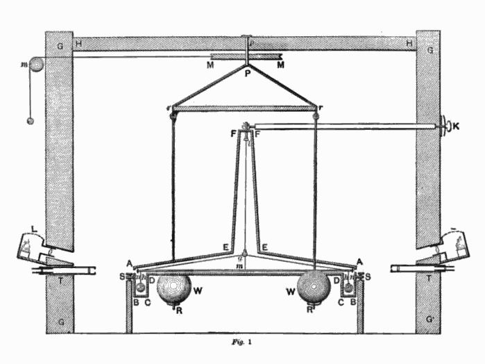
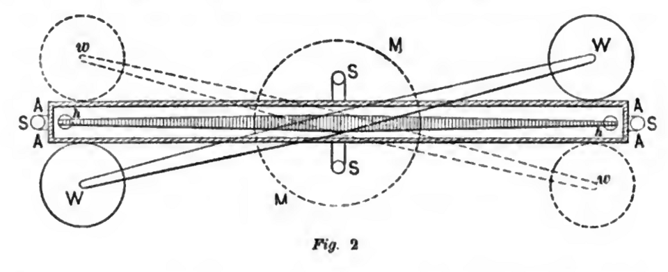

# 1. Introducción Histórica
Prácticamente desde el inicio de la humanidad, el ser humano ha observado los fenómenos naturales y ha intentado comprenderlos. La gravedad, como una de las fuerzas fundamentales de la naturaleza, ha sido objeto de estudio desde tiempos antiguos. El movimiento de los cuerpos celestes, la caída de los objetos hacia la Tierra y la sensación de peso han sido fenómenos que han despertado la curiosidad humana durante milenios. Precisamente el estudio de los cuerpos celestes ha estado presente en la mitología de muchas culturas, y ha sido un motor importante para el desarrollo de la astronomía y la física. Por otro lado, el movimiento de los objetos en la Tierra, como la caída de los cuerpos, ha sido observado y estudiado desde tiempos antiguos, lo que ha llevado a la formulación de teorías sobre la naturaleza de la gravedad.

Las primeras explicaciones sobre la gravedad, como causa del movimiento de los cuerpos en la superficie terrestre, se remontan a filósofos como Aristóteles, quien creía que los objetos caían hacia la Tierra debido a su naturaleza "pesada". Sin embargo, fue Isaac Newton quien, en el siglo XVII, formuló la ley de gravitación universal, estableciendo que todos los objetos con masa se atraen mutuamente con una fuerza proporcional a sus masas e inversamente proporcional al cuadrado de la distancia entre ellos, unificando así los fenómenos celestes y terrestres. Más tarde, en el siglo XX, Albert Einstein revolucionó nuestra comprensión de la gravedad con su teoría de la relatividad general, describiendo la gravedad no como una fuerza, sino como una curvatura del espacio-tiempo causada por la masa y la energía.

El estudio del campo gravitatorio ha sido fundamental en la historia de la física, desde las primeras observaciones de los movimientos celestes hasta las teorías modernas de la relatividad. En esta sección, exploraremos los hitos clave en el desarrollo de nuestra comprensión del campo gravitatorio.

* **Aristóteles (384-322 a.C.)**: Propuso que los objetos caen hacia la Tierra debido a su naturaleza "pesada".
* **Isaac Newton (1642-1727)**: Formuló la ley de gravitación universal, estableciendo que todos los objetos con masa se atraen mutuamente con una fuerza proporcional a sus masas e inversamente proporcional al cuadrado de la distancia entre ellos.
* **Albert Einstein (1879-1955)**: Desarrolló la teoría de la relatividad general, describiendo la gravedad como una curvatura del espacio-tiempo causada por la masa y la energía.

# 2. El Campo Gravitatorio
El campo gravitatorio es una región del espacio donde un objeto con masa experimentaría una fuerza de atracción hacia otro objeto con masa. La intensidad de esta fuerza depende de la masa de los objetos y la distancia entre ellos, según la ley de gravitación universal de Newton, y a partir de esta fuerza podremos definir el campo gravitatorio. En esta sección, trataremos conceptos fundamentales relacionados con campos en general y el campo gravitatorio en particular. A través del campo podremos posteriormente definir el potencial gravitatorio y la aceleración debida a la gravedad.

## 2.1. Definición de campo
En física, un campo es una función que asigna un valor para una magnitud física a cada punto del espacio. Esta magnitud puede ser escalar o vectorial, por lo que la asignación puede ser un número o un vector, dependiendo del tipo de campo. Ejemplos de campos escalares incluyen campos de temperaturas, presión y potencial eléctrico, mientras que ejemplos de campos vectoriales incluyen el campo de velocidad en un fluido, el campo eléctrico y el campo gravitatorio.

Los campos escalares se representan mediante una función que asigna el valor de una magnitud escalar, que es un número, a cada punto del espacio. Esto da lugar a una representación gráfica mediante líneas de contorno donde el campo toma igual valor, como sería el caso de los mapas topográficos donde se representan con lineas los puntos de igual altura o los mapas meteorológicos donde vienen representadas con líneas isobaras los puntos de igual presión atmosférica. Si el campo escalar fuese tridimensional, se representaría mediante superficies donde el campo toma igual valor, en vez de líneas.

Los campos vectoriales se representan mediante una función que asigna un vector a cada punto del espacio. La representación gráfica de un campo vectorial se realiza mediante líneas de campo, que indican la dirección y la magnitud del campo en cada punto, de forma que los vectores campo son perpendiculares a las líneas de campo. En el caso del campo de velocidad en un fluido, la velocidad de una partícula en un punto será tangente a la línea de campo en ese punto, y la magnitud de la velocidad será proporcional a la densidad de las líneas de campo.

## 2.2. Ley de gravitación universal de Newton
La ley de gravitación universal de Newton establece que todos los objetos con masa se atraen mutuamente con una fuerza proporcional a sus masas e inversamente proporcional al cuadrado de la distancia entre ellos. Matemáticamente, esta ley se expresa como: 

$$F = G \frac{m_1 m_2}{r^2}$$

donde $F$ es la fuerza de atracción gravitatoria entre dos objetos, $G$ es la constante de gravitación universal, $m_1$ y $m_2$ son las masas de los objetos, y $r$ es la distancia entre ellos. Esta ley es fundamental para entender el comportamiento de los objetos bajo la influencia de la gravedad, desde la caída de una manzana hasta el movimiento de los planetas alrededor del Sol.

::: {.callout-tip title="Constante de gravitación universal" collapse="false" icon="false"}
La constante de gravitación universal, denotada por $G$, es una constante física que aparece en la ley de gravitación universal de Newton. Su valor es aproximadamente $6.67430 \times 10^{-11} \, \text{m}^3 \text{kg}^{-1} \text{s}^{-2}$. Esta constante es fundamental para calcular la fuerza gravitatoria entre dos objetos con masa.
::::

:::: {.callout-tip title="Obtención experimental de la constante de gravitación universal" collapse="true" icon="false"}
La constante de gravitación universal $G$ se obtuvo por primera vez mediante el experimento de Cavendish en 1798. En este experimento, Henry Cavendish utilizó una balanza de torsión para medir la fuerza gravitatoria entre dos masas conocidas. A partir de las mediciones realizadas, Cavendish pudo calcular el valor de $G$ con una precisión sorprendente para la época, y su valor ha sido confirmado por numerosos experimentos posteriores. El valor de $G$ que obtuvo fue aproximadamente $6.754 \times 10^{-11} \, \text{m}^3 \text{kg}^{-1} \text{s}^{-2}$, lo que es muy cercano al valor aceptado actualmente, que es $6.67430 \times 10^{-11} \, \text{m}^3 \text{kg}^{-1} \text{s}^{-2}$, lo que representa una desviación de aproximadamente un 1.2\%.

El experimento de Cavendish no solo permitió determinar el valor de $G$, sino que también proporcionó la primera estimación de la masa de la Tierra, ya que al conocer $G$ y la fuerza gravitatoria entre la Tierra y un objeto en su superficie, se puede calcular la masa de la Tierra utilizando la ley de gravitación universal.

::: {layout-ncol=2 layout-valign=bottom}

{width=100%}

{width=100%}

:::

::: {style="text-align: center; font-size: 0.9em; color: gray;"}
Esquema del experimento de Cavendish (1797–1798). A la izquierda, vista lateral; a la derecha, vista superior.
 <small>Figuras originales del trabajo de Henry Cavendish (1798), vía Wikimedia Commons.</small>
:::

::::

La dirección de la fuerza gravitatoria es siempre hacia el objeto que genera el campo, lo que significa que la fuerza es atractiva. La magnitud de la fuerza depende de las masas de los objetos y la distancia entre ellos, lo que implica que objetos más masivos o más cercanos experimentarán una fuerza gravitatoria más fuerte. Si el origen de coordenadas se coloca en el primer cuerpo, $\vec r$ será el vector que va desde ese primer cuerpo hasta el segundo, y corresponderá con el vector de posición del segundo cuerpo. En este caso, la fuerza gravitatoria que experimentará el segundo cuerpo será:
$$\vec F = - G \frac{m_1 m_2}{r^2} \hat r$$
donde $\hat r$ es el vector unitario que apunta desde el primer cuerpo hacia el segundo. El signo negativo indica que la fuerza es atractiva, es decir, apunta hacia el primer cuerpo que genera la fuerza. 

::: {.callout-tip title="Expresión alternativa de la fuerza gravitatoria" collapse="false" icon="false"}
Un vector unitario es un vector que tiene un módulo 1 y se utiliza para indicar la dirección de un vector sin importar su módulo. Para cualquier vector $\vec a$, se puede construir el vector unitario $\hat a = \frac{\vec a}{|\vec a|}=\frac{\vec a}{a}$. En el caso de la anterior expresión del campo gravitatorio, el vector unitario $\hat r$ indica la dirección del vector que va del primer al segundo cuerpo, y que, al haber colocado el origen de coordenadas en el primer cuerpo, coincide con el vector de posición del segundo cuerpo $\vec r$. Por tanto $\hat r = \frac{\vec r}{r}$, y la fuerza gravitatoria que experimentará el segundo cuerpo se puede escribir como:
$$\vec F = - G \frac{m_1 m_2}{r^3} \vec r$$
:::

::: {.callout-note title="Ejemplo de aplicación de la ley de gravitación universal" collapse="true" icon="false"}
Supongamos que queremos calcular la fuerza gravitatoria entre la Tierra y la Luna. La masa de la Tierra es aproximadamente $5.97 \times 10^{24} \, \text{kg}$, la masa de la Luna es aproximadamente $7.35 \times 10^{22} \, \text{kg}$, y la distancia promedio entre la Tierra y la Luna es aproximadamente $384,400 \, \text{km}$ (o $3.844 \times 10^8 \, \text{m}$). Utilizando la ley de gravitación universal de Newton, podemos calcular la fuerza gravitatoria entre la Tierra y la Luna como sigue:
$$F = G \frac{m_1 m_2}{r^2} = (6.67430 \times 10^{-11} \, \text{m}^3 \text{kg}^{-1} \text{s}^{-2}) \frac{(5.97 \times 10^{24} \, \text{kg})(7.35 \times 10^{22} \, \text{kg})}{(3.844 \times 10^8 \, \text{m})^2}$$
$$F \approx 1.98 \times 10^{20} \, \text{N}$$
Esta fuerza es la que mantiene a la Luna en órbita alrededor de la Tierra, y es un ejemplo de cómo la ley de gravitación universal de Newton se aplica para entender los movimientos de los cuerpos celestes.
::::

## 2.3. Campo gravitatorio
El campo gravitatorio es una región del espacio donde un objeto con masa experimentaría una fuerza de atracción hacia otro objeto con masa. La intensidad de esta fuerza depende de la masa de los objetos y la distancia entre ellos, según la ley de gravitación universal de Newton. El campo gravitatorio se puede definir como la fuerza gravitatoria por unidad de masa que experimentaría un objeto colocado en un punto del espacio. Matemáticamente, el campo gravitatorio $\vec g$ en un punto del espacio se define como:
$$\vec g = \frac{\vec F}{m}$$
donde $\vec F$ es la fuerza gravitatoria que experimentaría un objeto de masa $m$ colocado en ese punto. Si el campo gravitatorio es generado por un objeto de masa $M$ situado en el origen de coordenadas, el campo gravitatorio en un punto del espacio con vector de posición $\vec r$ se puede expresar como:
$$\vec g = - G \frac{M}{r^3} \vec r$$
donde $r$ es la distancia desde el origen hasta el punto donde se calcula el campo gravitatorio, y el signo negativo indica que el campo gravitatorio apunta hacia el objeto que lo genera, es decir, hacia el origen de coordenadas. El campo gravitatorio es un campo vectorial, lo que significa que tiene tanto magnitud como dirección. La dirección del campo gravitatorio es siempre hacia el objeto que lo genera, lo que implica que la fuerza gravitatoria que experimentaría un objeto colocado en ese punto también estaría dirigida hacia el objeto que genera el campo. La magnitud del campo gravitatorio se puede calcular como:
$$g = G \frac{M}{r^2}$$
lo que indica que el campo gravitatorio disminuye con el cuadrado de la distancia desde el objeto que lo genera, y aumenta con la masa del objeto. El campo gravitatorio es fundamental para entender el comportamiento de los objetos bajo la influencia de la gravedad, desde la caída de una manzana hasta el movimiento de los planetas alrededor del Sol. Además, el campo gravitatorio es un concepto clave en la teoría de la relatividad general de Einstein, donde se describe la gravedad como una curvatura del espacio-tiempo causada por la masa y la energía.

## 2.4. Aceleración debida a la gravedad
La aceleración debida a la gravedad es la aceleración que experimenta un objeto debido a la fuerza gravitatoria que actúa sobre él. En la superficie de la Tierra, esta aceleración es aproximadamente $9.81 \, \text{m/s}^2$ y se denota comúnmente como $g$. La aceleración debida a la gravedad se puede calcular utilizando la ley de gravitación universal de Newton, considerando la masa de la Tierra y la distancia desde el centro de la Tierra hasta el objeto. Matemáticamente, la aceleración debida a la gravedad en la superficie de la Tierra se puede expresar como:
$$g = G \frac{M}{R^2}$$
donde $G$ es la constante de gravitación universal, $M$ es la masa de la Tierra, y $R$ es el radio de la Tierra. Esta aceleración es responsable de la caída de los objetos hacia la Tierra y es un factor importante en la dinámica de los cuerpos en la superficie terrestre. Además, la aceleración debida a la gravedad varía ligeramente con la altitud y la latitud debido a la forma de la Tierra y su rotación, pero el valor promedio de $9.81 \, \text{m/s}^2$ es comúnmente utilizado para la mayoría de los cálculos relacionados con la gravedad en la superficie terrestre.

:::: {.callout-tip title="Obtención del valor de la aceleración debida a la gravedad" collapse="true" icon="false"}
El valor de la aceleración debida a la gravedad en la superficie de la Tierra se puede obtener utilizando la ley de gravitación universal de Newton, considerando la masa de la Tierra y el radio de la Tierra. La masa de la Tierra es aproximadamente $5.97 \times 10^{24} \, \text{kg}$ y el radio de la Tierra es aproximadamente $6.371 \times 10^6 \, \text{m}$. Sustituyendo estos valores en la fórmula para calcular $g$, obtenemos:
$$g = G \frac{M}{R^2} = (6.67430 \times 10^{-11} \, \text{m}^3 \text{kg}^{-1} \text{s}^{-2}) \frac{5.97 \times 10^{24} \, kg}{(6.371 \times 10^6 \, \text{m})^2} \approx 9.81 \, \text{m/s}^2$$
Este valor es el promedio de la aceleración debida a la gravedad en la superficie de la Tierra, y es utilizado comúnmente para la mayoría de los cálculos relacionados con la gravedad en la superficie terrestre.

El radio de la Tierra no es constante, ya que la Tierra no es una esfera perfecta, sino que tiene una forma ligeramente achatada en los polos y ensanchada en el ecuador. El radio de la Tierra varía desde aproximadamente $6.356 \times 10^6 \, \text{m}$ en los polos hasta aproximadamente $6.378 \times 10^6 \, \text{m}$ en el ecuador. Sin embargo, el valor promedio del radio de la Tierra es comúnmente utilizado para cálculos relacionados con la gravedad, y es aproximadamente $6.371 \times 10^6 \, \text{m}$. La variación del radio de la Tierra afecta ligeramente el valor de la aceleración debida a la gravedad en diferentes latitudes, siendo ligeramente mayor en los polos y ligeramente menor en el ecuador debido a la forma de la Tierra y su rotación.
::::

# 3. Energía potencial y potencial gravitatorio
La fuerza gravitatoria es una fuerza central, es decir, que apunta siempre hacia el objeto que la genera, y depende únicamente de la distancia entre el objeto que la experimenta y el objeto que la genera. Todas las fuerzas centrales son conservativas, por lo que la fuerza gravitatoria es una fuerza conservativa, y se le puede asociar a ella una energía potencial. 

## 3.1. Energía potencial gravitatoria
La energía potencial gravitatoria es la energía almacenada en un sistema debido a la posición de los objetos bajo la influencia de la gravedad. Para una fuerza conservativa, como es el caso de la fuerza gravitatoria, la energía potencial se puede definir como el trabajo realizado por la fuerza conservativa para mover un objeto desde un punto de referencia hasta el punto donde se encuentra el objeto.

Recordemos que la relación entre una fuerza conservativa $\vec F$ y su energía potencial $U$ es que el trabajo de la fuerza conservativa es igual a menos la variación de la energía potencial, es decir:
$$W = \int \vec F \cdot d\vec r = -\Delta U$$
donde $W$ es el trabajo realizado por la fuerza conservativa, $\vec F$ es la fuerza conservativa, $d\vec r$ es un elemento infinitesimal del desplazamiento, y $\Delta U$ es la variación de la energía potencial. En el caso de la fuerza gravitatoria, la energía potencial gravitatoria $U$ se puede calcular integrando la fuerza gravitatoria desde un punto de referencia hasta el punto donde se encuentra el objeto. Si tomamos como punto de referencia el infinito, donde la energía potencial gravitatoria es cero, la energía potencial gravitatoria $U$ de un objeto de masa $m$ situado a una distancia $r$ de un objeto de masa $M$ se puede expresar como:
$$U = - G \frac{M m}{r}$$
donde $G$ es la constante de gravitación universal, $M$ es la masa del objeto que genera el campo gravitatorio, $m$ es la masa del objeto que experimenta la fuerza gravitatoria, y $r$ es la distancia entre los dos objetos. El signo negativo indica que la energía potencial gravitatoria es negativa, lo que refleja el hecho de que se requiere trabajo para separar los objetos y llevarlos a una distancia infinita, donde la energía potencial gravitatoria es cero. La energía potencial gravitatoria es un concepto fundamental en la física, ya que permite entender el comportamiento de los objetos bajo la influencia de la gravedad, desde la caída de una manzana hasta el movimiento de los planetas alrededor del Sol.

:::: {.callout-tip title="Energía potencial gravitatoria cerca de la superficie de la Tierra" collapse="false" icon="false"}
Cerca de la superficie de la Tierra, donde el campo gravitatorio es aproximadamente uniforme, la energía potencial gravitatoria $U$ de un objeto de masa $m$ situado a una altura $h$ sobre la superficie de la Tierra se puede expresar como:
$$U = m g h$$
donde $g$ es la aceleración debida a la gravedad, que es aproximadamente $9.81 \, m/s^2$ cerca de la superficie de la Tierra.
En este caso, la energía potencial gravitatoria es positiva, lo que refleja el hecho de que se requiere trabajo para elevar el objeto a una altura $h$ sobre la superficie de la Tierra. Esta expresión es una aproximación válida para alturas pequeñas en comparación con el radio de la Tierra, donde el campo gravitatorio puede considerarse uniforme.
::::

## 3.2. Potencial gravitatorio
El potencial gravitatorio es una medida de la energía potencial gravitatoria por unidad de masa en un punto del espacio. Se define como el trabajo realizado por la fuerza gravitatoria para mover un objeto de masa $m$ desde un punto de referencia hasta el punto donde se encuentra el objeto, dividido por la masa del objeto. Matemáticamente, el potencial gravitatorio $\Phi$ en un punto del espacio se puede expresar como:
$$\Phi = \frac{U}{m}$$
donde $U$ es la energía potencial gravitatoria y $m$ es la masa del objeto que experimenta la fuerza gravitatoria. Si tomamos como punto de referencia el infinito, donde el potencial gravitatorio es cero, el potencial gravitatorio $\Phi$ de un objeto situado a una distancia $r$ de un objeto de masa $M$ se puede expresar como:
$$\Phi = - G \frac{M}{r}$$
donde $G$ es la constante de gravitación universal, $M$ es la masa del objeto que genera el campo gravitatorio, y $r$ es la distancia entre el objeto que genera el campo y el punto donde se calcula el potencial gravitatorio. El signo negativo indica que el potencial gravitatorio es negativo, lo que refleja el hecho de que se requiere trabajo para separar los objetos y llevarlos a una distancia infinita, donde el potencial gravitatorio es cero. El potencial gravitatorio es un concepto fundamental en la física, ya que permite entender el comportamiento de los objetos bajo la influencia de la gravedad, desde la caída de una manzana hasta el movimiento de los planetas alrededor del Sol. 

## 3.3. Relación entre el campo gravitatorio y el potencial gravitatorio
El campo gravitatorio $\vec g$ y el potencial gravitatorio $\Phi$ están relacionados entre sí a través de la siguiente relación:
$$\vec g = - \nabla \Phi$$
donde $\nabla$ es el operador nabla, que se utiliza para calcular el gradiente de una función escalar. Esta relación indica que el campo gravitatorio es igual al negativo del gradiente del potencial gravitatorio, lo que significa que el campo gravitatorio apunta en la dirección de la mayor disminución del potencial gravitatorio. En otras palabras, el campo gravitatorio indica la dirección en la que un objeto se movería si se colocara en ese punto del espacio, y la magnitud del campo gravitatorio indica la fuerza gravitatoria que experimentaría un objeto de masa $m$ colocado en ese punto. Esta relación es fundamental para entender el comportamiento de los objetos bajo la influencia de la gravedad, desde la caída de una manzana hasta el movimiento de los planetas alrededor del Sol. 

# 4. Movimiento bajo la influencia de la gravedad
El movimiento de los objetos bajo la influencia de la gravedad es un tema fundamental en la física, y se puede describir utilizando las leyes del movimiento de Newton y la ley de gravitación universal. Distinguiremos entre el movimiento de un objeto en un campo gravitatorio uniforme y el movimiento de un objeto en un campo gravitatorio no uniforme. 

## 4.1. Movimiento en un campo gravitatorio uniforme
En un campo gravitatorio uniforme, la fuerza gravitatoria que actúa sobre un objeto es constante en magnitud y dirección. Esto ocurre, por ejemplo, cerca de la superficie de la Tierra, donde el campo gravitatorio es aproximadamente uniforme. En este caso, la fuerza gravitatoria que actúa sobre un objeto de masa $m$ es:
$$\vec F = m \vec g$$
donde $\vec g$ es la aceleración debida a la gravedad, que es aproximadamente $9.81 \, m/s^2$ cerca de la superficie de la Tierra. La aceleración $\vec a$ del objeto se puede calcular utilizando la segunda ley de Newton, que establece que la fuerza es igual a la masa por la aceleración, es decir:
$$\vec F = m \vec a$$
Sustituyendo la expresión de la fuerza gravitatoria, obtenemos:
$$m \vec a = m \vec g$$
Dividiendo ambos lados por $m$, obtenemos la aceleración del objeto bajo la influencia de la gravedad:
$$\vec a = \vec g$$
Esto significa que en un campo gravitatorio uniforme, todos los objetos experimentan la misma aceleración debido a la gravedad, independientemente de su masa. Este es el principio de equivalencia, que establece que la aceleración debida a la gravedad es la misma para todos los objetos, lo que fue una de las ideas clave que llevó a Einstein a desarrollar la teoría de la relatividad general.

Desde el punto de vista energético, la energía mecánica de un objeto en un campo gravitatorio uniforme se puede expresar como la suma de su energía cinética y su energía potencial gravitatoria, es decir:
$$E = K + U = \frac{1}{2} m v^2 + m g h$$
donde $h$ es la altura del objeto sobre la superficie de la Tierra. En un campo gravitatorio uniforme, la energía mecánica total del objeto se conserva, lo que significa que a medida que el objeto se mueve hacia abajo por el campo gravitatorio, su energía potencial gravitatoria disminuye y su energía cinética aumenta de tal manera que la suma de ambas se mantiene constante. Esto se puede expresar como:
$$E = \text{constante}$$
lo que implica que:
$$\frac{1}{2} m v^2 + m g h = \text{constante}$$
Esta relación muestra cómo la energía mecánica del objeto se conserva durante su movimiento bajo la influencia de un campo gravitatorio uniforme, y cómo la energía potencial gravitatoria se convierte en energía cinética a medida que el objeto se mueve hacia abajo por el campo gravitatorio.

:::: {.callout-note title="Ejemplo: movimiento en un plano inclinado sin rozamiento: fuerzas" collapse="true" icon="false"}
Supongamos que tenemos un objeto de masa $m$ situado en un plano inclinado con un ángulo $\theta$ respecto a la horizontal, y que el plano está bajo la influencia de un campo gravitatorio uniforme. La fuerza gravitatoria que actúa sobre el objeto se puede descomponer en dos componentes: una componente paralela al plano inclinado, que es responsable del movimiento del objeto hacia abajo por el plano, y una componente perpendicular al plano inclinado, que es responsable de la fuerza normal que el plano ejerce sobre el objeto. La componente paralela de la fuerza gravitatoria se puede calcular como:
$$F_{\parallel} = m g \sin \theta$$
y la componente perpendicular de la fuerza gravitatoria se puede calcular como:
$$F_{\perp} = m g \cos \theta$$
La aceleración del objeto hacia abajo por el plano inclinado se puede calcular utilizando la segunda ley de Newton, considerando solo la componente paralela de la fuerza gravitatoria, es decir:
$$m a = m g \sin \theta$$
Dividiendo ambos lados por $m$, obtenemos la aceleración del objeto hacia abajo por el plano inclinado:
$$a = g \sin \theta$$
Esto muestra que la aceleración del objeto hacia abajo por el plano inclinado depende del ángulo del plano inclinado, y es menor que la aceleración debida a la gravedad $g$ cuando el ángulo $\theta$ es menor que $90^\circ$.
::::

:::: {.callout-note title="Ejemplo: movimiento en un plano inclinado sin rozamiento: energía" collapse="true" icon="false"}
Supongamos que tenemos un objeto de masa $m$ situado en un plano inclinado con un ángulo $\theta$ respecto a la horizontal, y que el plano está bajo la influencia de un campo gravitatorio uniforme. La energía potencial gravitatoria del objeto se puede calcular como:
$$U = m g h$$
donde $h$ es la altura del objeto sobre la superficie de la Tierra, que se puede expresar en términos de la distancia $d$ del objeto al punto más bajo del plano inclinado como $h = d \sin \theta$. Por lo tanto, la energía potencial gravitatoria del objeto se puede expresar como:
$$U = m g d \sin \theta$$
Si el objeto se mueve hacia abajo por el plano inclinado, su energía potencial gravitatoria disminuirá, y su energía cinética aumentará. La energía mecánica total del objeto se puede expresar como la suma de su energía cinética y su energía potencial gravitatoria, es decir:
$$E = K + U = \frac{1}{2} m v^2 + m g d \sin \theta$$
Si no hay fuerzas de fricción u otras fuerzas no conservativas actuando sobre el objeto, la energía mecánica total del objeto se conservará, lo que significa quea medida que el objeto se mueve hacia abajo por el plano inclinado, su energía potencial gravitatoria disminuirá y su energía cinética aumentará de tal manera que la suma de ambas se mantendrá constante. Esto se puede expresar como:
$$E = \text{constante}$$
lo que implica que:
$$\frac{1}{2} m v^2 + m g d \sin \theta = \text{constante}$$
Esta relación muestra cómo la energía mecánica del objeto se conserva durante su movimiento por el plano inclinado bajo la influencia de un campo gravitatorio uniforme, y cómo la energía potencial gravitatoria se convierte en energía cinética a medida que el objeto se mueve hacia abajo por el plano inclinado.
::::

:::: {.callout-note title="Ejemplo: movimiento en un plano inclinado con rozamiento: fuerzas" collapse="true" icon="false"}
Supongamos que tenemos un objeto de masa $m$ situado en un plano inclinado con un ángulo $\theta$ respecto a la horizontal, que el plano está bajo la influencia de un campo gravitatorio uniforme y que el cuerpo desciende por el plano. Además, supongamos que hay una fuerza de fricción cinética actuando sobre el objeto, con un coeficiente de fricción cinética $\mu_k$. La fuerza de fricción cinética se puede calcular como:
$$F_{\text{fricción}} = \mu_k N $$

donde $N$ es la fuerza normal que el plano ejerce sobre el objeto, que es igual a la componente perpendicular de la fuerza gravitatoria, es decir:
$$N = F_{\perp} = m g \cos \theta$$
Por lo tanto, la fuerza de fricción cinética se puede expresar como:
$$F_{\text{fricción}} = \mu_k m g \cos \theta$$
Esta fuerza de fricción actúa en dirección opuesta al movimiento del objeto, es decir, hacia arriba por el plano inclinado, ya que hemos supuesto que el cuerpo baja (si el cuerpo subiera, la fuerza de fricción iría hacia abajo).

En la dirección del plano, las fuerzas que existen son la componente paralela del peso, que va hacia abajo del plano, y la fricción obtenida anteriormente, de forma que la fuerza neta que actúa sobre el objeto es la diferencia entre la componente paralela de la fuerza gravitatoria y la fuerza de fricción, es decir:
$$F_{\text{neto}} = F_{\parallel} - F_{\text{fricción}} = m g \sin \theta - \mu_k m g \cos \theta$$
La aceleración del objeto hacia abajo por el plano inclinado se puede calcular utilizando la segunda ley de Newton, considerando la fuerza neta que actúa sobre el objeto, es decir:
$$m a = m g \sin \theta - \mu_k m g \cos \theta$$
Dividiendo ambos lados por $m$, obtenemos la aceleración del objeto hacia abajo por el plano inclinado con fricción:
$$a = g \sin \theta - \mu_k g \cos \theta$$
Esta relación muestra cómo la aceleración del objeto hacia abajo por el plano inclinado se ve afectada por la presencia de una fuerza de fricción, y cómo la aceleración es menor que en el caso sin fricción debido a la fuerza de fricción que actúa en dirección opuesta al movimiento del objeto.
::::

:::: {.callout-note title="Ejemplo: movimiento en un plano inclinado con rozamiento: energía" collapse="true" icon="false"}
Supongamos que tenemos un objeto de masa $m$ situado en un plano inclinado con un ángulo $\theta$ respecto a la horizontal, que el plano está bajo la influencia de un campo gravitatorio uniforme y que el cuerpo desciende por el plano. Además, supongamos que hay una fuerza de fricción cinética actuando sobre el objeto, con un coeficiente de fricción cinética $\mu_k$. La energía potencial gravitatoria del objeto se puede calcular como:
$$U = m g h$$
donde $h$ es la altura del objeto sobre la superficie de la Tierra, que se puede expresar en términos de la distancia $d$ del objeto al punto más bajo del plano inclinado como $h = d \sin \theta$. Por lo tanto, la energía potencial gravitatoria del objeto se puede expresar como:
$$U = m g d \sin \theta$$
Si el objeto se mueve hacia abajo por el plano inclinado, su energía potencial gravitatoria disminuirá, y su energía cinética aumentará. Sin embargo, debido a la presencia de la fuerza de fricción, la energía mecánica total del objeto no se conservará, ya que la fuerza de fricción realiza un trabajo negativo sobre el objeto, disipando energía mecánica en forma de calor. La energía mecánica total del objeto se puede expresar como la suma de su energía cinética y su energía potencial gravitatoria, es decir:
$$E = K + U = \frac{1}{2} m v^2 + m g d \sin \theta$$
A medida que el objeto se mueve hacia abajo por el plano inclinado, su energía potencial gravitatoria disminuirá y su energía cinética aumentará, pero la energía mecánica total del objeto disminuirá debido al trabajo realizado por la fuerza de fricción, lo que se puede expresar como:
$$E = \text{no constante}$$
lo que implica que:
$$\frac{1}{2} m v^2 + m g d \sin \theta < \text{constante}$$
Esta relación muestra cómo la energía mecánica del objeto no se conserva durante su movimiento por el plano inclinado bajo la influencia de un campo gravitatorio uniforme debido a la presencia de una fuerza de fricción, y cómo la energía potencial gravitatoria se convierte en energía cinética a medida que el objeto se mueve hacia abajo por el plano inclinado, pero parte de esa energía mecánica se disipa en forma de calor debido a la fuerza de fricción.
::::

## 4.2. Movimiento en un campo gravitatorio no uniforme
Para un objeto de masa $m$ situado a una distancia $r$ de un objeto de masa $M$, la fuerza gravitatoria que actúa sobre el objeto de masa $m$ es:
$$\vec F = - G \frac{M m}{r^3} \vec r$$
donde $\vec r$ es el vector de posición del objeto de masa $m$ cono origen en el objeto de masa $M$. La aceleración $\vec a$ del objeto de masa $m$ se puede calcular utilizando la segunda ley de Newton, que establece que la fuerza es igual a la masa por la aceleración, es decir:
$$\vec F = m \vec a$$
Sustituyendo la expresión de la fuerza gravitatoria, obtenemos:
$$m \vec a = - G \frac{M m}{r^3} \vec r$$
Dividiendo ambos lados por $m$, obtenemos la aceleración del objeto de masa $m$ bajo la influencia de la gravedad:
$$\vec a = - G \frac{M}{r^3} \vec r$$
Esta ecuación describe el movimiento de un objeto bajo la influencia de la gravedad, y se puede utilizar para analizar el movimiento de los planetas alrededor del Sol, la caída de los objetos hacia la Tierra, y otros fenómenos relacionados con la gravedad. 

La energía mecánica de un objeto en un campo gravitatorio es la suma de su energía cinética y su energía potencial gravitatoria. La energía cinética $K$ de un objeto de masa $m$ que se mueve con una velocidad $\vec v$ se puede expresar como:
$$K = \frac{1}{2} m v^2$$
donde $v$ es la magnitud de la velocidad del objeto. La energía potencial gravitatoria $U$ de un objeto de masa $m$ situado a una distancia $r$ de un objeto de masa $M$ se puede expresar como:
$$U = - G \frac{M m}{r}$$
donde $G$ es la constante de gravitación universal, $M$ es la masa del objeto que genera el campo gravitatorio, y $r$ es la distancia entre los dos objetos. La energía mecánica $E$ de un objeto en un campo gravitatorio se puede expresar como:
$$E = K + U = \frac{1}{2} m v^2 - G \frac{M m}{r}$$
La energía mecánica es un concepto fundamental en la física, ya que permite entender el comportamiento de los objetos bajo la influencia de la gravedad, desde la caída de una manzana hasta el movimiento de los planetas alrededor del Sol. 

# 5. Teorema de Gauss para la gravedad
El teorema de Gauss para la gravedad es una herramienta matemática que se utiliza para calcular el campo gravitatorio generado por una distribución de masa. Este teorema establece que el flujo del campo gravitatorio a través de una superficie cerrada es proporcional a la masa total encerrada por esa superficie. Matemáticamente, el teorema de Gauss para la gravedad se puede expresar como:
$$\oint \vec g \cdot d\vec A = -4 \pi G M_{\text{enc}}$$
donde $\oint \vec g \cdot d\vec A$ es el flujo del campo gravitatorio a través de una superficie cerrada, $G$ es la constante de gravitación universal, y $M_{\text{enc}}$ es la masa total encerrada por la superficie. El signo negativo indica que el campo gravitatorio apunta hacia la masa que lo genera, lo que refleja el hecho de que la fuerza gravitatoria es atractiva. El teorema de Gauss para la gravedad es una herramienta poderosa para calcular el campo gravitatorio generado por distribuciones de masa con simetría, como es el caso de una esfera de masa uniforme, donde el campo gravitatorio fuera de la esfera se puede calcular fácilmente utilizando el teorema de Gauss, y se encuentra que el campo gravitatorio fuera de la esfera es el mismo que si toda la masa de la esfera estuviera concentrada en un punto en el centro de la esfera. Este resultado es conocido como el teorema de la esfera, y es un caso particular del teorema de Gauss para la gravedad.

# 6. Campo gravitatorio Terrestre
El campo gravitatorio terrestre es el campo gravitatorio generado por la masa de la Tierra. Este campo gravitatorio es responsable de la fuerza de gravedad que experimentamos en la superficie de la Tierra, y es fundamental para entender el comportamiento de los objetos bajo la influencia de la gravedad en la Tierra. El campo gravitatorio terrestre se puede aproximar como un campo gravitatorio uniforme cerca de la superficie de la Tierra, donde la aceleración debida a la gravedad es aproximadamente $9.81 \,\text{m/s}^2$. Sin embargo, a medida que nos alejamos de la superficie de la Tierra, el campo gravitatorio terrestre se vuelve no uniforme, y su intensidad disminuye con la distancia desde el centro de la Tierra. El campo gravitatorio terrestre también se ve afectado por la rotación de la Tierra, lo que provoca una ligera disminución de la aceleración debida a la gravedad en el ecuador en comparación con los polos. Además, el campo gravitatorio terrestre se ve afectado por la distribución de masa en la Tierra, lo que provoca pequeñas variaciones en la aceleración debida a la gravedad en diferentes lugares de la superficie de la Tierra. El campo gravitatorio terrestre es un tema fundamental en la física, ya que permite entender el comportamiento de los objetos bajo la influencia de la gravedad en la Tierra, desde la caída de una manzana hasta el movimiento de los satélites alrededor de la Tierra. 

## 6.1. Movimiento de los satélites alrededor de la Tierra
El movimiento de los satélites alrededor de la Tierra se puede describir utilizando las leyes del movimiento de Newton y la ley de gravitación universal. Un satélite en órbita alrededor de la Tierra experimenta una fuerza gravitatoria que actúa como fuerza centrípeta, manteniéndolo en órbita. La fuerza gravitatoria que actúa sobre un satélite de masa $m$ situado a una distancia $r$ del centro de la Tierra se puede expresar como:
$$\vec F = - G \frac{M m}{r^3} \vec r$$
donde $G$ es la constante de gravitación universal, $M$ es la masa de la Tierra, y $\vec r$ es el vector de posición del satélite con origen en el centro de la Tierra. La aceleración $\vec a$ del satélite se puede calcular utilizando la segunda ley de Newton, que establece que la fuerza es igual a la masa por la aceleración, es decir:
$$\vec F = m \vec a$$
Sustituyendo la expresión de la fuerza gravitatoria, obtenemos:
$$m \vec a = - G \frac{M m}{r^3} \vec r$$
Dividiendo ambos lados por $m$, obtenemos la aceleración del satélite bajo la influencia de la gravedad terrestre:
$$\vec a = - G \frac{M}{r^3} \vec r$$
Esta ecuación describe el movimiento de un satélite bajo la influencia de la gravedad terrestre, y se puede utilizar para analizar el movimiento de los satélites alrededor de la Tierra, la caída de los objetos hacia la Tierra, y otros fenómenos relacionados con la gravedad terrestre. 

Si la trayectoria del satélite es circular, la aceleración centrípeta necesaria para mantener el satélite en órbita se puede expresar como:
$$a = \frac{v^2}{r}$$
donde $v$ es la velocidad del satélite y $r$ es la distancia desde el centro de la Tierra. Igualando esta expresión con la aceleración debida a la gravedad, obtenemos:
$$\frac{v^2}{r} = G \frac{M}{r^2}$$
Multiplicando ambos lados por $r$, obtenemos la velocidad del satélite en órbita circular alrededor de la Tierra:
$$v = \sqrt{G \frac{M}{r}}$$
Esta relación muestra que la velocidad de un satélite en órbita circular alrededor de la Tierra depende de la masa de la Tierra y la distancia del satélite al centro de la Tierra, y es un resultado fundamental para entender el movimiento de los satélites alrededor de la Tierra.

A partir de esta relación, también podemos calcular el periodo del satélite en órbita circular alrededor de la Tierra. El periodo $T$ es el tiempo que tarda el satélite en completar una órbita completa, y se puede calcular utilizando la relación entre la velocidad del satélite y la circunferencia de la órbita, es decir:
$$T = \frac{2\pi r}{v}$$
Sustituyendo la expresión de la velocidad del satélite, obtenemos:
$$T = \frac{2\pi r}{\sqrt{G \frac{M}{r}}} = 2\pi \sqrt{\frac{r^3}{GM}}$$
Esta relación muestra que el periodo de un satélite en órbita circular alrededor de la Tierra depende de la masa de la Tierra y la distancia del satélite al centro de la Tierra, y es un resultado fundamental para entender el movimiento de los satélites alrededor de la Tierra.

:::: {.callout-note title="Ejemplo: Velocidad de un satélite en órbita circular" collapse="true" icon="false"}
Supongamos que tenemos un satélite en órbita circular alrededor de la Tierra a una distancia de $r = 7.0 \times 10^6 \, \text{m}$ desde el centro de la Tierra. La masa de la Tierra es aproximadamente $M = 5.97 \times 10^{24} \, \text{kg}$ y la constante de gravitación universal es $G = 6.67430 \times 10^{-11} \, \text{m}^3 \text{kg}^{-1} \text{s}^{-2}$. Sustituyendo estos valores en la fórmula para calcular la velocidad del satélite, obtenemos:
$$v = \sqrt{G \frac{M}{r}} = \sqrt{(6.67430 \times 10^{-11} \, \text{m}^3 \text{kg}^{-1} \text{s}^{-2}) \frac{5.97 \times 10^{24} \, \text{kg}}{7.0 \times 10^6 \, \text{m}}} \approx 7.12 \times 10^3 \, \text{m/s}$$
Esta es la velocidad que el satélite debe mantener para permanecer en órbita circular alrededor de la Tierra a esa distancia. Si el satélite se mueve a una velocidad menor, caerá hacia la Tierra, y si se mueve a una velocidad mayor, se alejará de la Tierra y eventualmente escapará de su influencia gravitatoria. Esta relación es fundamental para entender el movimiento de los satélites alrededor de la Tierra.
::::

:::: {.callout-note title="Ejemplo: Periodo de un satélite en órbita circular" collapse="true" icon="false"}
Supongamos que tenemos un satélite en órbita circular alrededor de la Tierra a una distancia de $r = 7.0 \times 10^6 \, \text{m}$ desde el centro de la Tierra. La masa de la Tierra es aproximadamente $M = 5.97 \times 10^{24} \, \text{kg}$ y la constante de gravitación universal es $G = 6.67430 \times 10^{-11} \, \text{m}^3 \text{kg}^{-1} \text{s}^{-2}$. Sustituyendo estos valores en la fórmula para calcular el periodo del satélite, obtenemos:
$$T = 2\pi \sqrt{\frac{r^3}{GM}} = 2\pi \sqrt{\frac{(7.0 \times 10^6 \, \text{m})^3}{(6.67430 \times 10^{-11} \, \text{m}^3 \text{kg}^{-1} \text{s}^{-2})(5.97 \times 10^{24} \, \text{kg})}} \approx 5.42 \times 10^3 \, \text{s}$$
Este es el tiempo que el satélite tarda en completar una órbita circular alrededor de la Tierra a esa distancia. Esta relación es fundamental para entender el movimiento de los satélites alrededor de la Tierra.
::::

:::: {.callout-note title="Ejemplo: Radio de una órbita geoestacionaria" collapse="true" icon="false" }
Queremos calcular el radio de una órbita geoestacionaria alrededor de la Tierra, es decir, una órbita en la que un satélite permanece fijo respecto a un punto en la superficie de la Tierra. Para que esto ocurra, el periodo del satélite debe ser igual al periodo de rotación de la Tierra, que es aproximadamente $T = 24 \, \text{h} = 86400 \, \text{s}$. La masa de la Tierra es aproximadamente $M = 5.97 \times 10^{24} \, \text{kg}$ y la constante de gravitación universal es $G = 6.67430 \times 10^{-11} \, \text{m}^3 \text{kg}^{-1} \text{s}^{-2}$. Sustituyendo estos valores en la fórmula para calcular el radio del satélite en órbita circular, obtenemos:
$$r = \left( \frac{G M T^2}{4 \pi^2} \right)^{1/3} = \left( \frac{(6.67430 \times 10^{-11} \, \text{m}^3 \text{kg}^{-1} \text{s}^{-2})(5.97 \times 10^{24} \, \text{kg})(86400 \, \text{s})^2}{4 \pi^2} \right)^{1/3} \approx 4.23 \times 10^7 \, \text{m}$$
Este es el radio de la órbita geoestacionaria alrededor de la Tierra, medido desde el centro de la Tierra. Esta relación es fundamental para entender el movimiento de los satélites geoestacionarios alrededor de la Tierra, que son utilizados para comunicaciones, meteorología y otros fines.
::::

## 6.2. Velocidad de escape de la Tierra
La velocidad de escape de la Tierra es la velocidad mínima que un objeto debe alcanzar para escapar completamente de la influencia gravitatoria de la Tierra. Esta velocidad se puede calcular utilizando la conservación de la energía. Para que un objeto escape de la Tierra, su energía mecánica total debe ser mayor o igual a cero, lo que significa que la energía cinética del objeto debe ser al menos igual a la energía potencial gravitatoria negativa del objeto en la superficie de la Tierra. La energía cinética $K$ de un objeto de masa $m$ que se mueve con una velocidad $v$ se puede expresar como:
$$K = \frac{1}{2} m v^2$$
La energía potencial gravitatoria $U$ de un objeto de masa $m$ situado a una distancia $r$ de un objeto de masa $M$ se puede expresar como:
$$U = - G \frac{M m}{r}$$
En la superficie de la Tierra, donde $r$ es igual al radio de la Tierra $R$, la energía potencial gravitatoria del objeto se puede expresar como:
$$U = - G \frac{M m}{R}$$
Para que el objeto escape de la Tierra, su energía mecánica total debe ser mayor o igual a cero, lo que implica que:
$$\frac{1}{2} m v^2 - G \frac{M m}{R} \geq 0$$
Multiplicando ambos lados por $2/m$, obtenemos:
$$v^2 \geq 2 G \frac{M}{R}$$
Tomando la raíz cuadrada de ambos lados, obtenemos la velocidad de escape de la Tierra:
$$v \geq \sqrt{2 G \frac{M}{R}}$$
Esta relación muestra que la velocidad de escape de la Tierra depende de la masa de la Tierra y el radio de la Tierra, y es un resultado fundamental para entender el movimiento de los objetos bajo la influencia de la gravedad terrestre, desde la caída de una manzana hasta el lanzamiento de cohetes y satélites al espacio. 

:::: {.callout-note title="Ejemplo: Cálculo de velocidad de escape en la Tierra" collapse="true" icon="false" }
Para calcular la velocidad de escape de la Tierra, partimos de la fórmula derivada de la conservación de la energía. La masa de la Tierra es aproximadamente $M = 5.97 \times 10^{24} \, \text{kg}$, el radio de la Tierra es aproximadamente $R = 6.371 \times 10^6 \, \text{m}$, y la constante de gravitación universal es $G = 6.67430 \times 10^{-11} \, \text{m}^3 \text{kg}^{-1} \text{s}^{-2}$. Sustituyendo estos valores en la fórmula para calcular la velocidad de escape, obtenemos:
$$v = \sqrt{2 G \frac{M}{R}} = \sqrt{2 (6.67430 \times 10^{-11} \, \text{m}^3 \text{kg}^{-1} \text{s}^{-2}) \frac{5.97 \times 10^{24} \, \text{kg}}{6.371 \times 10^6 \, \text{m}}} \approx 1.12 \times 10^4 \, \text{m/s}$$
Esta es la velocidad mínima que un objeto debe alcanzar para escapar completamente de la influencia gravitatoria de la Tierra. Si un objeto se mueve a una velocidad menor que esta, eventualmente caerá de nuevo hacia la Tierra debido a la fuerza gravitatoria. Esta relación es fundamental para entender el movimiento de los objetos bajo la influencia de la gravedad terrestre, desde la caída de una manzana hasta el lanzamiento de cohetes y satélites al espacio.
::::

:::: {.callout-note title="Ejemplo: Cálculo de la velocidad de escape en la Luna" collapse="true" icon="false" }
Para calcular la velocidad de escape de la Luna, partimos de la fórmula derivada de la conservación de la energía. La masa de la Luna es aproximadamente $M = 7.35 \times 10^{22} \, \text{kg}$, el radio de la Luna es aproximadamente $R = 1.737 \times 10^6 \, \text{m}$, y la constante de gravitación universal es $G = 6.67430 \times 10^{-11} \, \text{m}^3 \text{kg}^{-1} \text{s}^{-2}$. Sustituyendo estos valores en la fórmula para calcular la velocidad de escape, obtenemos:
$$v = \sqrt{2 G \frac{M}{R}} = \sqrt{2 (6.67430 \times 10^{-11} \, \text{m}^3 \text{kg}^{-1} \text{s}^{-2}) \frac{7.35 \times 10^{22} \, \text{kg}}{1.737 \times 10^6 \, \text{m}}} \approx 2.38 \times 10^3 \, \text{m/s}$$
Esta es la velocidad mínima que un objeto debe alcanzar para escapar completamente de la influencia gravitatoria de la Luna. Si un objeto se mueve a una velocidad menor que esta, eventualmente caerá de nuevo hacia la Luna debido a la fuerza gravitatoria. Esta relación es fundamental para entender el movimiento de los objetos bajo la influencia de la gravedad lunar, desde la caída de una roca hasta el lanzamiento de cohetes y satélites al espacio desde la superficie lunar.
::::