# 1. Ley de Coulomb 
Hay dos tipos de carga eléctrica: positiva y negativa. La unidad de carga en el sistema internacional es el Culombio, $\text{ C}$: 
$$1\text{C} =\text{ carga de }6.25 \times 10^{18}\text{ electrones}$$

También existe un principio de conservación de la carga eléctrica: la carga eléctrica de un sistema aislado permanece constante, es decir, la suma algebraica de las cargas positivas y negativas no varía.

Coulomb (1736-1806) estudió las fuerzas entre cargas eléctricas y formuló una ley que la describe.

> **Ley de Coulomb:** La fuerza entre dos cargas eléctricas puntuales $q_1$ y $q_2$, es directamente proporcional al valor de las cargas e inversamente proporcional al cuadrado de la distancia r que las separa:
>
> $$\vec{F} = \pm K \frac{q_{1} q_{2}}{r^{2}} \hat{u_{r}}$$

- $\vec{F}$ es un vector de modo que tiene: módulo, dirección y sentido, además de unidades \[Newton\].

- $K$ es una constante cuyo valor depende del medio en el que se encuentran las cargas: $K=\frac{1}{4\pi\varepsilon_0}$, donde $\varepsilon_0$ es la constante dieléctrica o permitividad del medio (en el vacío, $K=8.99 \cdot 10^9 \text{ Nm}^2\text{/C}^2$).

- $\hat{u_r}$ es el vector unitario en la dirección de ambas cargas puntuales.

La fuerza es **central**, o sea, que tiene la dirección de la recta que une las cargas, y puede ser:

- repulsiva si las cargas tienen el mismo signo.

- atractiva si las cargas tienen signo opuesto.

Por otra parte, la ley de Newton para la gravitación y la de Coulomb para la fuerza eléctrica tienen analogías y diferencias claras:

\

                          Analogías                                                               Diferencias
  --------------------------------------------------------- ----------------------------------------------------------------------------------------
                Expresión matemática análoga                                Gravitatoria asociada a masa. Eléctrica asociada a carga
                Proporcionales a carga o masa                             Gravitatoria siempre atractiva.Eléctrica atractiva/repulsiva
   Inversamente proporcionales al cuadrado de la distancia                    El valor de $G$ no depende del medio. El valor de $K$ sí
                      Fuerzas centrales                      $G \ll K$ . Fuerza gravitatoria mucho menor que fuerza eléctrica

\

::::{.callout-note title="Ejemplo:" collapse="false" icon="false"}
La distancia entre el electrón y el protón en el átomo de hidrógeno es de aproximadamente $5.3\cdot10^{-11}\text{ m}$. Calcula el valor del módulo de la fuerza electrostática que ejerce el protón sobre el electrón.

:::{.callout-note title="Solución:" collapse="true" icon="false"}

Haciendo uso de la ley de Coulomb, es posible hallar el módulo de la fuerza electrostática:

$$F = K \frac{\left|q_{1}q_{2}\right|}{r^{2}} = K \frac{e^2}{r^2} = \frac{8.99\cdot10^{9}\cdot1.6\cdot10^{-19}}{\left(5.3\cdot10^{-11}\right)^{2}}$$

$$F = 8.19\cdot10^{-8}\text{ N}$$
:::
::::

::::{.callout-note title="Ejemplo:" collapse="false" icon="false"}
Tres cargas se encuentran alineadas sobre el eje $X$. La carga $q_1$ están en el origen $\left(0,0\right)$, $q_2$ en el punto $\left(2,0\right)$ y $q_0$ se encuentra en el punto $\left(x,0\right)$, con $x > 2\text{ m}$ (todas estas medidas están expresadas en metros).

a.  Determine la fuerza resultante sobre $q_0$ que ejercen las demás cargas si $q_1=+50  \text{ nC}$, $q_2=-5  \text{ nC}$ y $3.5\text{ m}$.

::: {style="text-align:center;"}
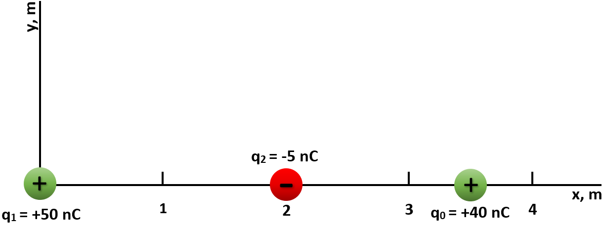{width="35%"}
:::

b.  Halle la fuerza neta sobre $q_0$ debida a las demás cargas en el intervalo $2  \text{ m} < x < \infty$.

::: {style="text-align:center;"}
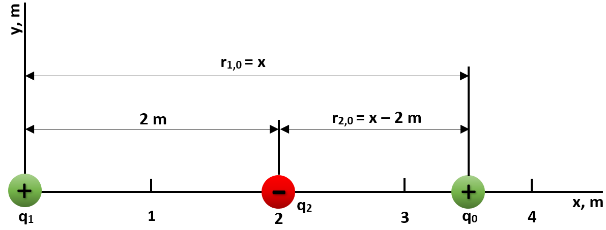{width="35%"}
:::

:::{.callout-note title="Solución:" collapse="true" icon="false"}

La  fuerza neta sobre $q_0$ es el vector suma de la fuerza $\vec{F}_{1,0}$ ejercida por $q_1$ y la fuerza $\vec{F}_{2,0}$ ejercida por $q_2$. Las fuerzas individuales se determinan mediante la ley de Coulomb. Obsérvese que $\hat{r}_{1,0}=\hat{r}_{2,0}=\hat{\imath}$, pues ambos versores se encuentran en la dirección positiva de $X$.

a.  Fuerza $\vec{F}_{1,0}$ debida a $q_1$: 
$$\vec{F}_{1,0}=K\frac{q_1  q_0}{r_{1,0}^2}\hat{r_{1,0}}=\frac{\left(8.99\cdot10^{9}\text{ N}\cdot\text{m}^{2}/\text{C}^{2}\right)\left(50\cdot10^{-9}\text{ C}\right)\left(40\cdot10^{-9}\text{ C}\right)}{\left(3.5\text{ m}\right)^{2}}\hat{\imath}=\left(1.469\cdot10^{-6}\text{ N}\right)  \hat{\imath}$$

    Fuerza $\vec{F}_{2,0}$ debida a $q_2$:
    $$\vec{F}_{2,0}=K\frac{q_2  q_0}{r_{2,0}^2}\hat{r_{2,0}}=\frac{\left(8.99\cdot10^{9}\text{ N}\cdot\text{m}^{2}/\text{C}^{2}\right)\left(-5\cdot10^{-9}\text{ C}\right)\left(40\cdot10^{-9}\text{ C}\right)}{\left(1.5\text{ m}\right)^{2}}\hat{\imath}=\left(-0.8\cdot10^{-6}\text{ N}\right)\hat{\imath}$$
    La fuerza neta ejercida sobre $q_0$ será la suma de ambas:
    $$\vec{F}_{\text{neta}}=\vec{F}_{1,0}+\vec{F}_{2,0}=\left(0.669\cdot10^{-6}  \text{ N}\right)\hat{\imath}$$
    
    
b.  La expresión de la fuerza debida a $q_1$ será: 
    $$\vec{F}_{1,0}=K\frac{q_1  q_0}{r_{1,0}^2}\hat{r_{1,0}}= K\frac{q_1  q_0}{x^2}\hat{\imath}$$
    y la debida a $q_2$:
$$\vec{F}_{2,0}=K\frac{q_2  q_0}{r_{2,0}^2}\hat{r_{2,0}}= K\frac{q_2  q_0}{\left(x-2\right)^2}\hat{\imath}$$

    Análogamente, para obtener el valor de la fuerza neta se suman los vectores resultantes obtenidos anteriormente:
$$\vec{F}_{\text{neta}}=\vec{F}_{1,0}+\vec{F}_{2,0}=\left(K\frac{q_1  q_0}{x^2}  + K\frac{q_2  q_0}{\left(x-2\right)^2}  \right)  \hat{\imath}$$
:::
::::

::::{.callout-note title="Ejemplo:" collapse="false" icon="false"}
La carga $q_1=+50  \text{ nC}$ está en el origen, la carga $q_2=-8  \text{ nC}$ está situada en el eje X a 4 m del origen y la carga $q_0=+10  \text{ nC}$ se encuentra en el punto $\left(4,4\right)\text{ m}$ tal y como aparece en la figura. Determina el vector de la fuerza resultante sobre la carga $q_0$.

:::{style="text-align:center;"}
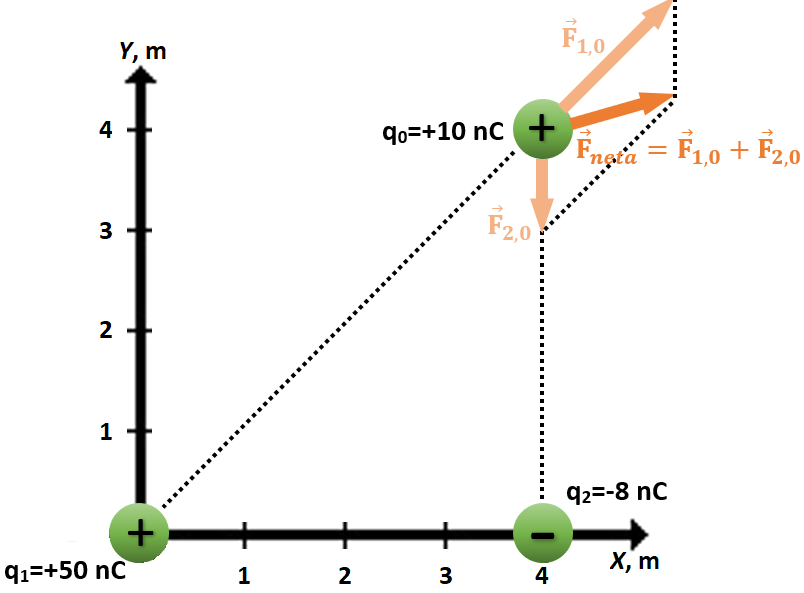{width="35%"}
:::

:::{.callout-note title="Solución:" collapse="true" icon="false"}

$$F_{1,0}=K\frac{\left|q_{1}q_{0}\right|}{r_{1,0}^{2}}=\frac{\left(8.99\cdot10^{9}\text{ N}\cdot\text{m}^{2}/\text{C}^{2}\right)\left(50\cdot10^{-9}\text{ C}\right)\left(10\cdot10^{-9}\text{ C}\right)}{\left(4\sqrt{2}\text{ m}\right)^{2}}=1.4\cdot10^{-7}\text{ N}$$ 
$$F_{1,0x}=F_{2,0y}=F_{1,0}\cos45^{\circ}=\frac{1.4\cdot10^{-7}\text{ N}}{\sqrt{2}}=9.89\cdot10^{-8}\text{ N}$$ $$\vec{F}_{2,0}=K\frac{q_{2}q_{0}}{r_{2,0}^{2}}\hat{r}_{2,0}=\frac{\left(8.99\cdot10^{9}\text{ N}\cdot\text{m}^{2}/\text{C}^{2}\right)\left(-8\cdot10^{-9}\text{ C}\right)\left(10\cdot10^{-9}\text{ C}\right)}{\left(4\text{ m}\right)^{2}}\hat{\jmath}=\left(-4.49\cdot10^{-8}\text{ N}\right)\hat{\jmath}$$ $$F_{x}^{neta}=F_{1,0x}+F_{2,0x}=\left(9.89\cdot10^{-8}\text{ N}\right)+0=9.89\cdot10^{-8}\text{ N}$$ 
$$F_{y}^{neta}=F_{1,0y}+F_{2,0y}=\left(9.89\cdot10^{-8}\text{ N}\right)+\left(-4.49\cdot10^{-8}\text{ N}\right)=5.4\cdot10^{-8}\text{ N}$$ 
$$F=\sqrt{F_{x}^{2}+F_{y}^{2}}=\sqrt{\left(9.89\cdot10^{-8}\text{ N}\right)^{2}+\left(5.4\cdot10^{-8}\text{ N}\right)^{2}}=1.13\cdot10^{-7}\text{ N}$$ 
$$\tan\theta=\frac{F_{y}}{F_{x}}=\frac{5.4\cdot10^{-8}\text{ N}}{9.89\cdot10^{-8}\text{ N}}=0.546\longrightarrow\theta=28.63^{\circ}$$
:::

::::

# 2. Campo Electrostático {#Campo-Electrostatico}

¿Cuál es el mecanismo según el cuál una carga eléctrica puede ejercer una fuerza sobre otra a través del espacio vacío que existe entre ellas sin que haya contacto? La fuerza eléctrica ejercida por una carga sobre otra es un ejemplo de acción a distancia (al igual que la fuerza gravitatoria).

Para explicar el fenómeno de acción a distancia se introduce el concepto de campo eléctrico. Toda carga eléctrica $q$ perturba el espacio donde está situada, creando un campo eléctrico $\vec{E}$ a su alrededor, y es este campo el que ejerce una fuerza sobre cualquier otra carga $q'$ situada en cualquier punto del espacio a una distancia $r$. Es decir, la carga $q'$ experimenta una fuerza debida al campo $\vec{E}$ (creado por la carga $q$) existente en su posición. $\vec{E}$ es un vector de modo que tiene: módulo, dirección y sentido, además de unidades \[Newton/Culombio\].

:::{style="text-align:center;"}
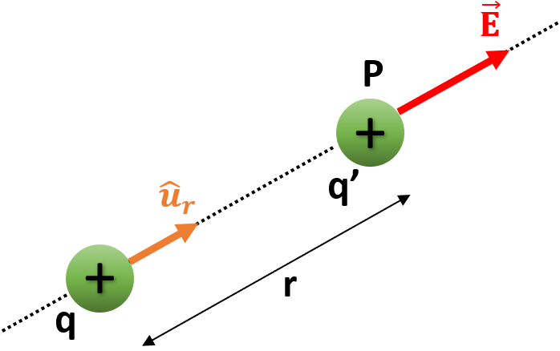{width="25%"}
:::

Supongamos una carga eléctrica $q$ en un punto del espacio. Si colocamos una carga $q'$ en otro punto, ésta experimentará una fuerza eléctrica $\vec{F}$ dada por la Ley de Coulomb.

> Se define en cada punto del espacio un vector $\vec{E}$, denominado **intesidad de campo eléctrico** o, simplemente, campo eléctrico, mediante la relación:
>
> $$\vec{E} = \frac{\vec{F}}{q'}$$

Por tanto, el campo eléctrico debido a una carga puntual $q$ en un punto $P$ situado a una distancia $r$ de la carga es:

$$\vec{E} = \pm  K  \frac{q}{r^{2}}  \hat{u_{r}}$$

## 2.1. Principio de Superposición de Campos Eléctricos {#Principio-Superposicion}

En el espacio puede haber **sistemas discretos** de cargas, formados por cargas puntuales aisladas unas de otras, o **sistemas continuos** de cargas, donde toda la carga se encuentra distribuida en un volumen. El **principio de superposición** establece que la intensidad del campo eléctrico en un punto debido a un sistema **discreto** de cargas es igual a la **suma** de las intensidades de los campos debidos a cada una de ellas. Si el sistema es **continuo**, la suma ha de sustituirse por la **integral** extendida al volumen del sistema de los campos debidos a cada elemento de volumen que contiene la carga elemental **dq**.

$$\vec{E}=\pm  K \sum_{i=1}^n \frac{q_{i}}{r_{i}^{2}}  \hat{u_{r_{i}}}$$ $$d \vec{E} = \pm  K \frac{dq}{r^{2}}  \hat{u_{r}}$$ $$\vec{E}=\int_{\tau}d\vec{E}=\pm  K \int_{\tau} \frac{dq}{r^{2}}  \hat{u_{r}}$$

:::{style="text-align:center;"}
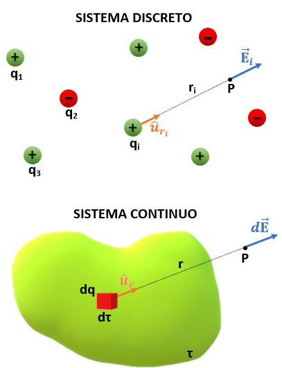{width="55%"}
:::

::::{.callout-note title="Ejemplo:" collapse="false" icon="false"}
Calcula la intensidad del campo eléctrico creado en el vacío por una carga puntual de +24 nC a una distancia de 20 cm. Halle el módulo de la fuerza que actuaría sobre una carga puntual de +1 nC situada en el mismo punto.

:::{style="text-align:center;"}
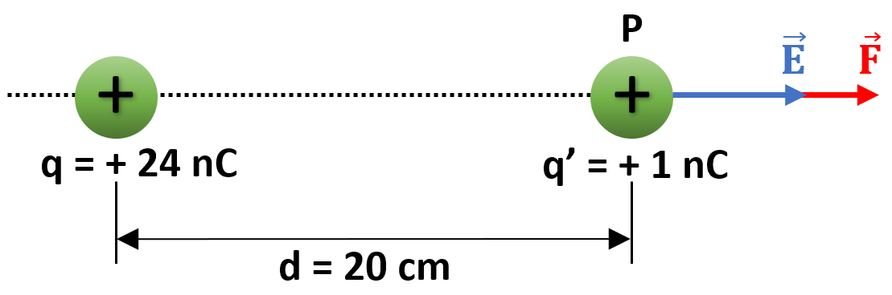{width="25%"}
:::

:::{.callout-note title="Solución:" collapse="true" icon="false"}

La intensidad del campo eléctrico creado en el punto $P$ por la carga de +24 nC será

$$E=K\frac{q}{r^{2}}=9\cdot10^{9}\text{ N}\cdot \text{ m}^{2}/\text{ C}^{2}\frac{24\cdot10^{-9}\text{ C}}{\left(0.2\text{ m}\right)^{2}}=5400\text{ N/C}$$

Por otra parte, la fuerza que actuaría sobre la carga $q'$ situada en el punto $P$ sería

$$F=q'\cdot E=1\cdot10^{-9}\text{ C}\cdot5400\text{ N/C}=5.4\cdot10^{-6}\text{ N}$$

Como $q'$ es positiva, $\vec{F}$ tiene el mismo sentido que $\vec{E}$.
:::
::::

::::{.callout-note title="Ejemplo:" collapse="false" icon="false"}
Dos cargas eléctricas puntuales $q_1=+4  \mu\text{C}$ y $q_2=-4  \mu\text{C}$ se encuentran situadas en los puntos $\left(0,0\right)\text{ m}$ y $\left(3,0\right)\text{ m}$, respectivamente. Determine el campo eléctrico en el punto $P$$\left(3,3\right)\text{ m}$.

:::{style="text-align:center;"}
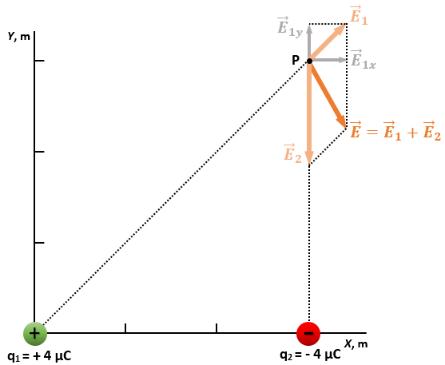{width="50%"}
:::

:::{.callout-note title="Solución:" collapse="true" icon="false"}

$$E_{1}=K\frac{q_{1}}{r_{1^{2}}}=9\cdot10^{9}\text{ N}\cdot\text{ m}/\text{ C}^{2}\frac{4\cdot10^{-6}\text{ C}}{\left(3\sqrt{2}\text{ m}\right)^{2}}=2000\text{ N/C}$$ $$E_{1x}=E_{1}\cos45^{\circ}=1414.21\text{ N/C}\quad\quad E_{1y}=E_{1}\sin45^{\circ}=1414.21\text{ N/C}$$ $$E_{2}=K\frac{q_{2}}{r_{2^{2}}}=9\cdot10^{9}\text{ N}\cdot\text{ m}/\text{ C}^{2}\frac{-4\cdot10^{-6}\text{ C}}{\left(3\text{ m}\right)^{2}}=-4000\text{ N/C}$$ $$E_{2x}=0\quad\quad E_{2y}=-4000\text{ N/C}$$ $$E_{x}=E_{1x}+E_{2x}=1414.21\text{ N/C}\quad\quad E_{y}=E_{1y}+E_{2y}=-2585.79\text{ N/C}$$

El campo eléctrico es $\vec{E}=\left(1414.21\hat{\imath}-2585.79\hat{\jmath}\right)\text{ N/C}$, y su módulo $E=\sqrt{E_{x}^{2}+E_{y}^{2}}=2947.25\text{ N/C}$
:::
::::

# 3. Energía Potencial {#Energia-Potencial}

**El campo eléctrico es "conservativo"** porque (se comprueba experimentalmente) el trabajo $W_{A\rightarrow B}$ necesario para trasladar una carga eléctrica con velocidad constante (es decir, sin variar su energía cinética) entre dos puntos **A** y **B** de un campo eléctrico, es el mismo independientemente del camino por el que se lleve la carga desde $A$ hasta $B$.

:::{style="text-align:center;"}
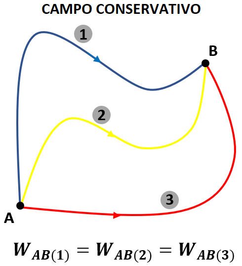{width="35%"}
:::

El trabajo $W_{A\rightarrow B}$ realizado por las fuerzas de campo se emplea en variar la energía potencial del sistema:

$$W_{A\rightarrow B}=-\Delta E_{p}=E_{p}\left(A\right)-E_{p}\left(B\right)$$

La energía potencial absoluta de una carga situada en un campo electrostático no puede calcularse sin tomar un origen de referencia. Si, por convenio, se toma el infinito como origen de referencia, y si se supone que $A$ está en el infinito ($E_{p}\left(A\right)=0$), el trabajo para traer la carga desde el infinito hasta $B$ puede interpretarse como:

$$W_{\infty\rightarrow B}^{\text{ext}}=\Delta E_{p}=E_{p}\left(B\right)-E_{p}\left(A\right)=E_{p}\left(B\right)-0=E_{p}\left(B\right)$$

La energía potencial $E_p$ de una carga eléctrica en un punto del campo electrostático es igual al trabajo necesario para traer la carga desde el infinito hasta ese punto.

$$E_{p}\left(B\right)=W_{\infty\rightarrow B}^{\text{ext}}=-\int_{\infty}^{B}\vec{F}\cdot d\vec{r}=-\int_{\infty}^{B}q'\vec{E}\cdot d\vec{r}=-K\int_{\infty}^{B}\frac{qq'}{r^2}dr=-Kqq'\left[-\frac{1}{r}\right]_{\infty}^{B}=K\frac{qq'}{r_{B}}$$

# 4. Potencial Electrostático {#Potencial-Electrostático}

La energía potencial en un punto depende de la carga $q'$ allí situada, por lo que se define una magnitud propia del campo en cada punto, el **potencial electrostático V**, que no es función de la carga colocada en él.

El potencial electrostático de un punto $B$ del campo eléctrico es la energía potencial de la unidad de carga eléctrica positiva situada en ese punto $B$:

$$V_{B}=\frac{E_{p}\left(B\right)}{q'}=K\frac{q}{r_{B}}$$

El potencial electrostático es una magnitud escalar, quedando definida por un número y una unidad. La unidad de potencial electrostático en el Sistema Internacional es el Voltio ($\text{V}$). Un punto del campo tiene un potencial de $1 \text{ V}$ si una carga de $+1 \text{ C}$ situada en él tiene una energía potencial de $1 \text{ J}$.

Si el campo eléctrico está creado por un conjunto de cargas puntuales $q_1$, $q_2$, $q_3$ \... situadas a diferentes distancias $r_1$, $r_2$, $r_3$ de un punto $B$ del campo, el potencial electrostático total creado en dicho punto es la suma algebraica de cada potencial (con su signo).

$$V_{B}=V_{1}+V_{2}+V_{3}+\ldots=\sum V_{i}$$

Si $V_A$ es el potencial electrostático del punto $A$, y $V_B$ es el del punto $B$, el trabajo para mover la carga $q'$ desde $A$ hasta $B$ en contra de las fuerzas del campo es:

$$W_{A\rightarrow B}^{\text{ext}}=E_{p}\left(B\right)-E_{p}\left(A\right)=V_{B}  q'-V_{A}  q'=\left(V_{B}-V_{A}\right)q'$$
$$\frac{W_{A\rightarrow B}^{\text{ext}}}{q'}=V_{B}-V_{A}$$

> La **diferencia de potencial** (ddp) entre dos puntos $A$ y $B$ es el trabajo realizado para transportar la unidad de carga eléctrica positiva desde $A$ hasta $B$.

::::{.callout-note title="Ejemplo:" collapse="false" icon="false"}
Determina el potencial electrostático en el punto $\left(4,4\right)$ creado por tres cargas puntuales de $+4  \mu\text{C}$, $-2  \mu\text{C}$ y $+8  \mu\text{C}$ situadas respectivamente en los puntos $\left(4,0\right)$, $\left(0,0\right)$ y $\left(0,4\right)$ (las distancias están expresadas en metros).

:::{.callout-note title="Solución:" collapse="true" icon="false"}

$$V_{1}=K\frac{q_{1}}{r_{1}}=9\cdot10^{9}\text{ N}\cdot \text{m}^{2}/\text{C}^{2}\frac{4\cdot10^{-6}\text{ C}}{4  \text{ m}}=9000\text{ V}$$ $$V_{2}=K\frac{q_{2}}{r_{2}}=9\cdot10^{9}\text{ N}\cdot \text{m}^{2}/\text{C}^{2}\frac{-2\cdot10^{-6}\text{ C}}{4\sqrt{2}  \text{ m}}=-3181.98\text{ V}$$ $$V_{3}=K\frac{q_{3}}{r_{3}}=9\cdot10^{9}\text{ N}\cdot \text{m}^{2}/\text{C}^{2}\frac{8\cdot10^{-6}\text{ C}}{4  \text{ m}}=18000\text{ V}$$

El potencial total en el punto $\left(4,4\right)$ es la suma de los potenciales debidos a cada carga:

$$V=V_{1}+V_{2}+V_{3}=9000\text{ V}-3181.98\text{ V}+18000\text{ V}=23818.02\text{ V}$$
:::
::::

# 5.  Líneas de Fuerza y Superficies Equipotenciales {#Equipotenciales}

Las **líneas de fuerza del campo eléctrico** son **líneas imaginarias tangentes** en cada punto al vector intensidad de campo eléctrico. Para representarlas gráficamente se usa como modelo la trayectoria que seguiría una unidad de carga eléctrica positiva ideal abandonada en reposo en un punto del campo eléctrico. Algunos ejemplos de líneas de fuerza creados por cargas puntuales y por un dipolo:

:::{style="text-align:center;"}
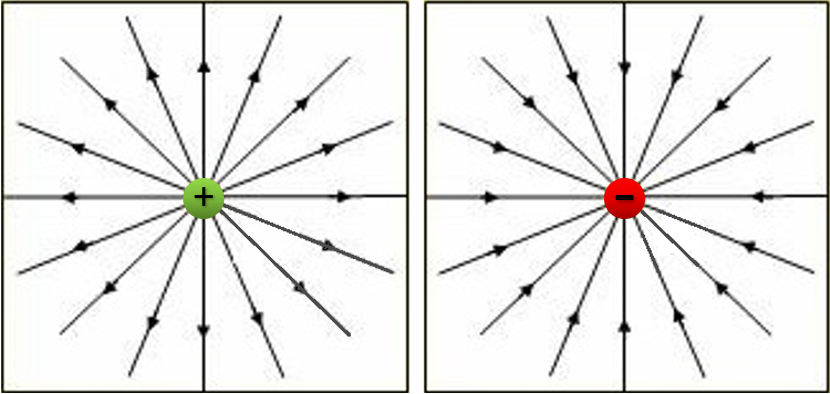{width="35%"}
:::

Las **superficies equipotenciales** son aquellos puntos del campo que tienen el mismo potencial electrostático. Así, son perpendiculares a las líneas de fuerza del campo. Ver ejemplo:

:::{style="text-align:center;"}
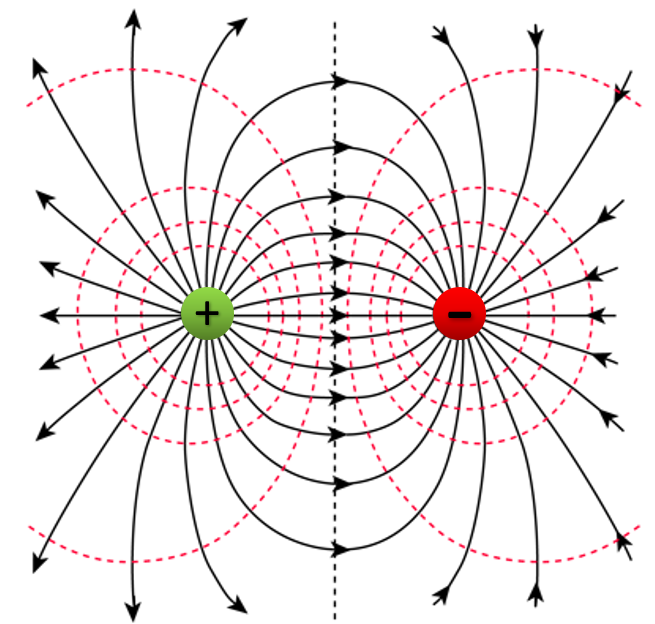{width="35%"}
:::

# 6. Teorema de Gauss {#Teorema-de-Gauss}

El **flujo de campo eléctrico**, $\Phi$, es la magnitud matemática relacionada con el número de líneas de campo que atraviesa una superficie.

En el caso de una superficie plana, como la de la @fig-flujo-electrico, con un campo $\vec{E}$ que forma un ángulo $\alpha$ con el vector Superficie $\vec{S}$ (perpendicular al plano y de módulo igual a su área), el flujo de campo se calcula matemáticamente como el siguiente producto escalar:

$$\Phi=\vec{E}\cdot\vec{S}=ES\cos\alpha$$

En el caso más general en que tengamos una superficie cualquiera, no plana, el flujo elemental $d\Phi$ a través de un elemento de superficie $dS$ es: $d\Phi=\vec{E} \cdot d\vec{S} $ y el flujo total a través de toda la superficie:

$$\Phi=\int_{S}d\Phi=\int_{S}\vec{E}\cdot d\vec{S}$$

El **Teorema de Gauss** dice que el flujo neto a través de cualquier superficie cerrada $S$ es igual a $4  \pi  K$ veces la carga neta encerrada en la superficie:

$$\Phi=\oint_{S}E_{n}dS=4\pi KQ_{\text{interior}}$$

:::{style="text-align:center;"}
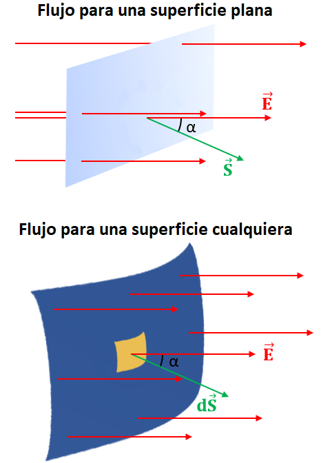{width="42%" #fig-flujo-electrico}
:::

El **Teorema de Gauss** puede utilizarse para determinar los campos eléctricos debidos a distribuciones de cargas de geometría sencilla. Por ejemplo, el campo eléctrico debido a una esfera hueca de radio $R$ cargada superficialmente con carga $Q$, sería:

- Cero en el interior, pues no hay carga encerrada.

- $E=K \frac{Q}{R^2}$, justo en la superficie de la esfera.

- $E=K \frac{Q}{r^2}$, a una distancia $r>R$ fuera de la esfera.

:::{style="text-align:center;"}
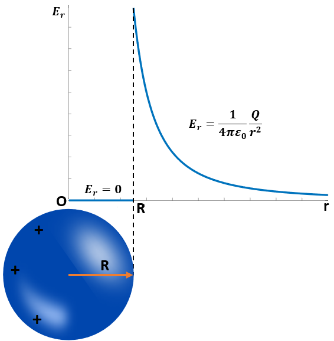{width="45%"}
:::

::::{.callout-note title="Ejemplo:" collapse="false" icon="false"}
Una esfera conductora hueca de radio $R=20 \text{ cm}$ situada en el vacío presenta una carga superficial de $80\text{ nC}$. Calcula la intensidad del campo eléctrico en un punto que dista del centro de la esfera.

a.  $5 \text{ cm}$.

b.  $20 \text{ cm}$.

c.  $40 \text{ cm}$.

:::{.callout-note title="Solución:" collapse="true" icon="false"}

a.  Para $r=5 \text{ cm}$ nos encontramos en el interior de la esfera, donde no hay carga, por lo que $E=0$.

b.  Para $r=R=20 \text{ cm}$ (superficie de la esfera):

$$E=\frac{1}{4\pi\varepsilon_{0}}\frac{Q}{R^{2}}=9\cdot10^{9}\text{ N}\cdot \text{m}^{2}/\text{C}^{2}\frac{80\cdot10^{-9}\text{ C}}{\left(0.2\text{ m}\right)^{2}}=18000\text{ N/C}$$

c.  De igual manera, para $r=40 \text{ cm}$ se tiene que

$$E=\frac{1}{4\pi\varepsilon_{0}}\frac{Q}{r^{2}}=9\cdot10^{9}\text{ N}\cdot \text{m}^{2}/\text{C}^{2}\frac{80\cdot10^{-9}\text{ C}}{\left(0.4\text{ m}\right)^{2}}=4500\text{ N/C}$$
:::
::::
