# 1. Introducción

En este tema se van a exponer unas breves nociones sobre electromagnetismo. Este texto no consiste en una repetición de lo ya estudiado en Bachillerato. Ni siquiera se abordarán todos los aspectos que en su momento se trataron. Se pretende aquí asentar unos conocimientos mínimos que se tratarán con más profundidad durante la asignatura de Física en el grado. Trataremos la fuerza magnética que actúa sobre cargas eléctricas en movimiento. Además se estudiarán algunos casos del campo creado por cargas en movimiento. Finalmente se abordará con algunos casos sencillos la generación de corriente eléctrica con el uso de campos magnéticos.

Dada la naturaleza de los campos magnéticos y sus efectos, el uso del cálculo vectorial estará presente durante todo el tema, por lo que se recomienda que antes de empezar repase sus conocimientos en esta materia, especialmente el producto vectorial y el producto escalar de vectores.

# 2. El campo magnético {#El-campo-magnético}

El fenómeno del magnetismo se conoce desde la Antigüedad. Ya entonces se conocía que ciertos materiales como la magnetita poseen la propiedad de atraer trozos de hierro. Esta atracción no es de origen electrostático, ya que aparece aun en la ausencia de carga neta.

Los materiales que poseen esta propiedad se llaman **imanes**. Los imanes se componen de dos polos, usualmente denominados norte y sur, de modo que si acercamos los polos norte de dos imanes, éstos se repelen. Lo mismo ocurre si acercamos los polos sur. En cambio, si acercamos el polo sur de un imán con el norte del otro, se atraerán.

Hay materiales que pueden convertirse en imanes temporalmente, al ponerlo en contacto con otro imán. Se les denomina imanes artificiales. Por ejemplo, la aguja de una brújula es un imán artificial. Una vez imantada, la aguja apuntará su polo sur hacia el norte geográfico, puesto que la Tierra es como un gran imán orientado de norte a sur.

La región de influencia de un imán se conoce como **CAMPO MAGNÉTICO**. En esta región se suelen representar unas líneas. En cada punto, estas líneas llevan la dirección que tendría una aguja imantada colocada en dicho punto. En la siguiente figura se muestran dos ejemplos: el campo magnético de un imán natural (izquierda) y el campo magnético terrestre (derecha).

::: {style="text-align:center;"}
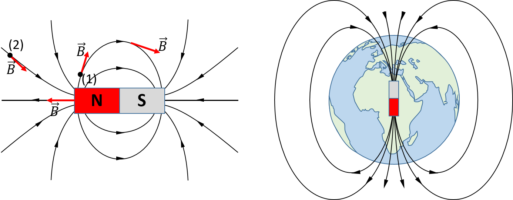{width="60%" #fig-campo_magnetico}
:::

Está claro que el campo magnético se deja sentir no sólo donde están las líneas, sino en toda la región del espacio. El número de líneas que se representan depende de la intensidad del campo, siendo mayor el número de líneas en las zonas donde el campo es mayor. Por ejemplo, en el dibujo anterior se señalan dos puntos (1) y (2). Obsérvese que la distancia entre las líneas de campo es mayor en el punto (2), lo cual implica que la intensidad del campo en ese punto es menor.

El campo magnético es un campo vectorial. Es decir, en cada punto, el campo tiene una intensidad y una dirección, y se representa por $\vec{B}$.

> La unidad de la intensidad del campo magnético en el S.I. es el Tesla (T).

# 3. Fuerza magnética sobre cargas en movimiento 

Como ya hemos dicho, los materiales magnéticos modifican su posición cuando se encuentran en presencia de un campo magnético, orientando sus polos en la dirección del campo. Para que este movimiento tenga lugar, es necesario que actúe sobre ellos una fuerza, que es la fuerza magnética.

Esta fuerza magnética no sólo actúa sobre los materiales magnéticos. También lo hace sobre **cargas eléctricas en movimiento**. Así, si tenemos una carga en reposo en el seno de un campo magnético, no actuará sobre ésta ninguna fuerza, pero si se está moviendo, entonces actuará una fuerza sobre ella. Esta fuerza tiene varias características:

- Es perpendicular a la dirección del campo.

- Es perpendicular a la dirección del movimiento de la carga.

- Es proporcional al campo, la velocidad de la carga y a la propia carga.

La expresión que representa todas estas características es la llamada **Ley de Lorentz**:

$$\fbox{$\vec{F}=q\vec{v}\times\vec{B}$}$$

De aquí podemos obtener ya una definición de Tesla: Es la fuerza que experimenta una carga de 1 C cuando se mueve a una velocidad de 1 m/s en la dirección perpendicular al campo.

Del ejemplo en la @fig-campo_magnetico se deduce también que en general, los campos, y por tanto la fuerza experimentada por cuerpos cargados, no tienen por qué tener el mismo valor ni en intensidad ni en dirección en todos los puntos del espacio. Pero como punto de partida nos situaremos de aquí en adelante en el caso más sencillo: campo magnético homogéneo, es decir, con el mismo valor en toda la región de influencia. Para representarlo lo indicaremos con un único vector en un extremo de la figura, con la dirección del campo. Además, si el campo es perpendicular a la pantalla, lo indicaremos con un punto si la dirección es hacia nosotros y una cruz si se aleja.

Veamos en esta situación cómo calcular la fuerza (y por tanto la aceleración). De la ley de Lorentz se deduce que la fuerza es nula en los siguientes casos:

- Carga en reposo (su velocidad es cero).

- Carga que se mueve en la dirección del campo. La ley de Lorentz es un producto vectorial, y el producto vectorial de dos vectores paralelos es nulo.

Si lo que deseamos conocer es la intensidad de la fuerza, entonces un modo sencillo de calcularlo es utilizar la forma más compacta del producto vectorial: $|\vec{a}\times\vec{b}|=|\vec{a}||\vec{b}|\sin[\theta]$. La dirección es la perpendicular al plano formado por ambos vectores. Para saber el sentido hay que seguir la regla del tornillo o de la mano derecha. Aquí usaremos la de la mano derecha, véanse algunos ejemplos en la @fig-producto_vectorial.

::: {style="text-align:center;"}
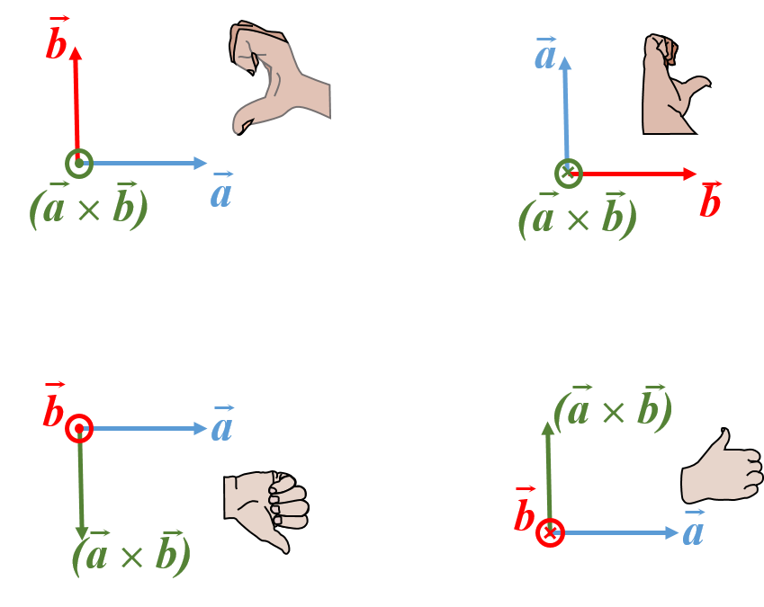{width="60%" #fig-producto_vectorial}
:::

Para aplicar esta regla, debe ponerse la mano derecha con los dedos índice-anular en la dirección del primer vector de modo que al cerrar el puño estos dedos se dirijan hacia el segundo vector. En esta posición, el pulgar indica la dirección del producto vectorial.

En nuestro caso, el vector $q\vec{v}$ juega el papel de $\vec{a}$ y el vector $\vec{B}$ el papel del vector $\vec{b}$. Esto quiere decir que si tenemos una carga positiva, el sentido de la fuerza es el mismo que el del producto $\vec{v}\times\vec{B}$, mientras que si la carga es negativa, entonces el sentido de la fuerza es el opuesto al producto $\vec{v}\times \vec{B}$, tal y como se muestra en la @fig-ley_Lorentz.

::: {style="text-align:center;"}
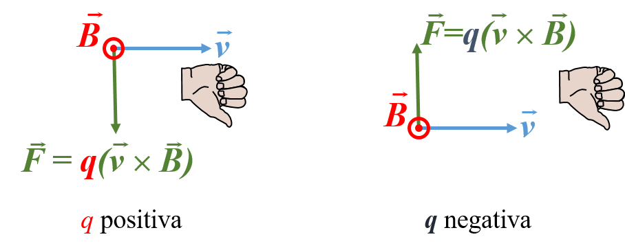{width="60%" #fig-ley_Lorentz}
:::

:::::: {.callout-tip title="Dirección de la fuerza magnética" collapse="true" icon="false"}

:::::{.callout-caution title="Caso 1" collapse="true" icon="false"}

En la siguiente figura, indicar el sentido de la fuerza sobre la carga, de $3\ \mu\text{C}$ de valor.

::: {style="text-align:center;"}
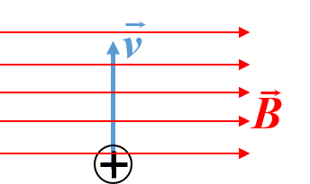{width="25%"}
:::

::::{.callout title="Solución" collapse="true" icon="false"}

$q>0$, luego la fuerza lleva la misma dirección que el producto vectorial $\vec{v}\times\vec{B}$

::: {style="text-align:center;"}
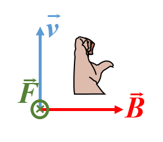{width="25%"}
:::
::::
:::::

:::::{.callout-caution title="Caso 2" collapse="true" icon="false"}

En la siguiente figura, indicar el sentido de la fuerza sobre la carga, de $-3\ \mu\text{C}$ de valor.

::: {style="text-align:center;"}
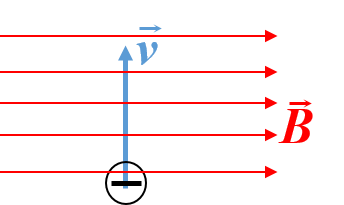{width="25%"}
:::

::::{.callout title="Solución" collapse="true" icon="false"}

Ahora la carga es negativa, $q < 0$, luego la fuerza lleva la misma dirección que el producto vectorial $\vec{v}\times\vec{B}$ pero SENTIDO OPUESTO. En la siguiente figura el esquema es igual que el del ejercicio anterior, pero ahora la fuerza apunta en sentido opuesto.

::: {style="text-align:center;"}
{width="25%"}
:::
::::
:::::

:::::{.callout-caution title="Caso 3" collapse="true" icon="false"}
En la siguiente figura, indicar el sentido de la fuerza sobre la carga, de $3\ \mu\text{C}$ de valor.

::: {style="text-align:center;"}
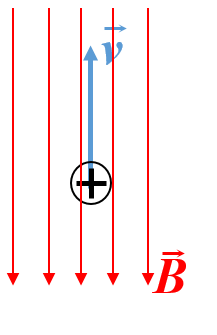{width="20%"}
:::

::::{.callout title="Solución" collapse="true" icon="false"}

El campo y la velocidad tienen sentidos opuestos, pero la misma dirección, y por tanto, la fuerza, que es el producto vectorial $\vec{F}=q\vec{v}\times\vec{B}$ es nulo.

::: {style="text-align:center;"}
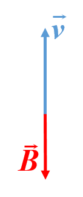{width="15%"}
:::
::::
:::::

:::::{.callout-caution title="Caso 4" collapse="true" icon="false"}

En la siguiente figura, indicar el sentido de la fuerza sobre la carga, de $3\ \mu\text{C}$ de valor.

::: {style="text-align:center;"}
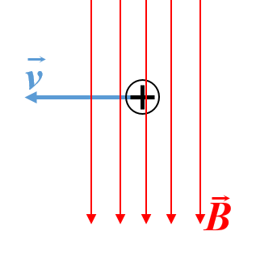{width="25%"}
:::

::::{.callout title="Solución" collapse="true" icon="false"}
$q>0$, luego la fuerza lleva la misma dirección que el producto vectorial $\vec{v}\times\vec{B}$.

::: {style="text-align:center;"}
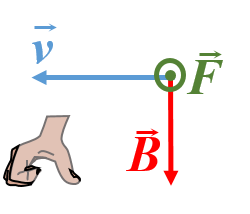{width="25%"}
:::
::::
:::::

:::::{.callout-caution title="Caso 5" collapse="true" icon="false"}
En la siguiente figura, indicar el sentido de la fuerza sobre la carga, de $-3\ \mu\text{C}$ de valor.

::: {style="text-align:center;"}
{width="25%"}
:::

::::{.callout title="Solución" collapse="true" icon="false"}
Ahora la carga es negativa, $q < 0$, luego la fuerza lleva la misma dirección que el producto vectorial $\vec{v}\times\vec{B}$ pero SENTIDO OPUESTO. En la siguiente figura el esquema es igual que el del ejercicio anterior, pero ahora la fuerza apunta en sentido opuesto.

::: {style="text-align:center;"}
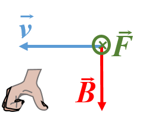{width="25%"}
:::
::::
:::::

:::::{.callout-caution title="Caso 6" collapse="true" icon="false"}
En la siguiente figura, indicar el sentido de la fuerza sobre la carga, de $3\ \mu\text{C}$ de valor.

::: {style="text-align:center;"}
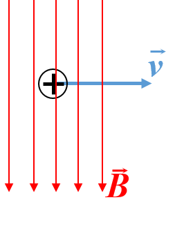{width="25%"}
:::

::::{.callout title="Solución" collapse="true" icon="false"}
$q>0$, luego la fuerza lleva la misma dirección que el producto vectorial $\vec{v}\times\vec{B}$.

::: {style="text-align:center;"}
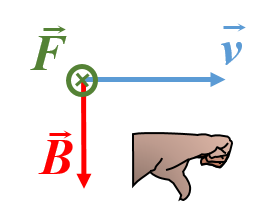{width="25%"}
:::
::::
:::::

:::::{.callout-caution title="Caso 7" collapse="true" icon="false"}
En la siguiente figura, indicar el sentido de la fuerza sobre la carga, de $-3\ \mu\text{C}$ de valor.

::: {style="text-align:center;"}
{width="25%"}
:::

::::{.callout title="Solución" collapse="true" icon="false"}
Ahora la carga es negativa, $q < 0$, luego la fuerza lleva la misma dirección que el producto vectorial $\vec{v}\times\vec{B}$ pero SENTIDO OPUESTO. En la siguiente figura el esquema es igual que el del ejercicio anterior, pero ahora la fuerza apunta en sentido opuesto.

::: {style="text-align:center;"}
{width="25%"}
:::
::::
:::::
::::::

Es posible también calcular la fuerza utilizando las coordenadas cartesianas de los vectores involucrados. Recordemos que, si $\vec{a}=a_x\hat{\imath}+a_y\hat{\jmath}+a_z\hat{k}$ y $\vec{b}=b_x\hat{\imath}+b_y\hat{\jmath}+b_z\hat{k}$, entonces:

$$\vec{a}\times\vec{b}=\begin{vmatrix}
\hat{\imath} & \hat{\jmath} & \hat{k}\\
a_x & a_y & a_z\\
b_x & b_y & b_z
\end{vmatrix}=\begin{vmatrix}
a_y & a_z\\
b_y & b_z
\end{vmatrix}\hat{\imath}-\begin{vmatrix}
a_x & a_z\\
b_x & b_z
\end{vmatrix}\hat{\jmath}+\begin{vmatrix}
a_x & a_y\\
b_x & b_y
\end{vmatrix}\hat{k}$$

::::{.callout-note title="Ejemplo" collapse="false" icon="false"}

Calcular la fuerza que actúa sobre una carga de $-2\mu\text{C}$ al moverse en un campo magnético $\vec{B}=5\hat{\imath}\text{ mT}$ con una velocidad $\vec{v}=3\hat{\jmath}\text{ m/s}$.

:::{.callout title="Solución" collapse="true" icon="false"}

La fuerza viene dada por la ley de Lorentz. Utilizaremos el sistema internacional, para el que $q=-2\cdot 10^{-6}\text{ C}$, $\vec{v}=3\hat{\jmath}\text{ m/s}$ y $\vec{B}=5\cdot 10^{-3}\hat\imath\text{ T}$. Calculemos primero $\vec{v}\times\vec{B}$ y el resultado lo multiplicaremos por la carga:

$$\vec{v}\times\vec{B}= \begin{vmatrix}
\hat{\imath} & \hat{\jmath} & \hat{k}\\
v_x & v_y & v_z\\
B_x & B_y & B_z 
\end{vmatrix}=\begin{vmatrix}
\hat{\imath} & \hat{\jmath} & \hat{k}\\
0 & 3 & 0\\
5\times 10^{-3} & 0 & 0 
\end{vmatrix}=\begin{vmatrix}
3 & 0\\
0 & 0 
\end{vmatrix} \hat{\imath}
+\begin{vmatrix}
0 & 0\\
5\cdot 10^{-3} & 0
\end{vmatrix} \hat{\jmath}+\begin{vmatrix}
0 & 3\\
5\cdot 10^{-3} & 0
\end{vmatrix} \hat{k}
=-15\cdot 10^{-3} \text{ T m/s} \, \hat{k}$$

Finalmente, la fuerza se obtiene multiplicando por la carga:

$$\vec{F}=-2\cdot 10^{-6}(-15\cdot 10^{-3} \hat{k})=30\cdot 10^{-9}\hat{k}\text{ N}$$
:::
::::

Profundicemos un poco más. En caso de que el vector velocidad forme un cierto ángulo $\theta$ con el campo, entonces la fuerza magnética tendrá por módulo:

$$F_m=q|\vec{v}\times \vec{B}|=qvB\sin\theta$$

::: {style="text-align:center;"}
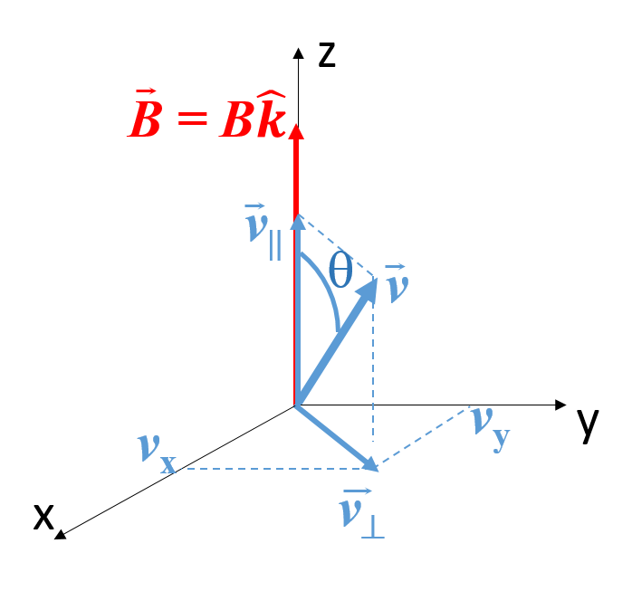{width="35%" #fig-vparalelo}
:::

Tal y como se muestra en la @fig-vparalelo, $v\sin\theta$ es la componente de la velocidad perpendicular al campo, $v_\perp$, por lo que concluimos que:

> Sólo la componente de la velocidad perpendicular al campo magnético producirá algún efecto en el cálculo de la fuerza magnética

Podemos verlo también vectorialmente. Si observamos de nuevo la figura, vemos que la velocidad la podemos descomponer como suma vectorial de dos vectores paralelo ($\parallel$) y perpendicular ($\perp$) al campo:

$$\vec{v}=\vec{v}_\parallel+\vec{v}_\perp$$

Si por ejemplo, el campo magnético lleva la dirección $OZ$, entonces:

$$\vec{v}_\parallel=v_z\hat{k}$$ $$\vec{v}_\perp=v_x\hat{\imath}+v_y\hat{\jmath}$$

La fuerza de Lorentz podemos descomponerla así:

$$\vec{F}=q\vec{v}\times\vec{B}=q\vec{v}_\parallel\times\vec{B}+q\vec{v}_\perp\times\vec{B}$$

El primer sumando es nulo y se llega a la misma conclusión. La fuerza magnética es independiente de la componente de la velocidad paralela al campo.

En el caso de que uno de los vectores, la velocidad, el campo magnético, o ambos, tenga una sola componente cartesiana, el producto vectorial se puede hacer de un modo más rápido. Tal y como se muestra en el esquema de la @fig-triedro, si aplicamos la regla de la mano derecha a cualesquiera dos vectores unitarios perpendiculares, entonces obtenemos el vector restante. Es decir, si giramos en el sentido antihorario nos da un producto positivo, si lo hacemos en el sentido horario, negativo. En la figura de la izquierda se muestra un ejemplo, $\hat{\jmath}\times\hat{k}$, y en la figura de la derecha un resumen de todas las opciones.

::: {style="text-align:center;"}
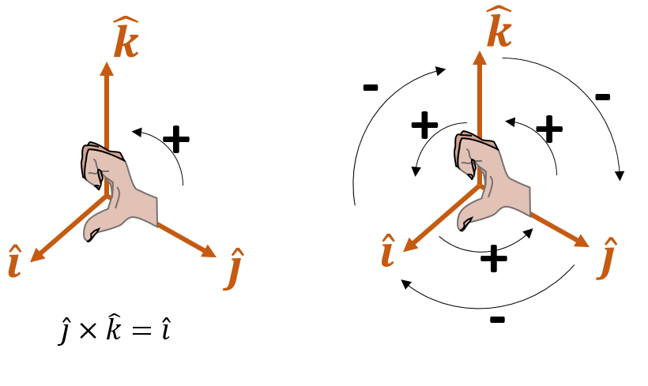{width="45%" #fig-triedro}
:::

Todas estas opciones se pueden resumir en las siguientes igualdades:

$$\begin{matrix}
\hat{\imath}\times\hat{\jmath}=\hat{k} & \hat{\jmath}\times\hat{k}=\hat{\imath} & \hat{k}\times\hat{\imath}=\hat{\jmath}\\
\hat{\jmath}\times\hat{\imath}=-\hat{k} & \hat{\imath}\times\hat{k}=-\hat{\jmath} & \hat{k}\times\hat{\jmath}=-\hat{\imath}
\end{matrix}$$ 

$$\hat{\imath}\times\hat{\imath}=\hat{\jmath}\times\hat{\jmath}=\hat{k}\times\hat{k}=0$$

Con esta idea en mente, el ejemplo anterior sería, $\vec{v}\times\vec{B}=v_y\hat{\jmath}\times B_x\hat{\imath}$, puesto que el resto de componentes cartesianas son cero. Reordenando:

$$\vec{v}\times\vec{B}=v_yB_x\hat{\jmath}\times\hat{\imath}=15\times 10^{-3} (-\hat{k})\text{ N}=-15\times 10^{-3}\hat{k}\text{ N}$$

:::::{.callout-note title="Ejemplo" collapse="false" icon="false"}
Una carga de $-5\mu\text{ C}$ se mueve a una velocidad $\vec{v}=(3\hat{\imath}+2\hat{k})\text{ m/s}$.
a. Calcular la fuerza magnética que actúa sobre ella cuando se encuentra en un campo magnético $\vec{B}=25\hat{\imath}$ mT.
b. Represente esquemáticamente los tres vectores.
c. Si su masa es $6.6 \cdot 10^{-26}\text{ kg}$, calcular la aceleración.
d. Y si la velocidad hubiese sido $\vec{v}=2\hat{k} \text{ m/s}$, ¿cambiaría el resultado? ¿por qué?

::::{.callout title="Solución" collapse="true" icon="false"}
a. Datos: $q=-5\cdot 10^{-6} \text{ C}$; $\vec v =3\hat{\imath}+2\hat{k} \text{ m/s}$; $\quad\vec{B}=25\cdot 10^{-3}\hat{\imath} \text{ T}$
La fuerza será:

$$\vec{F}=q\vec{v}\times\vec{B}=-5\cdot 10^{-6}(3\hat{\imath}+2\hat{k})\times 25\cdot 10^{-3}\hat{\imath}=$$ $$=-125\cdot 10^{-9}(3\hat{\imath}+2\hat{k})\times\hat{\imath}=-125\cdot 10^{-9}\left[3(\hat{\imath}\times\hat{\imath})+2(\hat{k}\times\hat{\imath})\right]$$

Como $\hat{\imath}\times\hat{\imath}=0$ y $\hat{k}\times\hat{\imath}=\hat{\jmath}$,
$$\vec{F}=-250\cdot 10^{-9}\hat{\jmath} \text{ N}$$

b. Para representar los vectores, se puede usar el siguiente esquema:

:::{style="text-align:center;"}
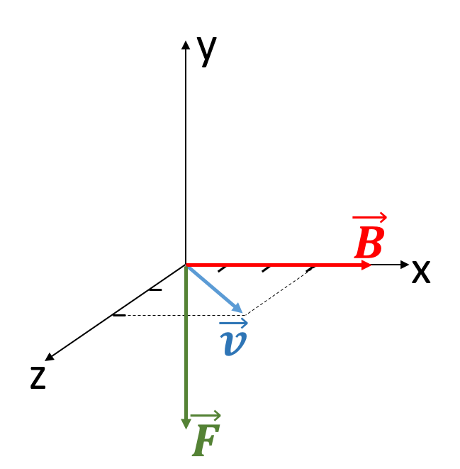{width="30%"}
:::
c. $\vec{F}=m\vec{a}$, de donde $\vec{a}=\vec{F}/m=\frac{-250\cdot 10^{-9}\text{ N}}{6.6\cdot 10^{-23}\text{ kg}}\hat{\jmath}=-3.8\cdot 10^{18}\hat{\jmath} \text{ m/s}^2$

d. La fuerza sólo depende de la proyección de la velocidad en el plano perpendicular al campo magnético. En nuestro caso, dado que el campo magnético va en la dirección $X$, la proyección de la velocidad en esta dirección no influye en la fuerza magnética, y por lo tanto el resultado no varía.
::::
:::::

::::{.callout-note title="Ejemplo" collapse="false" icon="false"}
Una carga de $2\text{ nC}$ viaja a una velocidad $\vec{v}=(5\hat{\jmath}+8\hat{k}) \text{ m/s}$. En esta región existe un campo magnético $\vec{B}=(0.2\hat{\imath}+0.2\hat{\jmath}) \text{ T}$. Calcular la fuerza que actúa sobre ella.

:::{.callout title="Solución" collapse="true" icon="false"}

Datos: $q= 2\cdot 10^{-9} \text{ C}$; $\quad v_x=0, \, v_y=5 \text{ m/s}, \, v_z=8 \text{ m/s}$; $\quad B_x=0.2 \text{ T}, \, B_y=0.2 \text{ T}$

Aplicando la ley de Lorentz:

$$\vec{F}= q\begin{vmatrix}
\hat{\imath} & \hat{\jmath} & \hat{k}\\
0 & v_y & v_z\\
B_x & B_y & 0
\end{vmatrix}=q\begin{vmatrix}
v_y & v_z\\
B_y & 0
\end{vmatrix}\hat{\imath}-q\begin{vmatrix}
0 & v_z\\
B_x & 0
\end{vmatrix}\hat{\jmath}+q\begin{vmatrix}
0 & v_y\\
B_x & B_y
\end{vmatrix}\hat{k}=$$ $$=-qv_zB_y\hat{\imath}+qv_zB_x\hat{\jmath}-qv_yB_x\hat{k}$$
Y sustituyendo:

$$\vec{F}=-2\cdot 10^{-9}\times 8\times 0.2\hat{\imath}+2\cdot 10^{-9}\times 8\times 0.2\hat{\jmath}-2\cdot 10^{-9}\times 5\times 0.2\hat{k}$$ 

$$\vec{F}=\left(-3.2\cdot 10^{-9}\hat{\imath}+3.2\cdot 10^{-9}\hat{\jmath}-2\cdot 10^{-9}\hat{k}\right) \text{ N}$$
:::
::::

Hemos visto que la fuerza magnética es siempre perpendicular a la dirección de movimiento de la carga. La aceleración que produce no actúa aumentando ni disminuyendo la velocidad, sino cambiándola de dirección, es decir:

**La fuerza magnética es una fuerza centrípeta.**

En ausencia de otras fuerzas, si una carga se mueve inicialmente perpendicularmente al campo magnético, realizará trayectorias circulares, tal y como se muestra esquemáticamente en la @fig-ciclotron.

:::{style="text-align:center;"}
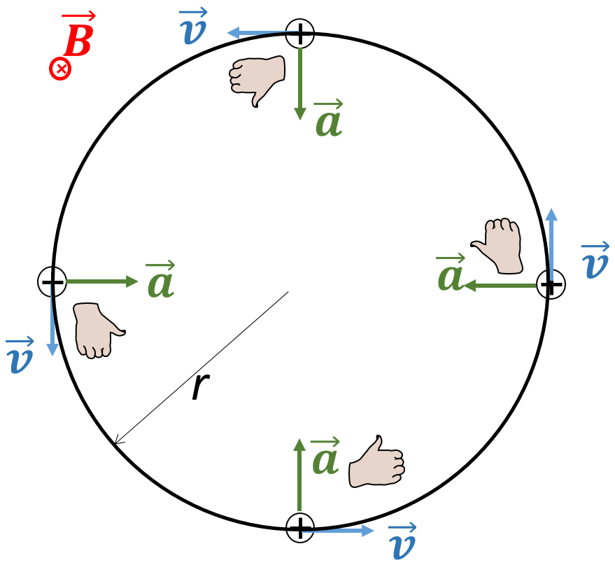{width="35%" #fig-ciclotron}
:::

El radio $r$ de esta trayectoria se puede calcular también. El ángulo entre $\vec{v}$ y $\vec{B}$ es 90$^\circ$, por lo que $|\sin \vec{v}\vec{B}|=1$. Por lo tanto:

Se trata de una aceleración centrípeta: $F=m\frac{v^2}{r}$, por lo que:

$$|q|vB=m\frac{v^2}{r}$$

Como hemos dicho que el módulo de la velocidad permanece inalterado, despejando de la ecuación anterior:

$$r=\frac{mv^2}{|q|vB}=\frac{mv}{|q|B}$$

Y la velocidad angular será:

$$\omega=\frac{v}{r}=|q|B/m$$

Esta propiedad se usa en la práctica, en los espectrómetros de masa (para medir masas muy pequeñas) y en el acelerador de partículas o ciclotrón, en los que se usa esta propiedad para proporcionar elevadas velocidades angulares a pequeñas cargas. Por ese motivo, a esta frecuencia $\omega=|q|B/m$ se le llama **frecuencia ciclotrón**.

Además, dado que la fuerza es también perpendicular al campo magnético, la carga se moverá siempre en el plano perpendicular. En efecto, $\vec{v}=\vec{v}_0+\vec{a}t$, y la aceleración, al igual que la fuerza, siempre está en la dirección perpendicular al campo. Por tanto, si inicialmente la velocidad no tiene ninguna componente en la dirección de $\vec{B}$, tampoco la tendrá después. Esto se ilustra en la @fig-aceleracion, en la que se muestra la velocidad de una carga en el seno de un campo magnético perpendicular, en dos instantes de tiempo $\vec{v}_0$ y $\vec{v}$ y de la aceleración que experimenta.

::: {style="text-align:center;"}
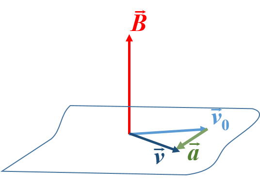{width="35%" #fig-aceleracion}
:::

Puede darse el caso de que la carga no se mueva inicialmente perpendicularmente al campo magnético. Por ejemplo, sea el campo magnético en la dirección $x$: $\vec{B}=B\hat{\imath}$ (ver figura inferior). Si la carga tiene una velocidad $\vec{v}=v\hat{\jmath}$, entonces estaríamos en el ejemplo anterior, campo y velocidad de la carga perpendiculares. Si en cambio, la velocidad no es perpendicular, entonces podemos separarla en dos componentes, una paralela y una perpendicular. En este ejemplo, tendríamos $\vec{v}=\vec{v}_\perp+v_\parallel\hat{\imath}$ (@fig-trayectoria_helicoidal).

::: {style="text-align:center;"}
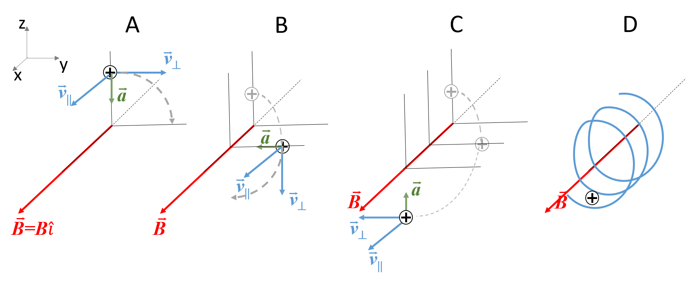{width="70%" #fig-trayectoria_helicoidal}
:::

Como la aceleración es perpendicular al campo, sólo hace variar $\vec{v}_\perp$, mientras que la otra componente no varía (obsérvese que en todos los casos $\vec{v}_\parallel$ es la misma).

En $A$, $\vec{v}_\perp$ lleva la dirección $\hat{\jmath}$, por lo que la fuerza de Lorentz le imprime una aceleración a la carga $\vec{a}$ dirigida en dirección $-\hat{k}$: la carga se desvía de su trayectoria horizontal tal y como indica la flecha discontinua gris. En $B$ y $C$ se indican momentos posteriores de la trayectoria.

Puesto que $\vec{v}_\parallel$ no varía la carga avanza en la dirección $X$ y a la vez gira en torno al eje dado por la dirección del campo magnético. Por ejemplo, trascurrido un tiempo nos encontramos en la situación dibujada en $B$. La carga ha avanzado en la dirección $X$ y se encuentra ahora en la posición indicada por la carga en negro con $\vec{v}_\perp$ en la dirección $-\hat{k}$. La aceleración ahora lleva la dirección $-\hat{\jmath}$, por lo que la carga se desvía en la misma dirección.

De nuevo, transcurrido un tiempo la carga se encuentra en la posición indicada en $C$: $\vec{v}_\perp$ en la dirección $-\hat{\jmath}$ y por tanto aceleración en la dirección $\hat{k}$, completando poco a poco la trayectoria circular.

En $D$ se muestra la trayectoria realizada: el movimiento consta de dos partes, una paralela al campo con velocidad constante $v_\parallel\hat{\imath}$, esto es, un movimiento rectilíneo uniforme y otra componente consistente en un movimiento circular en el plano perpendicular al campo. La composición de ambos movimientos será un movimiento helicoidal.

En la práctica se puede dar la situación en la que existe al mismo tiempo un campo eléctrico y un campo magnético. Por lo tanto, sobre una carga eléctrica actuará una fuerza electrostática y una fuerza magnética. La expresión de la fuerza de Lorentz generalizada será:

$$\vec{F}=q\left(\vec{E}+\vec{v}\times{B}\right)$$

::::::{.callout-note title="Ejemplos" collapse="true" icon="false"}

:::::{.callout-caution title="Ejemplo 1" collapse="true" icon="false"}
Se introduce una carga en una región donde coexisten un campo magnético y un campo eléctrico. Inicialmente la carga está en reposo. ¿Qué dirección debe llevar el campo magnético respecto del campo eléctrico para que la carga no se desvíe de su trayectoria?

::::{.callout title="Solución" collapse="true" icon="false"}
Inicialmente la carga está en reposo, luego sólo actúa la fuerza eléctrica y por tanto:

$$\vec{a}=\vec{F}/m=\frac{q}{m}\vec{E}$$
En el momento en que empieza a moverse, el campo magnético ejerce una fuerza perpendicular a dicha dirección. Para que no produzca ninguna desviación tiene que darse una de estas dos condiciones:

- Que la fuerza eléctrica contrarreste la fuerza magnética, o

- Que el campo magnético sea paralelo a la dirección de movimiento, en cuyo caso la fuerza magnética será nula.

El primero de los casos no puede darse puesto que la fuerza magnética es perpendicular a la velocidad, y ya hemos visto que la fuerza eléctrica, al menos en el instante inicial, es paralela a ésta. Queda como única opción que el campo magnético sea paralelo a la velocidad, y por lo tanto al campo eléctrico.

::::

:::::

:::::{.callout-caution title="Ejemplo 2" collapse="true" icon="false"}

Una electrón se mueve inicialmente con velocidad $v_i=20\text{ m/s}$ en la dirección del eje $OX$. Al entrar en una región donde coexisten un campo magnético de $500\text{ mT}$ y un campo eléctrico de $5\ \mu\text{N}/\text{C}$ paralelos a la dirección de movimiento de la carga,

a. ¿Cuál será su aceleración?

b. Calcular la velocidad $1\text{ s}$ después de aplicar el campo.

NOTA: Recuerde que el electrón tiene una carga $q_e=-1.6\cdot 10^{-19}\text{ C}$ y una masa $m_e=9.1\cdot 10^{-31}\text{ kg}$.

::::{.callout title="Solución" collapse="true" icon="false"}

Como la velocidad y campos son paralelos, entonces:

- La fuerza eléctrica y por tanto la aceleración son también paralelos a la velocidad inicial. Por tanto, el campo eléctrico no desvía la carga de su trayectoria recta.

- Inicialmente no hay fuerza magnética, puesto que la velocidad es paralela al campo magnético. Dado que la fuerza eléctrica no desvía a la carga de su trayectoria, la velocidad no cambia de dirección y por tanto no aparecerá en ningún momento una componente perpendicular.

a. \ 
$$\vec{F}=q_e\vec{E}=-1.6\cdot 10^{-19}\cdot 5\cdot 10^{-6}\hat{\imath}=-8\cdot 10^{-25}\hat{\imath}\text{ N}$$ $$\vec{a}=\frac{\vec{F}}{m_e}=\frac{-8\cdot 10^{-25}\hat{\imath}}{9.1\cdot 10^{-31}}=-879121\hat{\imath}\text{ m/s}^2\approx -879000\hat{\imath}\text{ m/s}^2$$

b. Como conocemos la aceleración y la velocidad inicial:

$$\vec{v}_f=\vec{v}_i+\vec{a}t=20\hat{\imath}\text{ m/s}-879000\text{ m/s}^2\cdot 1\text{ s}\hat{\imath}=-879101\hat{\imath}\text{ m/s}$$
::::
:::::

:::::{.callout-caution title="Ejemplo 3" collapse="true" icon="false"}

Una carga positiva con velocidad $\vec{v_i}=2\hat{\imath}$ m/s penetra en una región donde coexisten un campo magnético $\vec{B}=0.2\hat{\imath}\text{ T}$ y un campo eléctrico $\vec{E}=0.2\hat{\jmath}\text{ N/C}$. ¿Puede concluirse que el campo magnético no producirá ninguna fuerza?

::::{.callout title="Solución" collapse="true" icon="false"}

En el instante inicial está claro que no hay fuerza magnética, puesto que el campo magnético es paralelo a la velocidad. Pero sobre la carga actúa una fuerza eléctrica en la dirección del campo eléctrico. Como éste es perpendicular a la dirección inicial de la carga, ésta se desviará de esta trayectoria tal y como se indica en la figura de la izquierda,

:::{style="text-align:center;"}
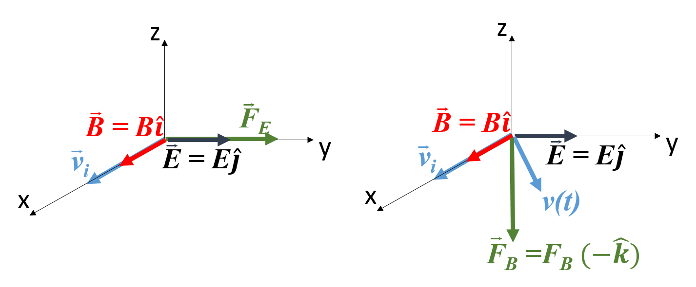{width="50%"}
:::

$$\vec{F}_e=q\vec{E}=qE_j\hat{\jmath}$$ $$\vec{a}=\frac{qE}{m}\hat{\jmath}$$ $$\vec{v}=\vec{v}_i+\vec{a}t=v_i\hat{\imath}+\frac{qE}{m}\hat{\jmath}$$
por lo que instantes después aparecerá una componente de la velocidad en la dirección del eje $OY$ y por tanto una fuerza magnética (figura derecha).
::::
:::::

:::::{.callout-caution title="Ejemplo 4" collapse="true" icon="false"}

Una carga de $-5\ \mu\text{ C}$ se mueve a una velocidad $\vec{v}=(3\hat{\imath}+2\hat{k})\text{ m/s}$. Calcular la fuerza que actúa sobre ella cuando se encuentra en una región donde coexisten un campo magnético $\vec{B}=25\hat{\imath}\text{ mT}$ y un campo eléctrico $\vec{E}=2000\hat{\imath}\ \mu\text{N/C}$.

::::{.callout title="Solución" collapse="true" icon="false"}
La fuerza total es la suma vectorial de la fuerza ejercida por los campos magnético y eléctrico. Llamemos $\vec{F}_m$ a la fuerza ejercida por el campo magnético y $\vec{F}_e$ a la ejercida por el campo eléctrico. La fuerza magnética será:

$$\vec{B}=B_x\hat{\imath}=25\cdot 10^{-3}\hat{\imath}\text{ T}$$ $$\vec{v}=v_x\hat{\imath}+v_z\hat{k}=(3\hat{\imath}+2\hat{k})\text{ m/s}$$ $$\vec{F}_m=q\vec{v}\times\vec{B}=qv_zB_x\hat{k}\times\hat{\imath}=qv_zB_x\hat{\jmath}$$ $$\vec{F}_m=-5\cdot 10^{-6}\text{ C}\cdot 2\text{ m/s}\cdot 25\cdot 10^{-3}\text{ T}\hat{\jmath}=-250\hat{\jmath}\text{ nN}$$
Y la fuerza eléctrica:

$$\vec{F}_e=q\vec{E}=-5\cdot 10^{-6}\text{ C}\cdot 2000\cdot 10^{-6}\hat{\imath}\text{ N/C}=-10\hat{\imath}\text{ nN}$$
La fuerza total será:

$$\vec{F}=(-10\hat{\imath}-250\hat{\jmath})\text{ nN}$$
En la siguiente figura se muestra una representación:

:::{style="text-align:center;"}
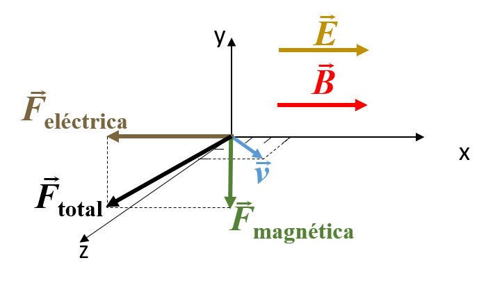{width="35%"}
:::
::::
:::::

:::::{.callout-caution title="Ejemplo 5" collapse="true" icon="false"}

Se tiene una carga de $5\ \mu\text{C}$ y masa $m=10^{-10}\text{ kg}$, inicialmente a una velocidad $\vec{v_i}=3\hat{\jmath}\text{ m/s}$. En $t=0$ se conectan un campo eléctrico $\vec{E}=2000\hat{\imath}\ \mu\text{N/C}$ y un campo magnético $\vec{B}=300\hat{\imath}\text{ mT}$.

a. Calcule la fuerza eléctrica y fuerza magnética que actúan sobre la carga en cualquier instante posterior.

b. Dibuje la trayectoria.

::::{.callout title="Solución" collapse="true" icon="false"}

a. Sobre la carga actúan dos fuerzas. La fuerza eléctrica es paralela al campo eléctrico, mientras que la fuerza magnética es perpendicular al campo magnético.

$$\vec{E}=2000\hat{\imath}\ \mu\text{N/C}=E\hat{\imath}$$ $$\vec{B}=0.3\hat{\imath}\text{ T}=B_x\hat{\imath}$$

Como resultado, la carga se moverá en el espacio con una cierta velocidad que todavía no conocemos, pero que podemos escribir como:

$$\vec{v}=v_x\hat{\imath}+v_y\hat{\jmath}+v_z\hat{k}$$

Como ambos campos son paralelos, esto significa que las fuerzas son perpendiculares entre sí. Por tanto, es de esperar que la carga se acelere en la dirección $X$ por la fuerza eléctrica y en el plano $YZ$ debido a la fuerza magnética.

La fuerza eléctrica será:

$$\vec{F}_E=q\vec{E}=qE\hat{\imath}=5\cdot 10^{-6}\text{ C}\cdot 2000\cdot 10^{-6}\hat{\imath}\text{ N/C}=1.36\cdot 10^{-5}\hat{\imath}\text{ N}$$

Para calcular la fuerza magnética, recordemos que

- Su módulo sólo depende de la parte de la velocidad perpendicular al campo. En nuestro caso $\vec{v}_\perp=v_y\hat{\jmath}+v_z\hat{k}$. En efecto, como se muestra en la figura, si $\theta$ es el ángulo que forma el campo y la velocidad, entonces $|\vec{F}_B|=qvB\sin\theta$ y tal y como se muestra en la figura $v\sin\theta=v_\perp=\sqrt{v_y^2+v_z^2}$.

::: {style="text-align:center;"}
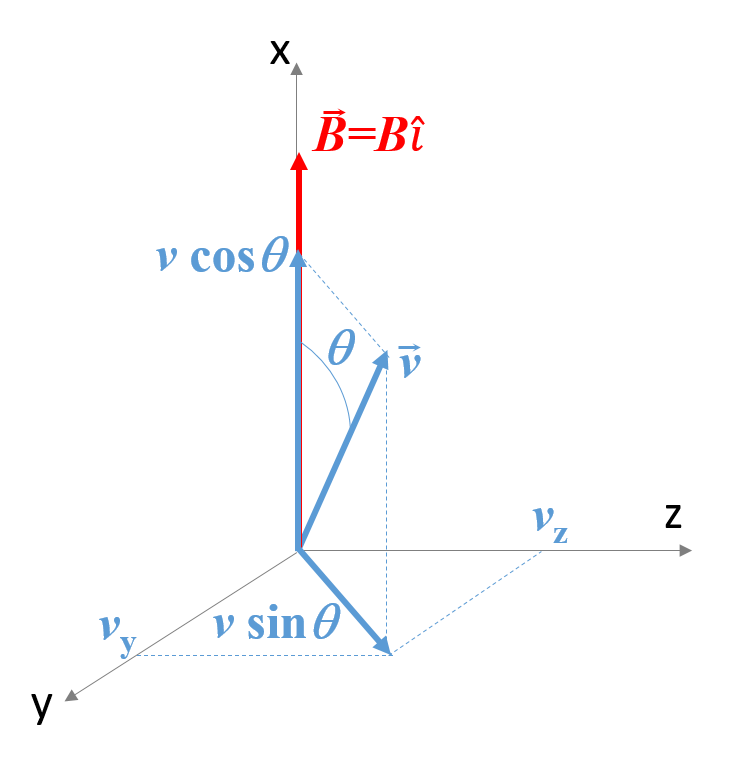{width="30%"}
:::

- La fuerza magnética es una fuerza centrípeta, perpendicular a la trayectoria, por lo que no modifica el módulo de la velocidad, sino sólo su dirección: $\vec{v}_\perp$ tiene siempre el mismo módulo y por tanto es igual al módulo en el instante inicial, es decir $v_\perp=v_i$ y por tanto:

$$|\vec{F}_B|=q|\vec{v}\times\vec{B}|=qv_iB_x=5\cdot 10^{-6}\text{ C}\cdot 3\text{ m/s}\cdot 0.3\text{ T}=4.5\cdot 10^{-6}\text{ N}$$

b. Podemos calcular la aceleración como

$$\vec{a}=a_x/m\hat{\imath}+a_y/m\hat{\jmath}+a_z/m\hat{k}=F_x/m\hat{\imath}+F_y/m\hat{\jmath}+F_z/m\hat{k}$$ $$F_x=F_E=qE$$ $$F_y\hat{\jmath}+F_z\hat{k}=\vec{F}_B$$

Por lo tanto:

$$a_x=\frac{F_x}{m}=\frac{qE}{m}=\frac{5\cdot 10^{-6}\text{ C}\cdot 2\cdot 10^{-3}\text{ N/C}}{10^{-10}\text{ kg}}=100\text{ m/s}^2$$

En la dirección $X$ sólo actúa la fuerza eléctrica lleva la dirección del eje $X$, y produce una movimiento uniformemente acelerado:

$$v_x=a_xt=\frac{qE}{m}t$$

Por otro lado, la fuerza magnética está en el plano $YZ$ (por ser perpendicular al eje $OX$) y es perpendicular a la velocidad, se trata de una fuerza centrípeta:

$$|\vec{F_B}|=\frac{mv^2_\perp}{r}$$

siendo $v_\perp=v_i$. Como $|\vec{F_B}|=qv_iB$. Por lo tanto, la proyección de la trayectoria en el plano $YZ$ es un movimiento circular con radio:

$$ r=\frac{mv_i}{qB}=\frac{10^{-10}\text{ kg }3\text{ m/s}}{5\cdot 10^{-6}\text{ C }0.3\text{ T}}=0.0002\text{ m}$$

Teniendo en cuenta la componente $x$ de la velocidad, tendremos finalmente que la trayectoria será helicoidal: la carga avanza con un movimiento uniformemente acelerado en la dirección $X$ girando en torno a dicho eje:

:::{style="text-align:center;"}
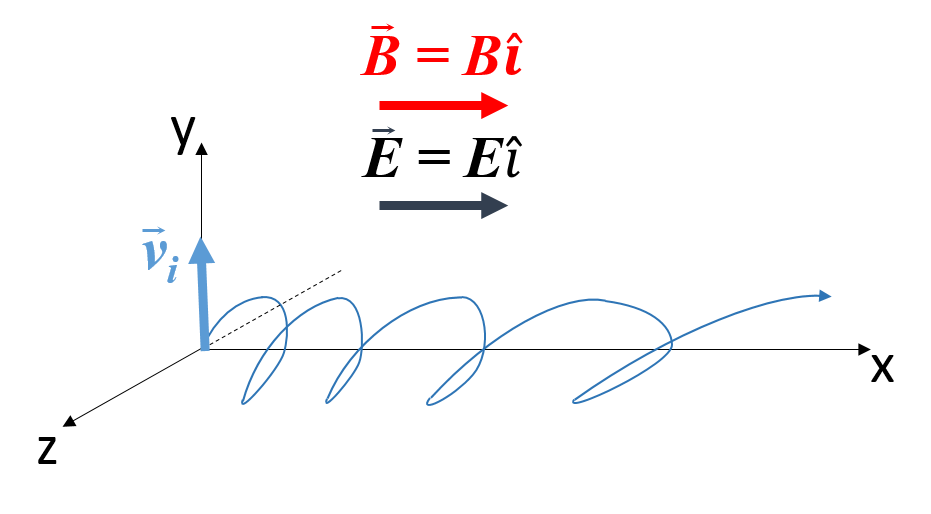{width="35%"}
:::
::::
:::::
::::::

# 4. Fuerza magnética sobre corrientes

La corriente eléctrica no es más que cargas eléctricas en movimiento, por lo que si situamos un conductor por el que pasa una corriente en un campo magnético, éste ejercerá una fuerza magnética sobre el conductor. Según la ley de Lorentz, esta fuerza debe ser perpendicular al campo y a la dirección de movimiento de las cargas, es decir, perpendicular al eje del conductor.

## 4.1. Corriente rectilínea 

Sea un segmento de conductor de una cierta longitud $l$ por el que circula una corriente de intensidad $I$. Podemos construir un vector $\vec{l}$ que tenga la longitud del conductor y dirección la de la corriente (ver figura [9](./electromagnetismo_teoría_files/teoria-conductor_rectilineo.png)). Entonces, la fuerza sobre eléctrica sobre el conductor viene dada por:

$$\fbox{$\vec{F}=I(\vec{l}\times\vec{B})$}$$

::: {style="text-align:center;"}
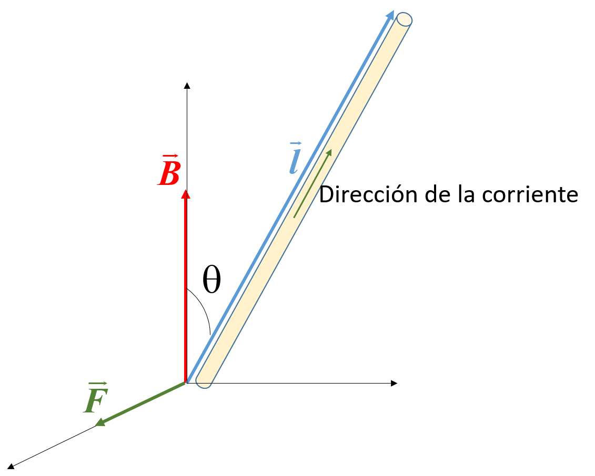{width="40%" }
:::

En definitiva:

- La fuerza es perpendicular al conductor.

- El sentido es el del productor vectorial $\vec{l}\times\vec{B}$.

- El módulo es $|\vec{F}|=IlB\sin\theta$.

## 4.2. Fuerza sobre una espira cuadrada 

Supongamos que tenemos una espira cuadrada perpendicular al campo magnético, tal y como se muestra en la figura A. Entonces sobre cada sección del conductor tendremos una dirección diferente de la fuerza, tal y como se indica en la figura [10](./electromagnetismo_teoría_files/teoria-espira.png).

::: {style="text-align:center;"}
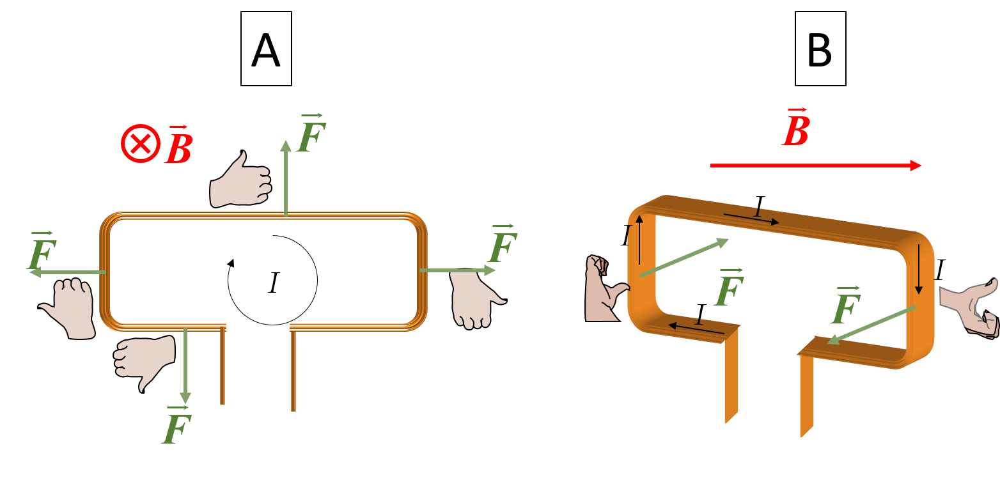{width="60%"}
:::

En efecto, sobre los tramos laterales el campo magnético es el mismo y también su longitud. Pero el sentido de la corriente, y por tanto de la fuerza, es opuesto. Lo mismo ocurre con los tramos horizontales.

Las fuerzas se anulan dos a dos y por tanto la espira no se desplaza.

Si en cambio, la espira no es perpendicular (figura B), vemos que las fuerzas sobre los tramos laterales ejercen un momento $\vec{M}$ que hace girar la espira. Este es el fundamento de los motores eléctricos: se hace pasar corriente por una espira situada en un campo magnético como el creado por un imán. En el momento que empieza a pasar corriente, la fuerza magnética fuerza a la espira y todo lo que esté ligado a ella a girar.

# 5. Campo creado por cargas en movimiento 

## 5.1. Campo creado por una corriente rectilínea 

**Dirección y sentido del campo magnético creado**

El campo magnético creado por una corriente $I$ son circunferencias que rodean al conductor y que siguen la dirección indicada por la mano derecha, tal y como se muestra en la @fig-campo_creado_conductor.

::: {style="text-align:center;"}
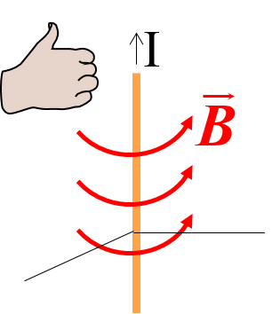{width="25%" #fig-campo_creado_conductor}
:::

**Módulo del campo**

Se puede entender intuitivamente que a mayor intensidad de corriente $I$, mayor número de cargas tenemos en movimiento y por lo tanto el campo ha de ser proporcional a dicha intensidad. El módulo del campo magnético se determina mediante la llamada ley de Biot y Savart:

$$\fbox{$B=\frac{\mu I}{2\pi r}$}$$

::::{.callout-note title="Ejemplo" collapse="false" icon="false"}
Tenemos una corriente de $20\text{ A}$ que circula por un conductor rectilíneo. Calcular el campo magnético que produce a $0.5\text{ m}$ de distancia.

:::{.callout title="Solución" collapse="true" icon="false"}

El módulo del campo mangético se calcula con la expresión:
$$B=\frac{\mu I}{2\pi r}=\frac{4\pi\cdot 10^{-7}\text{ Tm/A }20\text{ A}}{2\pi\cdot 0.5\text{ m}}=8\cdot 10^{-6}\text{ T}=8\text{ }\mu\text{T}$$
Si lo comparamos con el campo magnético terrestre (entre $25$ y $65\ \mu\text{T}$), vemos que se trata de una cantidad muy inferior.
:::

::::

## 5.2. Fuerza entre corrientes paralelas 

Anteriormente vimos que una corriente rectilínea en presencia de un campo magnético experimenta una fuerza perpendicular a la línea. Por tanto, si acercamos dos corrientes rectilíneas existirá una fuerza sobre una de ellas debida al campo magnético generado por la otra y viceversa. Esta fuerza es perpendicular a las líneas y será de repulsión o atracción según la dirección de las corrientes:

- Corrientes en el mismo sentido (A en la @fig-fuerza_entre_corrientes). En la figura A izquierda se ha destacado en rojo el campo magnético $\vec{B}_1$ generado por la corriente 1 en un punto situado sobre un elemento de la corriente 2. Esta corriente experimenta una fuerza $\vec{F}_{1-2}$ (fuerza que la corriente 1 ejerce sobre la corriente 2) en el sentido negativo del eje $OX$. Es de ATRACCIÓN. Se destaca en la figura A derecha en naranja el campo magnético $\vec{B}_2$ generado por la corriente 2 en un punto situado sobre un elemento de la corriente 1. Esta corriente experimenta una fuerza $\vec{F}_{2-1}$ (fuerza que la corriente 2 ejerce sobre la corriente 1) en sentido positivo del eje $OX$. Es de ATRACCIÓN. Naturalmente, por la ley de acción-reacción, ambas fuerzas han de ser iguales y de sentido opuesto.

- Corrientes antiparalelas (B en la @fig-fuerza_entre_corrientes). En la figura B izquierda se ha destacado en rojo el campo magnético $\vec{B}_2$ generado por la corriente 1 en un punto situado sobre un elemento de la corriente 2. Al ser la corriente 1 igual al ejemplo anterior, el campo es también el mismo. Sin embargo, dado que ahora la corriente 2 se dirige hacia abajo, la fuerza es opuesta al ejemplo anterior, en la dirección positiva del eje $OX$. Es de REPULSIÓN. Se destaca en la figura B derecha en naranja el campo magnético $\vec{B}_2$ generado por la corriente 2 en un punto sobre un elemento de la corriente 1. Teniendo de nuevo en cuenta la regla de la mano derecha, encontramos que la fuerza $\vec{F}_{2-1}$ sigue la dirección negativa del eje $OX$. Es de repulsión. De nuevo comprobamos que se cumple la ley de acción y reacción.

::: {style="text-align:center;"}
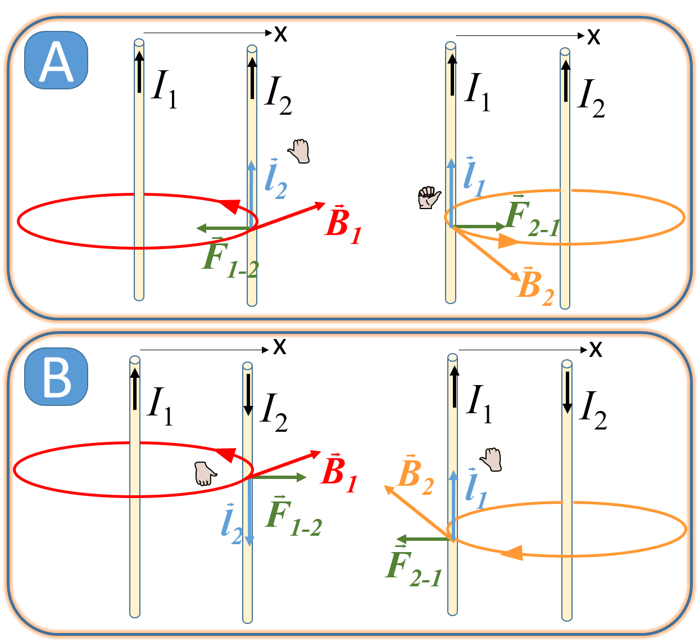{width="65%" #fig-fuerza_entre_corrientes}
:::

:::: {.callout-note title="Ejemplo" collapse="false" icon="false"}
Dos conductores rectilíneos paralelos, separados una distancia de $0.5\text{ m}$, por los que circulan corrientes de $20\text{ A}$ en el mismo sentido. Calcular la fuerza que se ejerce cada conductor sobre el otro.

:::{.callout title="Solución" collapse="true" icon="false"}
El campo magnético que genera el conductor 1 en el conductor 2 es:
$$B_1=\frac{\mu I_1}{2\pi r}=\frac{4\pi\cdot 10^{-7}\text{ Tm/A }20\text{ A}}{2\pi\cdot 0.5\text{ m}}=8\cdot 10^{-6}\text{ T}$$
La fuerza que ejerce el conductor 1 sobre el conductor 2 es:
$$F_{1-2}=I_2lB_1=20\text{ A}\cdot 1\text{ m}\cdot 8\cdot 10^{-6}\text{ T}=1.6\cdot 10^{-4}\text{ N}$$
Y la fuerza que ejerce el conductor 2 sobre el conductor 1 es:
$$F_{2-1}=I_1lB_2=20\text{ A}\cdot 1\text{ m}\cdot 8\cdot 10^{-6}\text{ T}=1.6\cdot 10^{-4}\text{ N}$$
En ambos casos, la fuerza es de atracción.

:::

::::

## 5.3. Campo magnético creado por un solenoide 

Un solenoide es un conductor enrollado en torno a un cilindro (ver la @fig-solenoide), de modo que su longitud es mucho mayor que el radio del cilindro. Se trata, pues, de un conjunto de $N$ espiras, tantas como vueltas. El campo magnético que genera en el eje es un vector que lleva la dirección del eje $Y$ el sentido marcado por la regla de la mano derecha. Se calcula con la expresión:

$$\fbox{$B=N\frac{\mu I}{L}$}$$

::: {style="text-align:center;"}
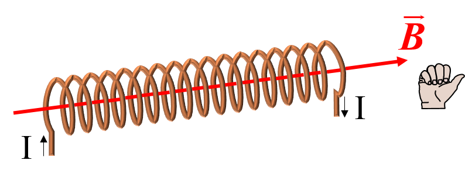{width="50%" #fig-solenoide}
:::

:::: {.callout-note title="Ejemplo" collapse="false" icon="false"}
Un solenoide tiene una longitud $L=25\text{ cm}$, un radio $R=1\text{cm}$ y un total de $N=400$ vueltas. Por él circula una corriente $I=3\text{ A}$. Calcular el campo magnético que genera.

:::{.callout title="Solución" collapse="true" icon="false"}
El campo magnético generado por el solenide es:
$$B=N\frac{\mu I}{L}=\frac{400\cdot 4\pi\cdot 10^{-7}\text{ Tm/A }3\text{ A}}{0.25\text{ m}}=6.03\cdot 10^{-3}\text{ T}=6.03\text{ mT}$$

:::
::::

# 6. El flujo magnético a través de una superficie 

El flujo es una magnitud que puede calcularse para cualquier campo vectorial y consiste en la suma del campo a todos los puntos de una superficie perpendicular a aquel. En este apartado vamos a aplicarlo al caso de un campo magnético.

**Vector superficie**

Previamente vamos a definir el vector superficie. Supongamos que trazamos una superficie imaginaria con un cierto área $S$. Esta superficie podría ser la sustentada por una línea de corriente como la de la espira de la @fig-vector_superficie. El vector superficie asociado es un vector de módulo $S$ y dirección PERPENDICULAR al plano de la superficie, tal y como se muestra en la misma figura:

:::{style="text-align:center;"}
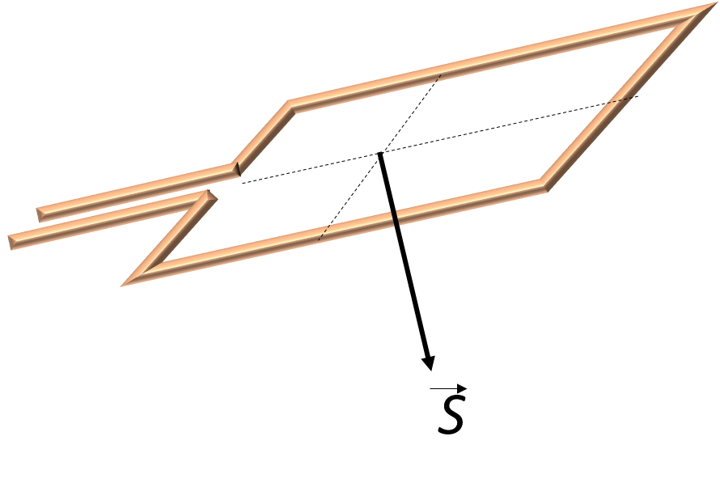{width="40%" #fig-vector_superficie}
:::

Naturalmente, si la superficie no es plana, entonces no se puede definir un único vector superficie para todo el área. En este caso, el vector superficie se define de manera local, para una porción de superficie infinitesimal $\vec{dS}$ (ver @fig-vector_superficie2). Al ser tan pequeña, la curvatura es despreciable y puede considerarse que la dirección es la misma en todos punto de este elemento de superficie.

::: {style="text-align:center;"}
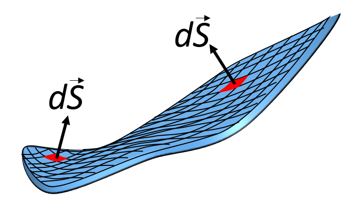{width="45%" #fig-vector_superficie2}
:::

Para el cálculo del flujo magnético partamos del caso más sencillo:

**Flujo magnético de un campo uniforme a través de una superficie plana **$\vec{S}\parallel\vec{B}$

En este caso, el plano de la superficie es perpendicular al vector campo y por lo tanto el flujo, campo sumado a todo punto de la superficie, es simplemente:

$$\Phi=BS$$

**Flujo magnético de un campo uniforme a través de una superficie plana inclinada respecto del campo**

Tal y como se muestra en la @fig-flujo_superficie, en este caso, la superficie perpendicular $S_\perp$ es la proyección de $\vec{S}$ en el plano perpendicular al campo:

$$\Phi=BS_\perp=BS\cos\theta=\vec{B}\cdot\vec{S}$$

es decir, el producto escalar entre campo magnético y vector superficie.

::: {style="text-align:center;"}
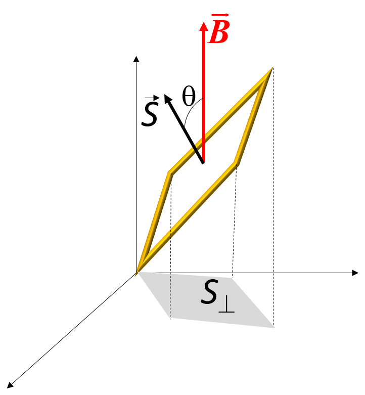{width="45%" #fig-flujo_superficie}
:::

**Flujo magnético de un campo no uniforme a través de una superficie cualquiera**

En este caso, no se puede realizar el cálculo directamente. Sí puede hacerse localmente. El flujo a través de una superficie elemental $\vec{dS}$ contenida en la superficie de interés es:

$$d\Phi=\vec{B}\cdot\vec{dS}$$

El flujo total a través de toda la superficie será la suma del flujo sobre cada elemento de superficie:

> $$\Phi=\int_S\vec{B}\cdot\vec{dS}$$
>
> La unidad del flujo magnético es el Weber (Wb)
>
> $$1 \text{ Wb}= 1 \text{ T·m}^2$$

# 7. Inducción electromagnética

Hemos visto que los campos magnéticos ejercen fuerzas sobre las cargas en movimiento. Vamos a ver a continuación que esto puede utilizarse para la generación de corriente eléctrica.

## 7.1. Ley de Faraday 

Si situamos un conductor en el seno de un campo magnético, en determinadas circunstancias se puede producir una fuerza electromotriz entre los extremos que dé lugar a una corriente eléctrica. Faraday realizó diversas experiencias en las que se mostraba como un campo magnético podía genera corriente en una espira:

- **Imán que se acerca o aleja de una espira.** El campo magnético que genera un imán no es uniforme, sino que disminuye en intensidad al alejarnos de él. Si acercamos o alejamos un imán a una espira, observaremos que se genera una corriente eléctrica en la espira.

- **Espira que se acerca o aleja de otra por la que circula una corriente.** Si tenemos una espira por la que hacemos pasar una corriente, esta corriente genera un campo magnético qe de nuevo es no uniforme. Si acercamos o alejamos esta espira a otra, observaremos una corriente en la segunda espira.

- También podemos conseguir una corriente en la segunda espira manteniendo la primera fija y utilizando un interruptor que conecte y desconecte la corriente. Mientras se conecta o desconecta, varía el campo magnético y se produce una corriente en la segunda espira.

Existen más posibilidades:

- **Espira con un lado móvil** (ver @fig-espira_ladomovil). Si ponemos una espira en un campo magnético uniforme y deslizamos uno de sus lados, entonces también se produce una corriente eléctrica.

- **Espira que gira.** Si la espira gira en el seno de un campo magnético, entonces también se produce una fuerza electromotriz. (Este es el fundamento de la dinamo de una bicicleta)

::: {style="text-align:center;"}
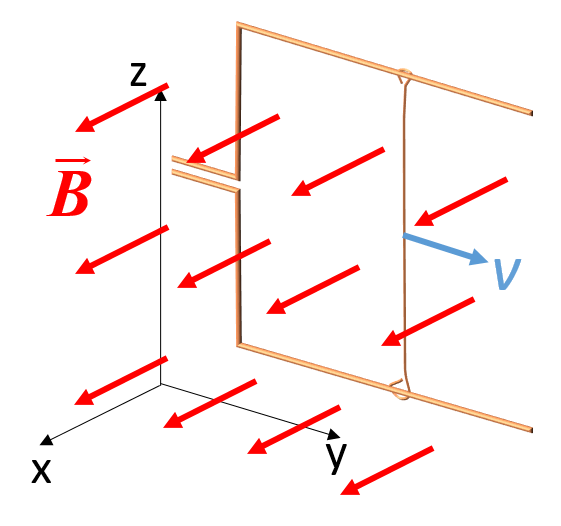{width="35%" #fig-espira_ladomovil}
:::

Vemos entonces que no es necesario que varíe el campo magnético. Basta con variar el área que sustenta la espira o el ángulo entre dicha superficie y el campo. Esto se resume en la ley de Faraday:

> $$\varepsilon=-\frac{\text{d}\Phi}{\text{d}t}$$
>
> La unidad de la fuerza electromotriz es el voltio (V)

Es decir, la fuerza electromotriz que se genera en una espira es igual a la rapidez con la que varía el flujo magnético en la superficie sustentada por dicha espira y cambiada de signo.

Teniendo en cuenta que, en el caso de campo magnético homogéneo, $\Phi=\vec{B}\cdot\vec{S}$, vemos que efectivamente, aparecerá una corriente cuando varíe el campo, el área sustentada por la espira o el ángulo entre ellas.

Para poder usar esta expresión seguiremos los siguientes pasos:

1. Definir el sentido del vector superficie. El vector superficie es perpendicular al área sustentada por la espira, pero no hay ningún criterio para elegir el sentido del vector. Escogemos uno cualquiera.

2. Usamos la regla de la mano derecha. Con el pulgar en la dirección escogida para $\vec{S}$ el sentido de cierre del puño indica el sentido de la corriente positiva.

3. Calculamos el flujo magnético $\Phi=\vec{B}\cdot\vec{S}$.

4. Utilizamos la ley de Faraday para obtener $\varepsilon$.

5. Si $\varepsilon$ es positivo, entonces la dirección de la corriente es la elegida con la regla de la mano derecha. Si se obtiene $\varepsilon < 0$, entonces la dirección es la opuesta.

::::::{.callout-note title="Ejemplos" collapse="true" icon="false"}
::::{.callout-caution title="Ejemplo 1" collapse="true" icon="false"}

Una bobina está formada por $N=200$ espiras cuadradas de lado $l=3\text{ cm}$ se sitúa en una región donde existe un campo magnético uniforme de $B=0.3\text{ T}$ perpendicular a las espiras. Calcular el flujo magnético que circula por ellas.

:::{.callout title="Solución" collapse="true" icon="false"}

Las espiras son planas y el campo uniforme, luego $\Phi=\int_S\vec{B}\cdot\text{d}\vec{S}=\vec{B}\cdot{S}$. Como las espiras son perpendiculares al campo, el vector superficie es paralelo a éste, y por tanto $\vec{B}\cdot\vec{S}=BS$. El área total será el área de una espira multiplicado por el número total de espiras que tenemos:
$$S=Nl^2$$ 

$$\Phi=BS=BNl^2=0.3\text{ T}\cdot 200\cdot 0.03^2\text{ m}^2=0.054\text{ Wb}$$
:::
::::

:::::{.callout-caution title="Ejemplo 2" collapse="true" icon="false"}

Considere la situación de la figura.

a. Dibuje el vector superficie.

b. Calcule el flujo a través de la espira.

:::{style="text-align:center;"}
{width="20%"}
:::

::::{.callout title="Solución" collapse="true" icon="false"}

a. \

::: {style="text-align:center;"}
{width="20%"}
:::
b. Como la espira es plana y el campo uniforme:
$$\Phi=\vec{B}\cdot\vec{S}=BS\cos (70^\circ)=0.0547\text{ Wb}$$
::::
:::::

:::::{.callout-caution title="Ejemplo 3" collapse="true" icon="false"}

Una espira cuadrada se encuentra en el seno de un campo magnético uniforme de módulo $B=0.5\text{ T}$ tal y como se muestra en la figura. La espira tiene un lado que puede deslizarse sobre unas guías, de modo que mantiene dos lados de tamaño fijo $l_1=1.2\text{ m}$ y los otros dos se van reduciendo de acuerdo con $l_2=1.2\text{ m}-vt$, siendo $v=0.2\text{ m/s}$, el ritmo al que se desliza el lado móvil.

a. Calcular el flujo a través del área sustentada por la espira.

b. Calcular la fuerza electromotriz inducida sobre la espira.

c. Dibujar la dirección que lleva la corriente por la espira.

:::{style="text-align:center;"}
{width="25%"}
:::

::::{.callout title="Solución" collapse="true" icon="false"}

a. Para calcular el flujo, primero necesito una dirección de la superficie. Escogemos la misma que la del campo magnético, como se muestra en la figura A. Entonces, el flujo será:

$$\Phi=\vec{B}\cdot\vec{S}=BS$$

donde $S=l_1l_2=1.2(1.2-0.2t)$ m$^2$, por lo tanto:

$$\Phi=0.5\text{ T}\times 1.2(1.2-0.2t)\text{ m}^2=(0.72-0.12t)\text{ Wb}$$

:::{style="text-align:center;"}
{width="30%"}
:::

b. Sigamos los pasos indicados en teoría. Definido el sentido del vector superficie, usamos la regla de la mano derecha para determinar el sentido positivo de la fuerza electromotriz, tal y como se muestra en la figura B.

A continuación, utilizamos el flujo magnético calculado en el apartado anterior para calcular la fuerza electromotriz:

$$\varepsilon=-\frac{\text{d}\Phi}{\text{d}t}=-\frac{\text{d}}{\text{d}t}(0.72-0.12t)\text{ Wb}=+0.12\text{ V}$$

c. Dado que se ha obtenido un valor positivo, esto quiere decir que el sentido escogido en la figura B es el sentido correcto de la fuerza electromotriz, y por tanto de la corriente.
::::
:::::

:::::{.callout-caution title="Ejemplo 4" collapse="true" icon="false"}

La misma espira del ejercicio anterior, pero ahora el lado móvil se mueve en dirección contraria a igual velocidad, de modo que $l_1=1.2\text{ m}$ y $l_2=vt$, siendo $v=0.2\text{ m/s}$. El campo es el mismo, $B=0.5\text{ T}$. ¿Cómo cambiaría el ejercicio anterior?

:::{style="text-align:center;"}
{width="25%"}
:::

::::{.callout title="Solución" collapse="true" icon="false"}

Intuitivamente, podríamos decir que dado que la superficie en este caso aumenta en vez de disminuir, también lo hace el flujo magnético y por tanto la ley de Faraday me dará el mismo valor pero cambiado de signo. Esto indica que la fuerza electromotriz y por tanto la corriente siguen la dirección opuesta. En detalle sería:

Lo primero es escoger una dirección de la superficie. Escogemos la misma que la del campo magnético, como se muestra en la figura. Entonces, el flujo será el mismo que en el ejercicio anterior:

$$\Phi=\vec{B}\cdot\vec{S}=BS$$

donde $S=l_1l_2=0.24t\text{ m}^2$, por lo tanto:

$$\Phi=0.5\text{ T}\times 0.24t\text{ m}^2=0.12t\text{ Wb}$$

:::{style="text-align:center;"}
{width="25%"}
:::

Definido el sentido del vector superficie, usamos la regla de la mano derecha para determinar el sentido positivo de la fuerza electromotriz, tal y como se muestra en la figura a la derecha en verde.

A continuación, calculamos la fuerza electromotriz con la ley de Faraday:

$$\varepsilon=-\frac{\text{d}\Phi}{\text{d}t}=-\frac{\text{d}}{\text{d}t}(0.12t)\text{ Wb}=-0.12\text{ V}$$

Efectivamente $\varepsilon < 0$, por lo que la fuerza electromotriz y la corriente siguen el sentido indicado en la figura en amarillo.
::::
:::::

::::{.callout-caution title="Ejemplo 5" collapse="true" icon="false"}

Un solenoide está compuesto por $N=300$ espiras cuadradas de lado $2.0\text{ cm}$ y gira en torno al eje vertical $OZ$ con una frecuencia de $60 \text{ Hz}$ en una región en la que existe un campo magnético uniforme $\vec{B}=0.4\hat{\imath}\text{ T}$ (ver figura).

a. ¿Cuál es la fuerza electromotriz en cualquier instante de tiempo $t$?

b. ¿Cuál es la máxima fuerza electromotriz?

:::{style="text-align:center;"}
{width="20%"}
:::

:::{.callout title="Solución" collapse="true" icon="false"}

a. El primer paso es elegir el vector superficie. Dado que la espira está girando, la orientación cambia con el tiempo. El número de vueltas que realiza por segundo, es decir, la frecuencia $f=60 \text{ Hz}$, multiplicado por el ángulo que corresponde a una vuelta, es decir $2\pi\text{ rad}$, me dará el ángulo que gira por segundo $\omega$. Esto multiplicado por el tiempo que está girando me da el ángulo $\theta$ con el eje $OX$:

$$\theta=2\pi ft$$

El área sustentada cada espira es $S=l^2=4\cdot 10^{-4}$ m$^2$. Como hay un total de 300 espiras. $S=0.12$ m$^2$. El vector superficie será:

$$\vec{S}=0.12(\cos (2\pi ft)\hat{\imath}+\sin (2\pi ft)\hat{\jmath})$$

El flujo será:

$$\Phi=\vec{B}\cdot\vec{S}=BS\cos\theta=BS\cos (2\pi ft)$$

Y con la ley de Faraday:

$$\varepsilon=-\frac{\text{d}\Phi}{\text{d}t}=-\frac{\text{d}}{\text{d}t}(BS\cos (2\pi ft))=BS2\pi f\sin (2\pi ft)$$

Y sustituyendo los datos

$$\varepsilon=0.4\text{ T}\cdot 0.12\text{ m}^22\pi 60\text{ Hz}\sin (120\pi t)=18.09\text{ V}\sin (120\pi t)$$

b. Como vemos, la fuerza electromotriz varía sinusoidalmente. Alcanzará el valor máximo en los instantes en el que $\sin (120\pi t)$ sea máximo. Dado que la función *seno* tiene como valor máximo 1, entonces, la fuerza electromotriz máxima será 18.09 V.
:::
::::
::::::