# 1. Oscilaciones

## 1.2. Cinemática del M.A.S.

Imaginemos un cuerpo que se ve sometido a una fuerza dirigida siempre a un punto, que llamaremos de equilibrio. A tal fuerza se le llama "fuerza restauradora". Si este cuerpo se encuentra en reposo en dicha posición de equilibrio, entonces la fuerza es nula y se mantendrá en reposo. Se dice que el cuerpo está en equilibrio. Podemos imaginarnos varias situaciones de este tipo. En la figura se muestran tres ejemplos.

::: {style="text-align:center;"}
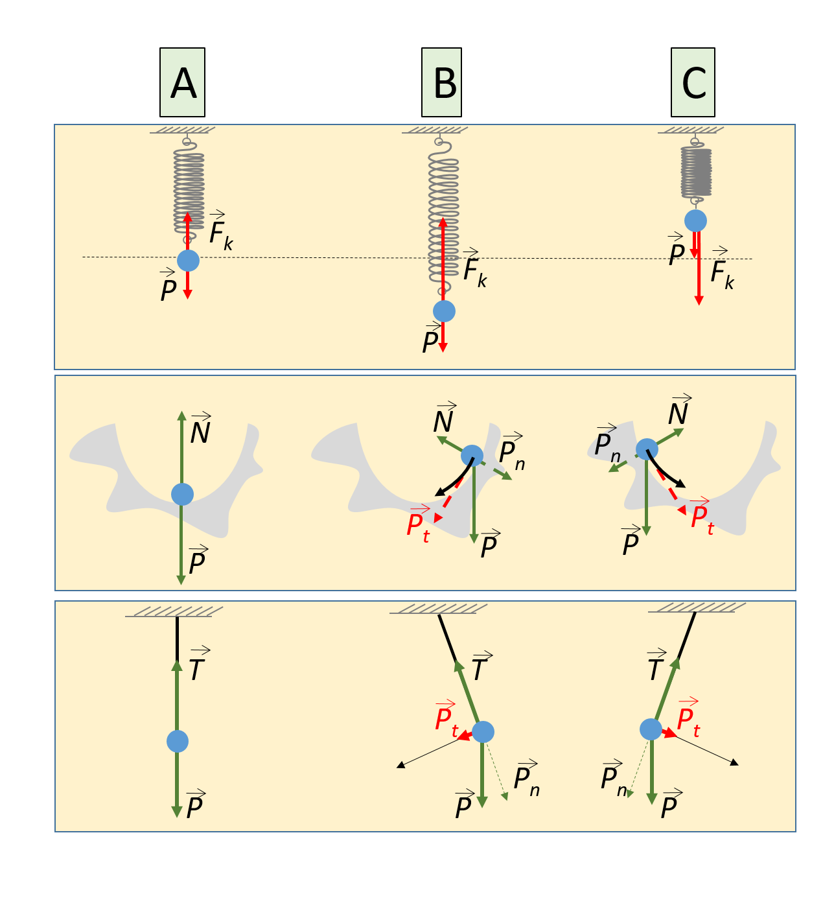{width="50%"}
:::

En el primer ejemplo, el muelle que inicialmente esté en B o C tiende a recuperar su forma natural en a). En el segundo ejemplo, el peso en b) y c) no es perpendicular a la plataforma y la rueda tiende a caer hacia la posición más baja. En el tercer ejemplo, la tensión del hilo en b) y c) no es paralelo al peso, por lo que la componente perpendicular al hilo $P_t$ no está compensado y hacen volver al péndulo a su posición vertical.

En cualquiera de estas situaciones, el cuerpo regresa a la posición de equilibrio con una cierta velocidad. En esta posición, la fuerza neta es nula, con lo cual el cuerpo mantiene su velocidad y rebasa esta posición de equilibrio. Por lo tanto aparece una fuerza restauradora en la dirección opuesta que hará que el cuerpo se frene primero y vuelva a continuación.

Este tipo de movimiento, en el que el cuerpo se desplaza en torno a una posición de equilibrio se denomina "oscilación".

En muchos casos, el cuerpo no sólo pasa repetidas veces por su posición de equilibrio, sino que lo hace periódicamente. Es decir, el tiempo que tarda en hacer un ciclo completo es siempre el mismo. A este tipo de oscilaciones se les llama **vibración armónica**.

Si el cuerpo se desvía pequeñas distancias del equilibrio, entonces una buena aproximación a su movimiento viene dada por la **vibración armónica simple**. En este caso,

- La fuerza que actúa sobre la partícula o sistema es proporcional al desplazamiento del cuerpo con respecto a su posición de equilibrio.

- La posición de la partícula se pueda especificar mediante una función seno o coseno del tiempo.

## 1.2. Movimiento armónico simple (M.A.S.) 

Se define el movimiento armónico simple como aquél que se puede describir con una función armónica del tiempo, es decir, con una función seno o coseno.

En los movimientos periódicos, la partícula se aleja una distancia máxima, a la que se llama **amplitud** $A$, distancia en la que se frena completamente y se dirige de nuevo a la posición de equilibrio.

Imaginemos que en el instante inicial la partícula se encuentra en la posición de equilibrio, es decir, $x(t=0)=0$. En cualquier otro instante de tiempo, la posición de la partícula se puede describir mediante una función del tiempo $x(t)$ dada por: 
$$x(t)=A\sin\left(\varphi\right)=A\sin\left(2\pi\frac{t}{T}\right)$$ 
donde $\varphi$ lo denominamos la "fase" del movimiento.

En la siguiente gráfica se representa esta función. Obsérvese que para $t=T/4$, entonces $\sin\left(\pi/2\right)=1$, su valor máximo, y por tanto, en ese instante, $x(T/2)=A$. Dado que el máximo valor del seno es 1, entonces, el máximo valor de $x$ es, efectivamente, la amplitud $A$. Del mismo modo, para $t=3T/4$, $\sin\left(3\pi/2\right)=-1$ entonces, $x(3T/4)=-A$: La partícula ejecuta oscilaciones desde $A$ hasta $-A$. Si esperamos hasta $t=T/4+T$, entonces de nuevo $x(5T/4)=A$, es decir, transcurrido un periodo, la partícula vuelve al máximo.

::: {style="text-align:center;"}
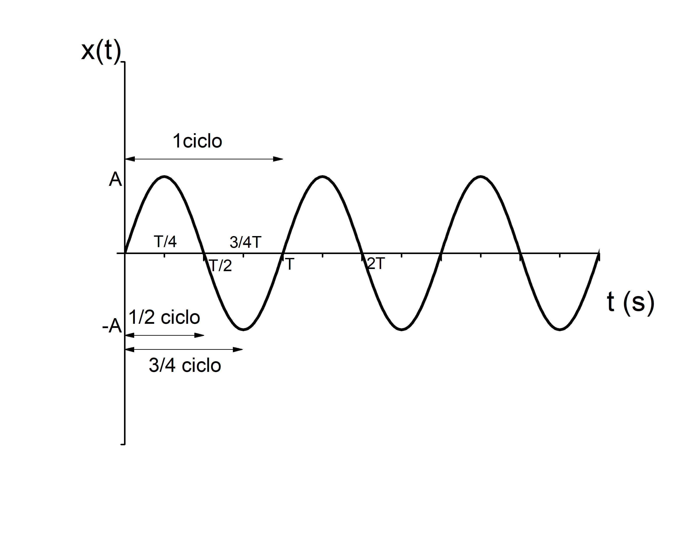{width="80%"}
:::

Por tanto, $T$ es el tiempo que tarda la partícula en ejecutar una oscilación completa. A este tiempo lo llamamos **periodo**. Fíjese que en medio periodo, habrá completado 1/2 ciclo, en 1/4 de periodo, 1/4 ciclo, etc.

:::: {.callout-note title="Ejemplo:" collapse="false" icon="false"}
Un objeto está oscilando sujeto a un muelle vertical. Se observa que tarda tarda 3 segundos en llegar desde su punto más alto hasta su punto más bajo. Calcule su periodo.

:::{.callout-note title="Solución:" collapse="true" icon="false"}

Si observamos la figura anterior, el recorrido entre el punto más alto, es decir, cuando $x=A$, hasta el punto más bajo, es decir, cuando $x=-A$, es la mitad del ciclo completo y tardará por lo tanto $T/2$. Por lo tanto, si tarda $t=3 \text{ s}$, el periodo será el doble: $T=6 \text{ s}$.
:::
::::

Se define la **frecuencia** como el número de ciclos por unidad de tiempo. Para calcularlo, basta con tener en cuenta que en un tiempo $T$ se ejecuta una oscilación, es decir, 
$$f=\frac{1}{T}$$ 
Como el tiempo se mide en segundos, la frecuencia se mide en $\text{s}^{-1}$. A esta unidad se le conoce como **hercio** (Hz). Fíjese que con esta definición, en un cierto tiempo $t$ ejecutará $N=ft$ oscilaciones.

:::: {.callout-note title="Ejemplo:" collapse="false" icon="false"}
Un objeto está oscilando sujeto a un muelle vertical. Se observa que tarda tarda 5 segundos en realizar 10 oscilaciones. Calcule su periodo y su frecuencia.

:::{.callout-note title="Solución:" collapse="true" icon="false"}

El periodo será el tiempo que tarda en realizar una oscilación: 
$$T=\frac{t}{N}=\frac{5 \text{ s}}{10}=0.5 \text{ s}$$
Por otro lado, la frecuencia es el número de oscilaciones en la unidad de tiempo: 
$$f=\frac{N}{t}=\frac{1}{T}=2 \text{ Hz}$$
:::
::::

Finalmente, recordemos que la función seno o coseno es cíclica cuando su argumento (al que llamamos fase), llega a 2$\pi$. Por ello, es usual definir la **frecuencia angular** $\omega$ como la fase en radianes por unidad de tiempo. Como un ciclo completo son 2$\pi$ radianes, la frecuencia angular será: $$\omega=2\pi f$$ y se mide en rad/s. De este modo es fácil ver que el M.A.S. se puede describir con la función: $$x(t)=A\sin\left(\omega t\right)$$

En resumen:

|Nombre|Abreviatura|Unidad|Equivalencia|
|:---------------------|:--------------------|:--------------------|:--------------------|
|Amplitud |          $A$|        m     | |
|Periodo  |          $T$|        s     | |
|Frecuencia|         $f$|        Hz    |$\frac{1}{T}$|
|Frecuencia angular|   $\omega$|   rad/s|    $\frac{2\pi}{T}=2\pi f$|

En este movimiento, no sólo varía la posición. Nótese que la partícula se frena al llegar a la máxima amplitud y luego invierte la dirección del movimiento. La velocidad la podemos calcular como la variación temporal de la posición: 
$$v=\frac{dx}{dt}=A\omega\cos\left(\omega t\right)$$ 
Dado que los límites de la función coseno son también $\pm$1, entonces la velocidad oscila también con el tiempo desde un valor máximo $v_{MAX}=A\omega$ hasta el valor mínimo $-v_{MAX}$, pero lo hace desfasada $\pi/2$ respecto de la posición. En efecto, cuando el muelle está estirado, la masa se para ($v=0$) e inicia su movimiento ascendente (velocidad negativa). Cuando pasa por la posición de equilibrio, la velocidad es máxima y continúa su ascenso a velocidad negativa pero decreciente en valor absoluto. Cuando el muelle está comprimido, la masa se vuelve a frenar ($v=0$) e inicia el descenso (velocidad positiva). En resumen, cuando $x$ es máxima en valor absoluto, entonces la velocidad es cero y viceversa.

::: {style="text-align:center;"}
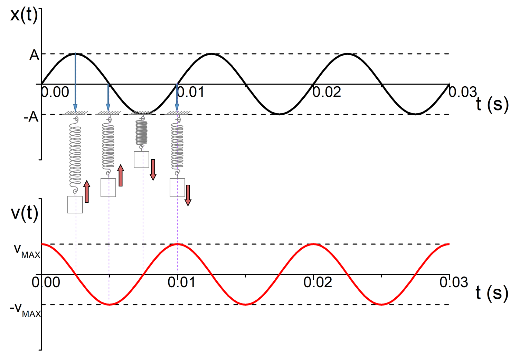{width="80%"}
:::

+---------------------+-------------------------------------+
| $x=A$               | $v=0$                               |
+---------------------+-------------------------------------+
| $A>x>0$             | $v<0$ creciente en valor absoluto   |
+---------------------+-------------------------------------+
| $x=0$               | $v=-v_{MAX}$                        |
+---------------------+-------------------------------------+
| $0>x>-A$            | $v<0$ decreciente en valor absoluto |
+---------------------+-------------------------------------+
| $x=-A$              | $v=0$                               |
+---------------------+-------------------------------------+
| $-A < x < 0$        | $v>0$ creciente en valor absoluto   |
+---------------------+-------------------------------------+

Este caso particular nos ha servido para entender las características principales del M.A.S. Fijémosnos ahora en el instante incial del movimiento, es decir, $t=0$. Si observamos de nuevo la gráfica anterior, podemos ver que en el instante inicial $t=0$ el objeto parte de la posición de equilibrio $x(0)=0$ con la velocidad máxima $v(0)=v_{MAX}$. Sin embargo, no todas las oscilaciones son así. Por ejemplo, podríamos haber iniciado el movimiento estirando o comprimiendo el muelle y soltándolo en el instante inicial. En este caso, las ecuaciones anteriores no son correctas porque no describen el movimiento real. Otra opción podría haber sido partir de una posición intermedia a una velocidad. Por tanto, cuando se estudia un movimiento es muy importante tener en cuenta las "condiciones" iniciales del movimiento. Éstas se expresan indicando $x(t=0)$ (o bien, simplemente $x(0)$) y $v(t=0)$ (o bien, simplemente $v(0)$).

Veamos cómo se actúa en este caso. En el ejemplo del muelle estirado que se suelta en el instante inicial, la velocidad inicial es $v(0)=0$. Hemos visto en la tabla anterior que cuando la velocidad es nula, la masa tiende a volver a su posición de equilibrio. Esto quiere decir que la elongación es máxima: $x(0)=A$. Esto se cumple si escribimos, para cualquier otro instante de tiempo: $$x(t)=A\sin\left(\omega t+\pi/2\right)$$ Efectivamente, si sustituimos $t=0$ en la ecuación anterior, obtenemos $x=A$. Para la velocidad, como es la derivada temporal de la posición: $$v(t)=\frac{dx}{dt}=A\omega\cos\left(\omega t+\pi/2\right)$$

Y como hemos llamado $v_{MAX}$ al valor máximo de la velocidad, entonces: $$v(t)=A\omega\cos\left(\omega t+\pi/2\right)=v_{MAX}\cos\left(\omega t+\pi/2\right)$$ Y por tanto, $$v_{MAX}=A\omega$$ Vemos, pues, que podemos utilizar la misma función trigonométrica, modificando ligeramente su argumento para incluir lo que llamamos **fase inicial**. La fase inicial en este ejemplo es $\varphi_0=\pi/2$.

En el caso completamente general, podemos decir que en $t=0$, la fase del ciclo $\varphi_0$ no tiene por qué ser ni cero ni $\pi/2$. Por ello, el modo más general de describir el M.A.S. es mediante:

En la siguiente gráfica se muestran tres casos. La línea negra corresponde con el caso $\varphi_0=0$, es decir, la masa parte de la posición de equilibrio. La línea verde es el caso $\varphi_0=\pi/2$, es decir, la masa parte de la máxima elongación en reposo. La línea roja es el caso $\varphi_0=\pi/4$, que es un caso intermedio: la masa parte de una distancia menor que la máxima con una velocidad menor que la velocidad máxima.

::: {style="text-align:center;"}
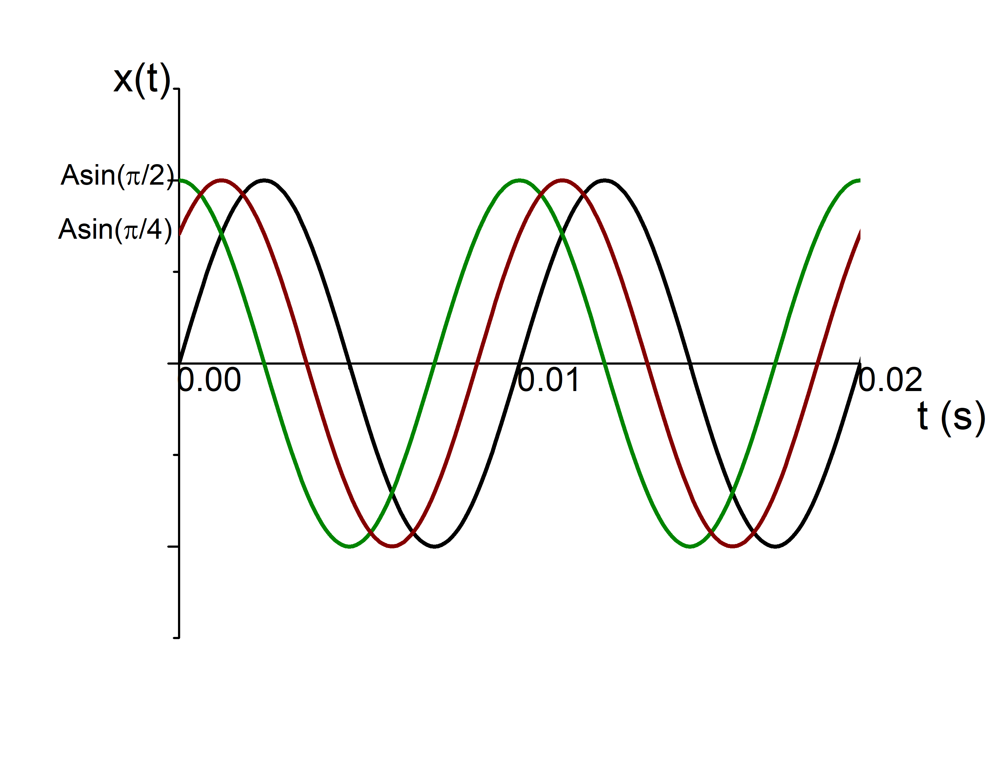{width="30%"}
:::

En un caso cualquiera, para poder determinar la posición y velocidad en cualquier instante, tendremos en cuenta que:

- $x(t=0)=A\sin\left(\varphi_0\right)$

- $v(t=0)=A\omega\cos\left(\varphi_0\right)$

Típicamente, si en un problema nos dan la frecuencia y la posición y velocidad iniciales, entonces, de las dos ecuaciones anteriores se obtiene la amplitud del movimiento y la fase inicial.

:::: {.callout-note title="Ejemplo:" collapse="false" icon="false"}

Tenemos una oscilación de frecuencia $\omega = 20 \text{ rad/s}$ . Inicialmente, la masa se encuentra en $x = 1 \text{ m}$ respecto de la posición de equilibrio y con una velocidad de $v = 20 \text{ m/s}$. Encuentre la función que describe la posición y velocidad en cualquier instante.

:::{.callout-note title="Solución:" collapse="true" icon="false"}

En general, sabemos que: $$x(t) = A \sin(\omega t + \varphi_0) = A \sin(20t+ \varphi_0)$$ $$v(t) = A \omega \cos(\omega t + \varphi_0) = 20 A \cos(20t+ \varphi_0)$$ Nos dan los valores en el instante inicial:\
$x(0) = 1 \text{ m} = A \sin (\varphi_0)$.\
$v(0) = 20 \text{ m/s} = 20 A \cos (\varphi_0)$.\
De esta última ecuación: $$v(0)/20 = 20/20 = 1 = A \cos (\varphi_0)$$ Y por tanto, 
$$\frac{x(0)}{v(0)/20} = \frac{A \sin(\varphi_0)}{A \cos(\varphi_0)} = tan(\varphi_0)$$ Como $\frac{x(0)}{v(0)/20} = 1$, entonces, $$\varphi_0 = \pi/4$$ 
Además, $x(0) = 1 \text{ m} = A \sin (\varphi_0)$, por lo tanto $$\frac{x(0)}{\sin(\varphi_0)} = \sqrt{2}$$ 
Finalmente:
$$x(t) = \sqrt{2} \sin(20t + \pi/4) \text{ m} = 1.41 \sin(20t+ \pi/4) \text{ m}$$ 
$$v(t) = \sqrt{2} \cdot 20 \cos(20t + \pi/4) \text{ m/s} = 28.3 \cos(20t+ \pi/4) \text{ m/s}$$
:::
::::

## 1.3 Ley de Hooke

Como ya se adelantó, un cuerpo oscila cuando sobre él actúa una fuerza recuperadora, es decir, una fuerza que se dirige siempre hacia una posición, que es la posición de equilibrio. Tomemos el caso de una masa sujeta a un muelle:

::: {style="text-align:center;"}
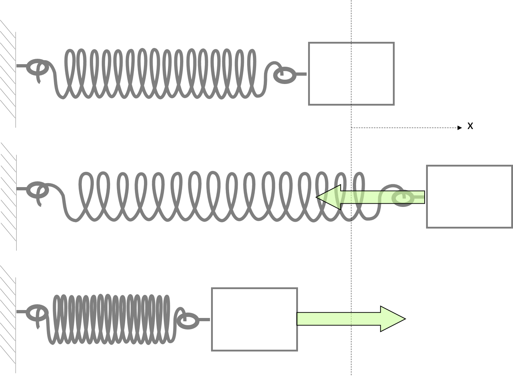{width="30%"}
:::

A medida que la partícula se desplaza hacia la derecha (segundo dibujo), el muelle se estira y por tanto ejerce una fuerza sobre la masa hacia la izquierda. En el tercer dibujo el muelle se opone a ser comprimido, por lo que la fuerza lleva el sentido positivo del eje x. Si situamos el origen de coordenadas en la posición de equilibrio, tal y como se muestra en esta figura, entonces la fuerza que ejerce el muelle es: $$\vec{F}=-kx\hat{\imath}$$ siendo $k$ la "constante elástica del muelle". Esta es la denominada "ley de Hooke".

:::: {.callout-note title="Ejemplo:" collapse="false" icon="false"}

Si tenemos un muelle de constante k = 20 N/m, calcule la fuerza que ejerce sobre una masa m = 0.5 kg, cuando ésta esté situada a 15 cm de la posición de equilibrio. ¿Con qué aceleración se mueve?

::: {style="text-align:center;"}
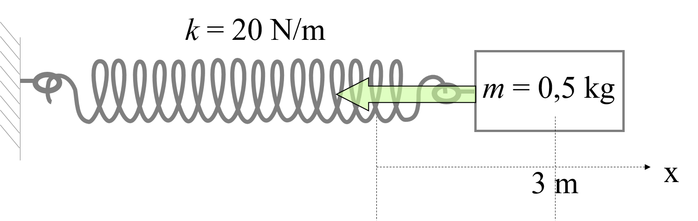{width="50%"}
:::

:::{.callout-note title="Solución:" collapse="true" icon="false"}

$\vec{F}=-kx\hat{\imath}$, entonces: $$\vec{F}=-20 \text{ N/m} \cdot 0.15\text{ m }\hat{\imath} = -3 \text{ N }\hat{\imath}$$ Para calcular la aceleración $\vec{a}$, utilizamos la segunda ley de Newton: $\vec{F}=m\vec{a}$, por lo que $$\vec{a}= \frac{\vec{F}}{m} = -\frac{3\text{ N}}{0.5 \text{ kg}}\hat{\imath} = -6 \text{ m/s}^2\text{ } \hat{\imath}$$
:::
::::

Como la única fuerza es la que ejerce el muelle, por la segunda ley de Newton: $$\sum\vec{F}=-kx\hat{\imath}=m\frac{d^2x}{dt^2}\hat{\imath}$$ Cuando una masa está sometida a una fuerza de este tipo, entonces su posición viene descrita por un M.A.S. Es decir, $$x(t)=A\cos\left(\omega t+\varphi_0\right)$$ Por lo tanto su velocidad será: $$\vec{v}(t)=v_x(t)\hat{\imath}=\frac{dx}{dt}\hat{\imath}=-\omega A\sin\left(\omega t+\varphi_0\right)\hat{\imath}$$ Y su aceleración: $$\vec{a}(t)=\frac{d\vec{v}}{dt}=-\omega^2A\cos\left(\omega t+\varphi_0\right)\hat{\imath}$$ En definitiva nos queda: $$\sum\vec{F}=-kx\hat{\imath}=-kA\cos\left(\omega t+\varphi_0\right)\hat{\imath}$$ $$m\frac{d^2x}{dt^2}\hat{\imath}=-m\omega^2A\cos\left(\omega t+\varphi_0\right)\hat{\imath}$$ E igualando: $$-kA\cos\left(\omega t+\varphi_0\right)=-m\omega^2A\cos\left(\omega t+\varphi_0\right)$$ Por lo tanto: $$\omega=\sqrt{\frac{k}{m}}$$

## 1.4. El muelle vertical

Hemos visto que cuando sobre una masa actúa una fuerza del tipo $\vec{F}=-kx\hat{\imath}$, siendo $x$ la distancia respecto de la posición de equilibrio, entonces el objeto realiza un movimiento armónico simple. Veamos que esto es válido también cuando además de esta fuerza, actúa otra constante.

Un ejemplo es el muelle vertical. En este caso, además de la fuerza del muelle, actúa la fuerza gravitatoria. En la siguiente figura se esquematiza esta situación.

::: {style="text-align:center;"}
{width="30%"}
:::

En el primer caso, el muelle no tiene ningún peso, por lo que su longitud es la longitud natural del muelle, $l_0$. A continuación se suspende una masa $m$. Como consecuencia, el muelle se alarga un poco hasta encontrar el equilibrio. En esta posición de equilibrio (segundo dibujo), la suma de fuerzas ha de ser nula: $$\sum\vec{F}=\vec{F}_k+\vec{P}=0$$ Por lo tanto, $-k(l-l_0)\hat{\jmath}+mg\hat{\jmath}=0$, es decir: $$-k(l-l_0)+mg=0$$

En el tercer dibujo, la elongación del muelle es mayor, por lo que la fuerza del muelle supera al peso y habrá una componente neta en dirección hacia arriba. En este caso, la elongación del muelle es $l+y-l_0$ por lo que la fuerza neta es: $$\sum\vec{F}=\vec{F}_k+\vec{P}=-k(l-l_0+y)\hat{\jmath}+mg\hat{\jmath}$$ Reagrupando: $$\sum\vec{F}=-ky\hat{\jmath}\underbrace{-k(l-l_0)\hat{\jmath}+mg\hat{\jmath}}$$ El contenido dentro de la llave hemos visto que es nulo, por lo que: $$\sum\vec{F}=-ky\hat{\jmath}$$ Y por la segunda ley de Newton: $$\sum\vec{F}=m\vec{a}=-ky\hat{\jmath}$$ que se corresponde con la ley de Hooke. Es decir, cuando el muelle está en posición vertical, el objeto realiza un M.A.S. pero desde una posición de equilibrio diferente, en la que el muelle está algo deformado.

Con esta situación tenemos un modo de calcular la constante de un muelle. Si colgamos una masa conocida y determinamos la elongación de equilibrio $l-l_0$, la constante del muelle se determina a partir de: $$-k(l-l_0)\hat{\jmath}+mg\hat{\jmath}=0$$ Es decir, en el equilibrio la suma de fuerzas es 0. Y despejando la constante del muelle, podemos calcularla a partir de la siguiente ecuación:$$k=\frac{m g}{l-l_0}$$

## 1.5. Energía del oscilador armónico simple

El oscilador armónico tiene una energía mecánica dada por: $$E_m=E_p+E_c$$ siendo $E_c$ la energía cinética de la masa y $E_p$ la energía potencial del muelle que tiene el muelle cuando está deformado. Esta energía viene dada por: $$E_p=\frac{1}{2}kx^2$$ Como $$x(t)=A\sin\left(\omega t+\varphi_0\right)$$ tendremos entonces que: $$E_p=\frac{1}{2}kA^2\sin^2\left(\omega t+\varphi_0\right)$$ Fíjese que la energía potencial será máxima cuando el muelle esté totalmente estirado o comprimido, instantes en los que $x=\pm A$ y por lo tanto: $$E_{p,MAX}=\frac{1}{2}kA^2$$

Por otro lado, la masa en su movimiento tiene una energía cinética: $$E_c=\frac{1}{2}mv^2$$ Como: $$v(t)=\frac{dx}{dt}=\omega A\cos\left(\omega t+\varphi_0\right)$$ se obtiene que: $$E_c=\frac{1}{2}m\omega^2A^2\cos^2\left(\omega t+\varphi_0\right)$$ Y dado que $\omega=\sqrt{\frac{k}{m}}$, entonces: $$E_c=\frac{1}{2}kA^2\cos^2\left(\omega t+\varphi_0\right)$$

El valor máximo de la energía cinética será: $$E_{c,MAX}=\frac{1}{2}kA^2$$

Exactamente igual que el valor máximo de la energía potencial. Fíjese que en realidad estos valores de energía se alcanzan en instantes diferentes. En efecto, cuando la velocidad es máxima (y por tanto tambié la energía cinética), la posición es la de equilibrio ($x=0$, ya que la velocidad y la posición están desfasados $\pi/2$), y por tanto la energía potencial es nula. Igualmente, cuando la posición es máxima (y por tanto, la energía potencial), la velocidad es nula, y por tanto, la energía cinética es nula. Dicho de otro modo:

**Cuando el muelle está totalmente estirado o comprimido, la energía potencial es máxima y la energía cinética nula, mientras que cuando el muelle no está deformado, la energía potencial es nula y la energía cinética máxima.**

Esto se ilustra en la siguiente figura.

::: {style="text-align:center;"}
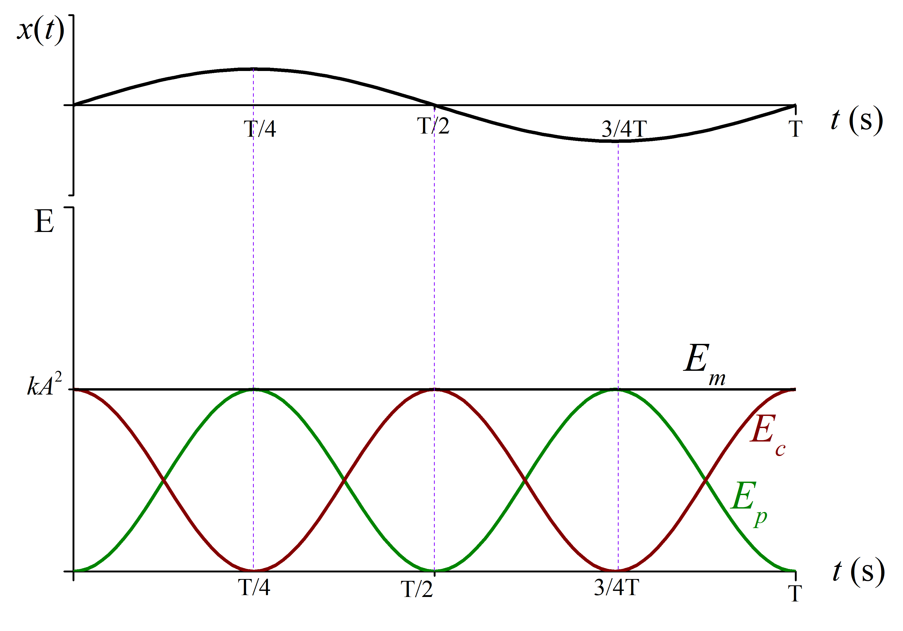{width="50%"}
:::

La energía mecánica total será: $$E_m=E_c+E_p=\frac{1}{2}kA^2\cos^2\left(\omega t+\varphi_0\right)+\frac{1}{2}kA^2\sin^2\left(\omega t+\varphi_0\right)$$

Y sacando factor común $\frac{1}{2}kA^2$, tendremos:
$$E_m=\frac{1}{2}kA^2\left [\cos^2\left(\omega t+\varphi_0\right)+\sin^2\left(\omega t+\varphi_0\right)\right ]$$ 
Si tenemos en cuenta que $\cos^2R+\sin^2R=1$, tendremos: 
$$E_m=\frac{1}{2}kA^2$$

Puede verse que aunque tanto la energía cinética como la energía potencial varían con el tiempo, la suma permanece constante, es decir,\

> **La energía mecánica de un oscilador armónico se conserva**

De este modo, cuando la masa se aleja de la posición de equilibrio, empieza a frenarse, disminuye su energía cinética hasta que se para y retrocede. Al mismo tiempo, la energía potencial va aumentando hasta llegar a su valor máximo cuando la masa se ha parado.

## 1.6. El péndulo {#el-pendulo}

Imaginemos una cuerda de longitud $L$ fija en su extremo superior. Supongamos que es muy ligera. En el extremo inferior sujetamos un cuerpo de masa $m$. En este sistema, las únicas fuerzas que actúan sobre dicho cuerpo son su peso y la tensión de cuerda. Mientras que la primera será siempre vertical, la segunda llevará la dirección de la cuerda.

::: {style="text-align:center;"}
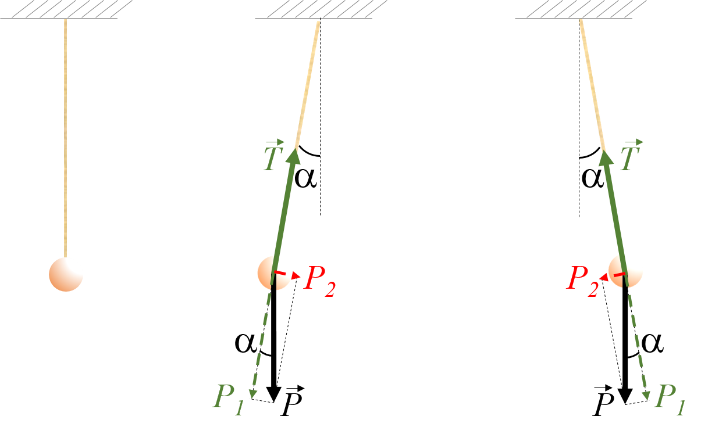{width="50%"}
:::

Por tanto, en el equilibrio, la cuerda estará en posición vertical, de modo que la tensión de la cuerda compensa el peso de dicho cuerpo. Si desplazamos la masa hacia la izquierda, tal y como se muestra en el segundo dibujo, entonces la tensión de la cuerda y el peso no llevarán la misma dirección. Si separamos el peso en componentes radial $$P_1=P\cos\alpha$$ y tangencial $$P_2=P\sin\alpha=P\frac{x}{L}$$ dado que la tensión de la cuerda tiene dirección radial, entonces sólo compensará a la componente $P_1$, mientras que la componente tangencial del peso será la responsable del movimiento. Por lo tanto, el objeto se moverá en dirección tangencial, es decir, describiendo arcos.

$$\sum\vec{F}=\vec{P}_2=m\vec{a}$$ $$P_2=-mg\frac{x}{L}=ma_t$$

En la siguiente figura se muestra un esquema: en un instante cualquiera, tendremos que la cuerda se ha desviado desde la vertical un ángulo $\alpha$, de modo que el arco descrito $s=L\alpha$.

::: {style="text-align:center;"}
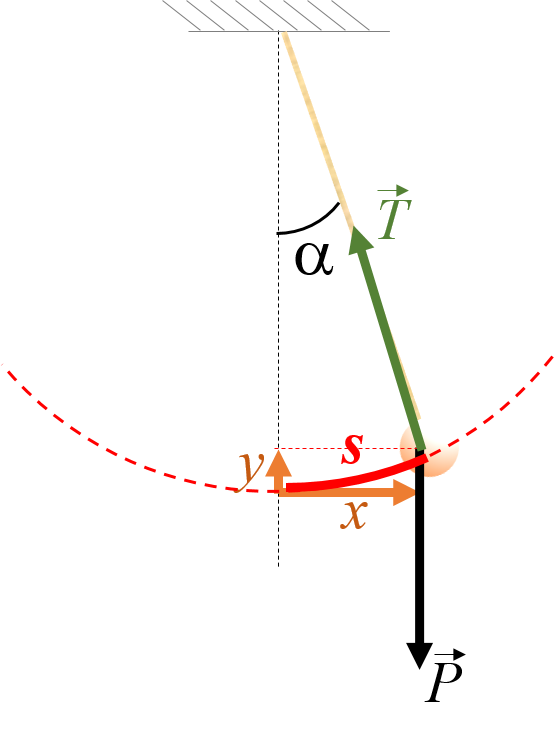{width="30%"}
:::

Si el ángulo $\alpha$ es pequeño, entonces el arco $s$ que describe el péndulo es prácticamente igual a $x$, y por tanto el movimiento tiene lugar prácticamente en la horizontal, es decir,

$$a_t=\frac{d^2s}{dt^2}\approx\frac{d^2x}{dt^2}$$

Finalmente: $$-m\frac{g}{L}x=m\frac{d^2x}{dt^2}$$ Esta ecuación es idéntica a la ecuación de la ley de Hooke, si hacemos la equivalencia $k=mg/L$. Por lo tanto, siempre y cuando el ángulo sea pequeño, el péndulo realizará un movimiento armónico simple de frecuencia: $$\omega=\sqrt{\frac{g}{L}}$$

La ecuación del movimiento será: $$x(t)=A\sin\left(\omega t+\varphi_0\right)$$

Y su velocidad: $$v(t)=\omega A\cos\left(\omega t+\varphi_0\right)$$ Fíjese que las características son las mismas que en el caso del muelle, pero con una diferencia: la frecuencia no depende de la masa. En efecto, esto podríamos haberlo deducido desde el principio: cuando la única fuerza externa es la fuerza gravitatoria, entonces la aceleración, la velocidad y la posición no dependen de la masa.

## 1.6. Energía del péndulo

Al igual que en el caso del muelle, la energía cinética será: 
$$E_c=\frac{1}{2}m\omega^2A^2\cos^2\left(\omega t+\varphi_0\right)$$

Pero ahora la energía potencial es energía potencial gravitatoria: $$E_p=mgy$$ Para conocer $y$, la altura que asciende el péndulo en cada instante desde la posición más baja, observemos el triángulo rectángulo de la siguiente figura:

::: {style="text-align:center;"}
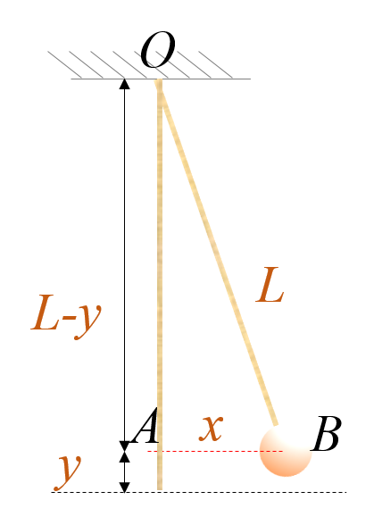{width="35%"}
:::

De ahí, $$L^2=(L-y)^2+x^2=L^2+y^2-2Ly+x^2=L^2+y^2-2Ly+x^2$$ Simplificando y sacando factor común $y$: $$0=y(y-2L)+x^2$$ Dado que el péndulo se desvía poco de la vertical, tendremos que $y$ es mucho más pequeño que $2L$, por lo que el paréntesis en la igualdad anterior es aproximadamente: $$y(y-2L)\approx -2Ly$$ Y por lo tanto $$0=y(y-2L)+x^2\approx -2Ly+x^2$$ de donde: $$y=\frac{x^2}{2L}$$ Teniendo en cuenta que $x(t)$ es un M.A.S., la energía potencial nos queda:
$$E_p=mgy=mg\frac{x^2}{2L}=\frac{1}{2}m\frac{g}{L}A^2\sin^2\left(\omega t+\varphi_0\right)$$ Finalmente, como $\omega=\sqrt{\frac{g}{L}}$, $$E_p=\frac{1}{2}m\omega^2A^2\sin^2\left(\omega t+\varphi_0\right)$$

Observamos que las características son las mismas que en el caso del muelle. La única diferencia estriba en el valor de la frecuencia $\omega$. Por tanto, la energía potencial y cinética se comportan igual que en aquel caso. Además, la energía mecánica: 
$$E_m=E_p+E_c=\frac{1}{2}m\omega^2A^2\left [\sin^2\left(\omega t+\varphi_0\right)+\cos^2\left(\omega t+\varphi_0\right)\right ]$$
Y como $\sin^2R+\cos^2R=1$, $$E_m=E_p+E_c=\frac{1}{2}m\omega^2A^2=\frac{mg}{2L}A^2$$ Y se conserva durante el movimiento del péndulo.

Tomemos el caso de un péndulo que parte del reposo con un cierto ángulo inicial. Este caso es idéntico al caso del muelle que se estira y se suelta. la ecuación del movimiento viene dada por: $$x(t)=A\sin\left(\sqrt{\frac{g}{L}}t+\pi/2\right)$$ siendo $A=x(0)$. Es decir, si se suelta el péndulo, éste nunca rebasará la posición inicial, ya que esto significaría aumentar la energía potencial por encima del máximo y por tanto, no se cumpliría el principio de conservación de la energía mecánica.

# 2.  Ondas 

Una onda (o movimiento ondulatorio) se puede definir como una perturbación que se propaga de unos puntos a otros del espacio. También se define como un trasporte de energía de un punto del espacio a otro sin que haya transporte neto de materia. Ejemplos de ondas son: onda en una cuerda, en la superficie del agua, el sonido, o las ondas electromagnéticas.

## 2.1. El pulso

Podemos imaginarnos una onda de manera esquemática como se muestra en la figura. Tenemos una cuerda horizontal y tensa infinitamente larga y sujeta en un extremo a un muelle que se fuerza a oscilar. En un cierto tiempo $T/4$, concretamente) se habrá levantado el extremo. La tensión de la cuerda provocará que el segmento adyacente se levante a continuación. En este tiempo, el muelle comienza a descender, tirando de nuevo de la cuerda hacia abajo, de modo que en la cuerda se van sucediendo las situaciones mostradas en la figura. Transcurrido un cierto tiempo observaremos que un segmento cualquiera de cuerda que inicialmente estaba en reposo, y que por tanto no tenía energía mecánica, comienza a oscilar, es decir, adquiere energía potencial elástica y energía cinética procedente del muelle oscilante.

:::{style="text-align:center;"}
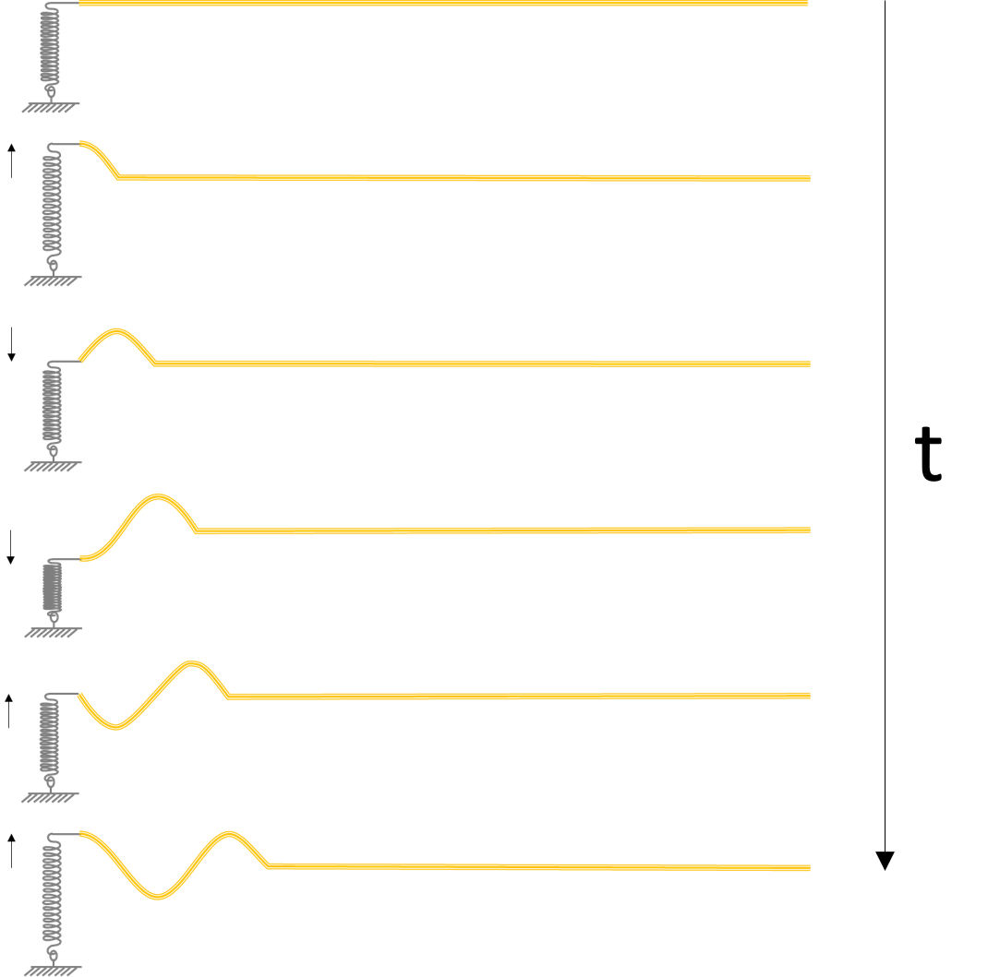{width="55%"}
:::

Vemos por tanto que se propaga energía de izquierda a derecha sin desplazamiento de materia (la cuerda sólo oscila en la dirección vertical). **A esta propagación de energía lo llamamos onda**. Al emisor de este pulso lo llamamos **fuente**.

Si el muelle sigue oscilando, entonces, al cabo de un tiempo todos los segmentos de la cuerda se pondrán también a oscilar. Si nos fijamos en un segmento concreto, entonces veremos que está haciendo una oscilación en la dirección vertical:

$$y(t)=A\text{sen}\left(\omega t+\varphi_0\right)$$ 
donde la fase inicial dependerá del segmento qu estemos mirando. Es decir, depende de la coordenada $x$. Si en vez de fijarnos en un segmento concreto, hacemos una foto en un instante cualquiera, entonces veremos que la cuerda tiene la forma de una función seno. Cada cierta distancia nos encontraremos que la cuerda está haciendo exactamente lo mismo que el muelle. Esta distancia entre dos puntos de la cuerda que ejecutan exactamente el mismo movimiento se llama **longitud de onda** y se designa por la letra griega $\lambda$.

## 2.2. Tipos de onda

En el caso anterior vemos que hay dos desplazamientos diferentes. Por un lado, cada segmento se mueve en la dirección vertical. Por otro lado, el muelle continúa su oscilación produciendo continuamente una perturbación sobre la cuerda que se propaga hacia la derecha en la dirección horizontal. Ambos desplazamientos, movimiento de la cuerda y perturbación, se producen en direcciones perpendiculares. Cuando se da este tipo de situación, decimos que la onda es **transversal**.

En la siguiente figura tenemos un tubo en el que hay un gas, por ejemplo aire. En el extremo izquierdo hay una membrana como la de un tambor. Deformamos la membrana rápidamente y la hacemos vibrar como se ve en la segunda figura. La densidad, y por tanto la presión, en esa zona aumentará, por lo que el aire se desplazará hacia la derecha. En ese tiempo, la membrana se dirige hacia la derecha como se ve en la figura tercera. Cuando vuelve, generará un nuevo pulso de alta presión. Al cabo de un tiempo se obtiene la imagen de la última figura, donde la presión pasa alternativamente de alta a baja a medida que nos desplazamos por el tubo.

:::{style="text-align:center;"}
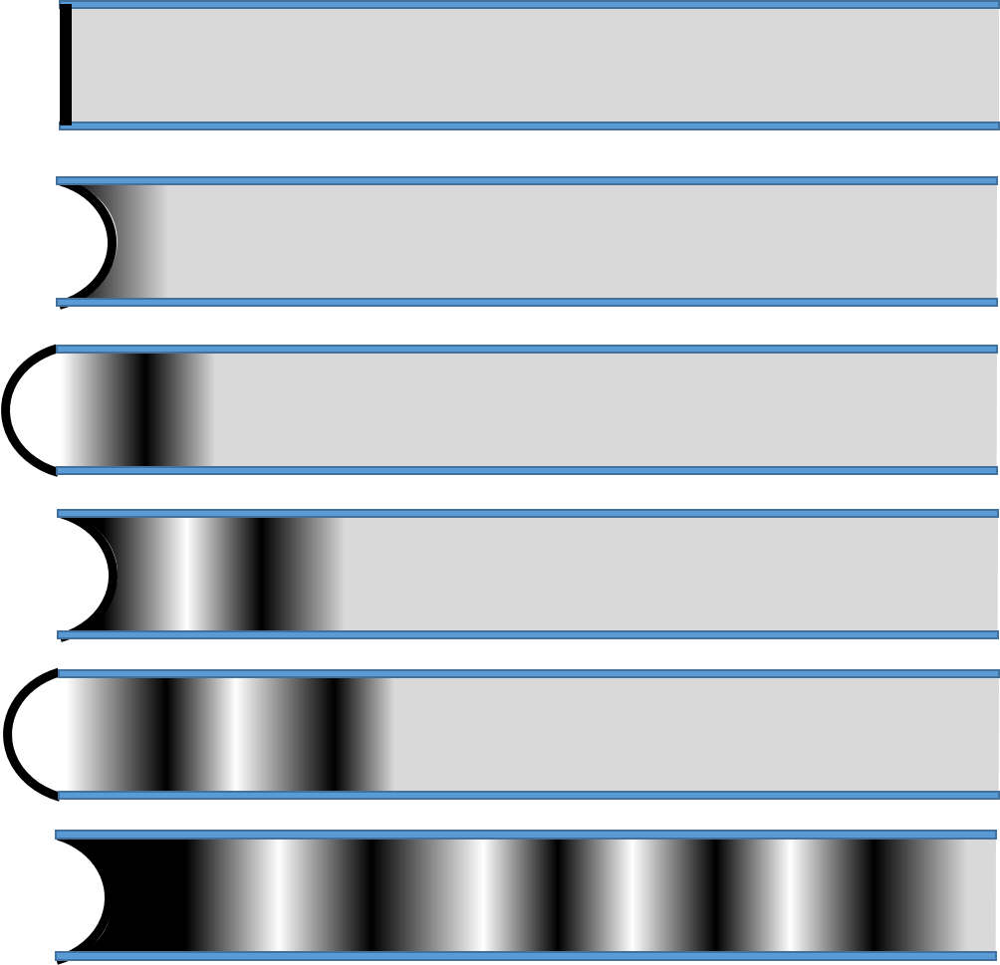{width="50%"}
:::

En este caso, el desplazamiento del aire y la perturbación llevan la misma dirección. Se dice que la onda es **longitudinal**.

Finalmente, hay ondas que no son ni puramente longitudinales ni transversales. Un ejemplo son las olas del mar, en las que el agua ejecuta movimientos circulares como el de la figura.

:::{style="text-align:center;"}
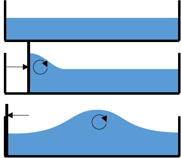{width="50%"}
:::

Todas estas ondas tienen una característica común: se propagan en una única dirección. Se dice que son **monodimensionales**. También pueden ser **bidimensionales**, si se extiende en dos dimensiones, como el caso de la onda producida por una piedra en el agua, o la estela de un barco, o **tridimensionales**, si se propaga en tres dimensiones, como el caso del sonido en el espacio.

Ya sean monodimensionales o no, longitudinales o transversales, todos los ejemplos mostrados tienen una cosa en común: necesitan un medio para propagarse. Por ello, se les llama **ondas mecánicas**. Si por el contrario no necesitan de un medio material, como es el caso de la luz, se les llama **ondas electromagnéticas**. En resumen:

\

  -----------------------------------------------------------------------------------
                      Tipo                                    Ejemplo
  -------------------------------------------- --------------------------------------
       **Necesidad de un medio material**      

                   Mecánicas                        Sonido, onda en la cuerda,\
                                                             terremotos

               Electromagnéticas                       Luz, microondas, radio

          **Dirección de propagación**         

               Monodimensionales                       Cuerda, tubo de sonido

                Bidimensionales                 Ondas en una plataforma vibratoria,\
                                                  ondas en la superficie del agua

                Tridimensionales                            Luz, sonido

   **Relación entre propagación y vibración**  

                 Longitudinales                                Sonido

                 Transversales                   Onda en la cuerda, luz en el vacío

                     Mixtas                                     Olas
  -----------------------------------------------------------------------------------

## 2.3. Magnitudes características de una onda

### Velocidad de la onda

Tomemos el ejemplo anterior de la cuerda horizontal estirada. El impulso que produce el muelle tarda un tiempo en llegar al final de la cuerda. En el caso del sonido o cualquier otra onda, el pulso producido por la fuente tarda siempre un tiempo en llegar a cualquier receptor ya que viaja a una velocidad finita. La velocidad a la que viaje el pulso o perturbación producido por la fuente lo llamamos **velocidad de la onda**. Esta velocidad depende de las características del medio por el que viaja.

No debe confundirse esta velocidad con la velocidad de vibración. En una onda existen dos velocidades:

- La velocidad de vibración de las partículas. Esta es la velocidad a la que se mueven las partículas al oscilar y se calcula como la variación temporal de su posición: 
$\frac{d y}{d t}$.

- La velocidad de la onda. Se suele designar con la letra $v$. Esta es la velocidad a la que se transmite la perturbación de unos puntos a otros del medio por el que se propaga la onda. Por ejemplo, la velocidad de la luz en el vacío es $3\cdot 10^8$ m/s. La velocidad del sonido en el aire es 340 m/s. No está relacionado con la posición de ninguna partícula. Depende de las características elásticas y la densidad del medio.

::::: {.callout-note title="Ejemplo:" collapse="false" icon="false"}
Una cuerda estirada horizontal se levanta repentinamente en un extremo una altura de $20\text{ cm}$ y se vuelve a bajar a la posición inicial. En total el extremo tarda $0.1\text{ s}$ en bajar desde la posición más alta. Se observa que dicho pulso se propaga por la cuerda de modo que recorre $5 \text{ m}$ en $2 \text{ s}$. Hacer un esquema de la situación inicial cuando se levanta la cuerda, cuando han pasado $0.1\text{ s}$ y cuando han pasado $2 \text{ s}$.

::::{.callout-note title="Solución:" collapse="true" icon="false"}

:::{style="text-align:center;"}
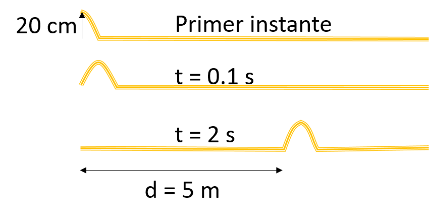{width="55%"}
:::

La primera figura muestra la situación inicial en la que el extremo está levantado $20 \text{ cm}$. En la segunda el extremo ha bajado a su posición inicial y el pulso se ha trasladado una cierta distancia. En la tercera, el pulso se encuentra a $5 \text{ m}$ y el resto está en reposo ya que sólo se ha producido un pulso.
::::
:::::

:::: {.callout-note title="Ejemplo:" collapse="false" icon="false"}
EJEMPLO 2: En el ejemplo anterior, ¿cuál es la velocidad de la onda?

:::{.callout-note title="Solución:" collapse="true" icon="false"}
La velocidad de la onda es la velocidad a la que viaja el pulso. Por tanto: $$v=\frac{v}{t}=\frac{5 \text{ m}}{2 \text{ s}}=2.5\text{ m/s}$$
:::
::::

:::: {.callout-note title="Ejemplo:" collapse="false" icon="false"}
¿Cuál es la velocidad media del extremo de la cuerda?

:::{.callout-note title="Solución:" collapse="true" icon="false"}

La velocidad del extremo de la cuerda es la velocidad a la que se mueve. Por tanto: $$v_c=\frac{20 \text{ cm}}{0.1 \text{ s}}=2\text{ m/s}$$
:::
::::

:::: {.callout-note title="Ejemplo:" collapse="false" icon="false"}
¿Determinar la posición del pulso cuando el extremo vuelve a la posición horizontal

:::{.callout-note title="Solución:" collapse="true" icon="false"}

La posición del pulso es la distancia recorrida por éste. Como la velocidad de la onda es $2.5 \text{ m/s}$, en $0.1\text{ s}$ habrá recorrido: 
$$v_2=vt=2.5 \text{ m/s} \cdot 0.1\text{ s} = 0.25 \text{ m}$$
:::
::::

::::: {.callout-note title="Ejemplo:" collapse="false" icon="false"}
¿Cuál será la anchura del pulso?

::::{.callout-note title="Solución:" collapse="true" icon="false"}

Cuando el extremo de la cuerda vuelve a su posicián inicial, el pulso está totalmente desarrollado. Esto ocurre $0.1 \text{ s}$ después de tenerlo en su punto más alto. En el apartado anterior encontramos que en ese instante, el punto de mayor altura se habrá desplazado a $0.25 \text{ m}$. La siguiente figura esquematiza esta situación:

:::{style="text-align:center;"}
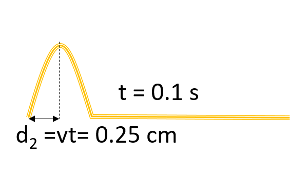{width="45%"}
:::
::::

Luego, esa distancia es justamente la mitad de la anchura del pulso. Es decir la anchura del pulso es $0.5 \text{ m}$.
:::::

### Periodicidad de la onda

Supongamos que hacemos vibrar un extremo de la cuerda, el periodo $T$ (señalado en azul en la figura siguiente) es el tiempo que tarda en ejecutar un ciclo completo. Durante este tiempo, la perturbación habrá recorrido una distancia $vT$ (señalado en verde en la figura), de modo que transcurrido un tiempo $T$, ambos puntos se encuentran exactamente en la misma posición. Dado que el extremo sigue vibrando, se siguen propagando pulsos por la cuerda. Estos pulsos son periódicos, al igual que la vibración del extremo. Por tanto, si esperamos otro tiempo $T$, entonces, el extremo y los puntos situados a una distancia $vT$ y $2vT$ se encontrarán en la misma posición y así sucesivamente. Si detenemos el tiempo (podemos imaginarnos esta situación si hacemos una foto a la cuerda), nos encontraremos que la posición de la cuerda se repite periódicamente en intervalos espaciales $vT$. Esta es la periodicidad espacial, conocida como **"longitud de onda\"**. La longitud de onda se designa con la letra griega $\lambda$ y se mide en metros en el S.I.

:::{style="text-align:center;"}
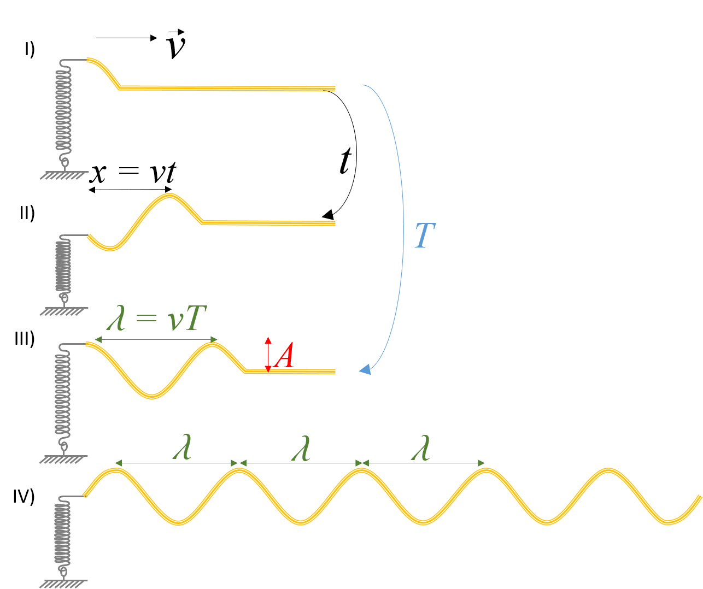{width="50%"}
:::

> La longitud de onda es la mínima distancia entre dos puntos del medio por el que se propaga la onda que se mueven de la misma forma. Se calcula como:
>
> $$\lambda=vT$$

Para describir las ondas, es usual utilizar también el llamado **"número de ondas"**. Se calcula como: 
$$k=\frac{2\pi}{\lambda}$$
y se mide en $\text{ m}^{-1}$.

Por tanto, en una onda existe una doble periodicidad:

- Temporal: El extremo de la cuerda está vibrando, por lo que su posición se repite cada periodo de tiempo $T$. Esta perturbación se propaga por la cuerda. Por lo tanto, si nos fijamos en un cierto punto de la cuerda situado a una distancia $x$ del extremo, observaremos que realiza el mismo movimiento que el extremo, es decir, una oscilación con un mismo periodo $T$. Dado que esta perturbación tarda un tiempo $t=x/v$ en llegar desde el extremo hasta dicho punto, entonces, observamos que realiza el mismo movimiento, pero retrasado.

- Espacial: Cuando el extremo llega a su punto más alto, en la cuerda habrá puntos que también están en su punto más alto. Por tanto, en un instante concreto, la situación en la que se encuentra el extremo se repite en puntos de la cuerda equidistantes. La distancia entre estos puntos es la longitud de onda.

:::: {.callout-note title="Ejemplo:" collapse="false" icon="false"}
En la siguiente figura, determine la distancia entre los puntos indicados, en términos de la longitud de onda $\lambda$.

:::{style="text-align:center;"}
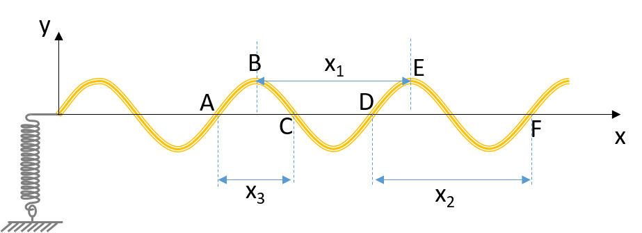{width="55%"}
:::

:::{.callout-note title="Solución:" collapse="true" icon="false"}

Por definición, $x_1 = \lambda$.\
Los extremos de $x_2$ están en la misma posición y tienen la misma velocidad: la distancia entre ellos también es la longitud de onda:
$$x_2 = \lambda$$
Los extremos de $x_3$ están en la misma posición pero la velocidad es diferente: $A$ tiene velocidad negativa y $C$ positiva. Luego
$$x_3 = \frac{\lambda}{2}$$
Para saber la velocidad de un punto de la cuerda tenemos que fijarnos en el lado por el que viene la perturbación. En el ejemplo, la onda se dirige hacia la derecha. Por ejemplo, el punto $A$, tiene a su izquierda un tramo de cuerda que se encuentra por debajo. Por lo tanto, en instantes posteriores, dicho punto de la cuerda bajará, es decir, en el instante indicado en la figura, el punto $A$ tiene velocidad negativa. El punto $C$, sin embargo, tiene a su izquierda un tramo que está a mayor altura y por lo tanto, como reacción, en instantes posteriores se espera que $C$ suba, es decir, tiene velocidad positiva.
:::
::::

### Amplitud de la onda

Dado que el extremo ejecuta oscilaciones, su separación del equilibrio no superará un cierto valor, que es la amplitud de la oscilación. Por tanto, ningún segmento de la cuerda superará esta separación del equilibrio. Esta máxima distancia de separación del equilibrio se llama **"Amplitud\"** $A$, en rojo en la figura anterior). Sus unidades son las mismas que tenga la perturbación. En el caso de la onda en la cuerda, la perturbación es un desplazamiento, por lo que $A$ se mide en metros.

## 2.4. Ecuación de la onda armónica

Al igual que la ecuación de una vibración describe la posición del oscilador en cualquier instante de tiempo, la ecuación de ondas debe describir la posición temporal de todos los puntos por los que se propaga la onda. Imaginemos que se trata de una onda transversal como la de la cuerda. Entonces la ecuación de ondas debe ser una función del tipo: 
$$y(x,t)$$
Es decir, la posición $y$ en el instante $t$ del segmento de cuerda o punto del espacio situado a una distancia $x$ de la fuente que produce la onda.

Decimos que una onda es armónica cuando se puede describir matemáticamente mediante una función seno o coseno. Si la fuente ejecuta una oscilación armónica simple: $$y(0,t)=A\sin\left(\omega t\right)$$ Entonces, en cualquier otro punto encontraremos: 
$$y(x,t)=A\sin\left(\omega t-kx\right)$$
Esta es la ecuación de una onda armónica.

:::: {.callout-note title="Ejemplo:" collapse="false" icon="false"}
EJEMPLO: Una onda se desplaza por una cuerda de acuerdo con la siguiente ecuación: $y(x, t) = (2000\pi t − 20x)$. Determine:

-La altura máxima a la que podremos encontrar cualquier segmento de la cuerda.
-La frecuencia angular de la onda.
-El periodo.
-La longitud de onda.
-La velocidad de la onda.
-La posición y velocidad de un segmento situado a 2 m de la fuente en cualquier instante.

:::{.callout-note title="Solución:" collapse="true" icon="false"}

En general, sabemos que: 
$$y(x,t)=A\sin\left(\omega t-kx\right)$$

$A = 1\text{ m}$. Esta es la amplitud del movimiento en cualquier punto de la cuerda, luego también es la máxima altura que se puede alcanzar.

Si comparamos con la ecuación general, la frecuencia angular \omega será: $$\omega=2000\pi \text{ rad/s}$$

Dado $T=\frac{2\pi}{\omega}$ entonces $$T=10^{-3} \text{ s}$$

En la ecuación de ondas tenemos también $k = 20 \text{ m}^{−1}$.Como $k=\frac{2\pi}{\lambda}$, entonces la longitud de onda es $\lambda=\frac{2\pi}{k}$.Sustituyendo valores: $$\lambda=0.314 \text{ m}$$

La velocidad la podemos obtener teniendo en cuenta que $\lambda=vT$, luego $v=\lambda/T$. Sustituyendo: $$v = \frac{0.314 \text{ m}}{10^{-3} \text{ s}} = 314 \text{ m/s}$$

Es decir $x=2 \text{ m}$. Sustituyendo en la ecuación de ondas: $$y(x=2,t) = A\sin(\omega t-40)$$ Y la velocidad de este segmento es su velocidad de vibración en la dirección vertical: $$v_v=\frac{d_y}{d_t} = A\omega\cos(\omega t -kx)$$ Sustituyendo los valores que conocemos de $A$, $\omega$, $k$ y $x$: $$v_v=2000\pi \cos(2000\pi t - 40) \text{ m/s}$$
:::
::::
